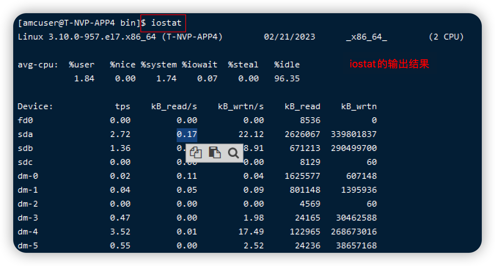

# iostat命令详解

目标：
1. 通过iostat定位那个设备有IO问题
2. iostat命令结果的解读

iostat命令是sysstat 命令集下的一个工具 

iostat命令用于监视系统I/O设备负载。iostat通过观察设备处于活动状态的时间（相对于其他平均传输速率）来整理实时报告输出。 

在实际工作中用于监视本地文件系统以及网络文件系统的负载。 

iostat 命令的输出结果

结果分为两部分：
一部分是CPU的一些统计信息

%user   用户模式下所花费的CPU时间
%nicd   用户进程改变过优先级的进程占用CPU时间  （不关注）
%system 内核进程所花费的CPU时间 
**%iowait IO等待所占用的CPU时间（重要）**  小于30%是正常的 （不同功能的服务器不同）。 邮件服务器正常情况下还是比较耗时的。
%steal 丢失时间占用CPU （参考）
%idle CPU处于中断（空闲）状态的时间 

一般情况下，如果 user + system 的和小于80%， 则说明系统的IO正常，没有问题。相反，则说明系统的IO可能出现了问题

一般来说， %idle持续游走在20%以下，瓶颈出现在CPU的性能层面。 
iowait 高，而idle 在70% 以上，瓶颈出现在IO设备层面。 

Device： 设备名 dm 是disk mapper 的缩写，可以在/dev/mapper下查找对应于谁
        参数 -N 可以将dm转换成对应的LVM名
tps：  设备每秒接受的IO传输请求 tps： transfers per second
kB_read/s 设备每秒**读取**的数据量（KB） 参数-m 可以转换为MB
kb_wrtn/s 设备每秒
kB_read
kB_wrtn

硬盘有并行处理多个IO请求的能力。 

比较iowait 和计算机磁盘计算的理论值，如果相差很多，说明设备有问题。 
