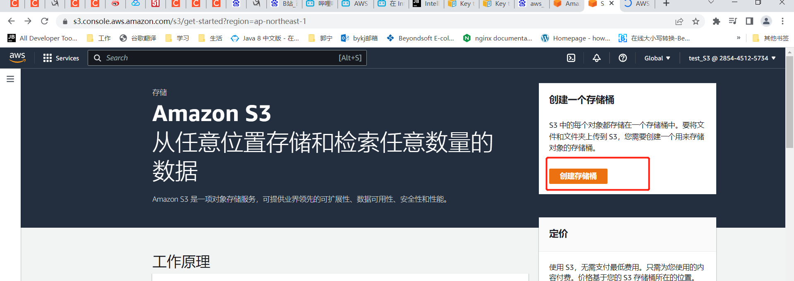
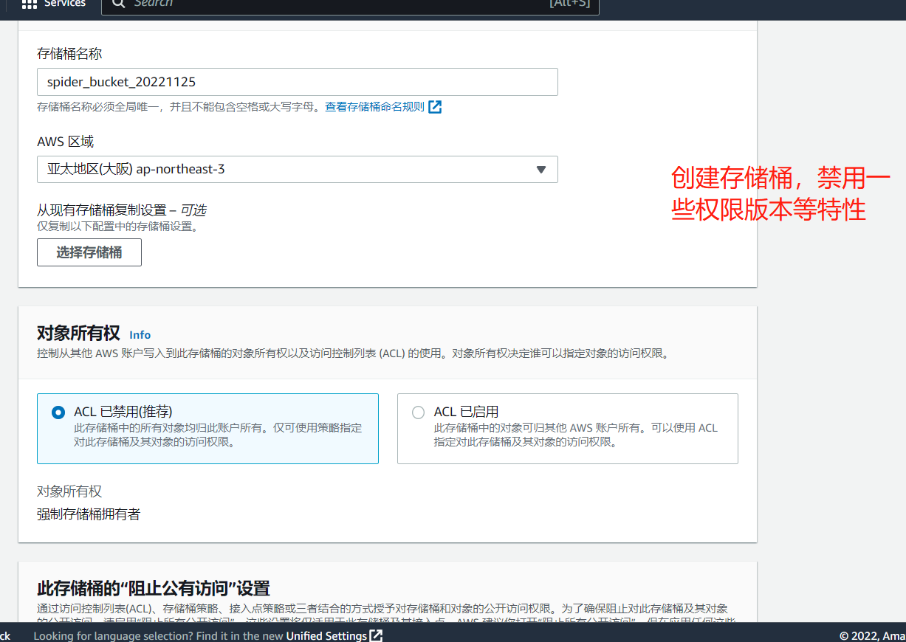
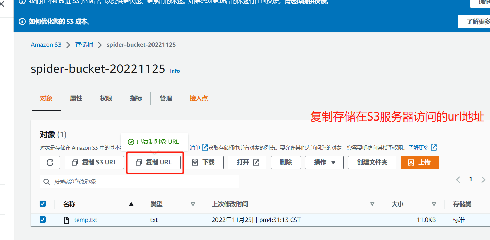
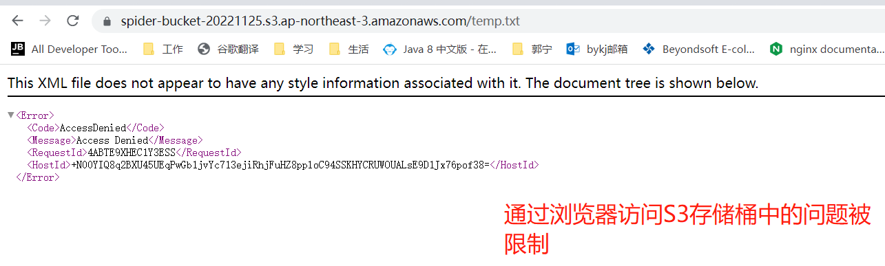
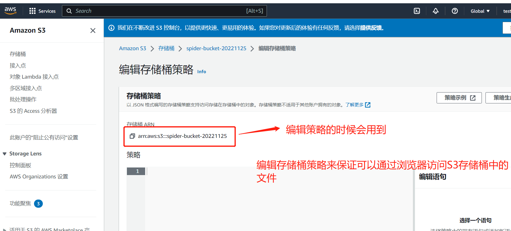
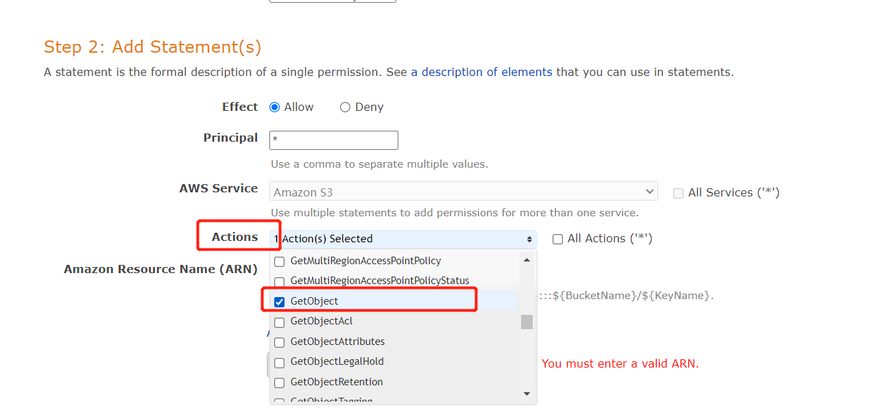
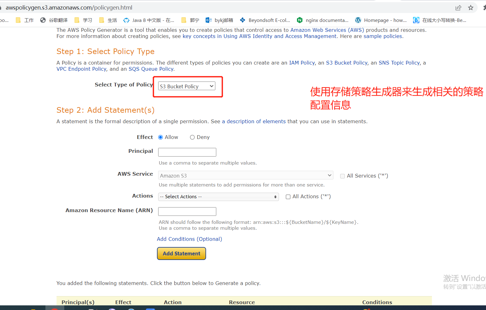
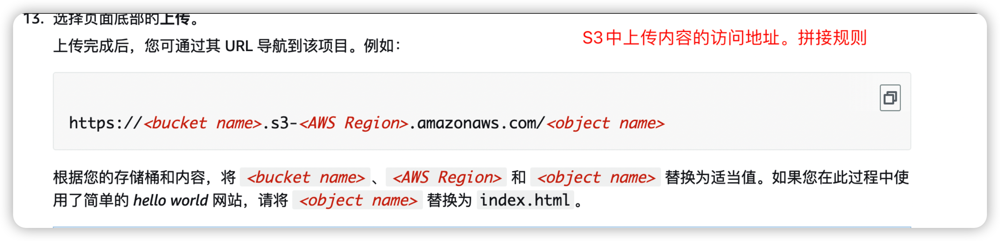
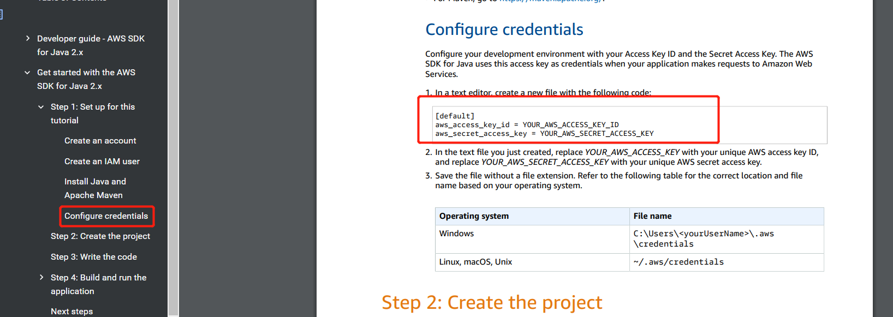
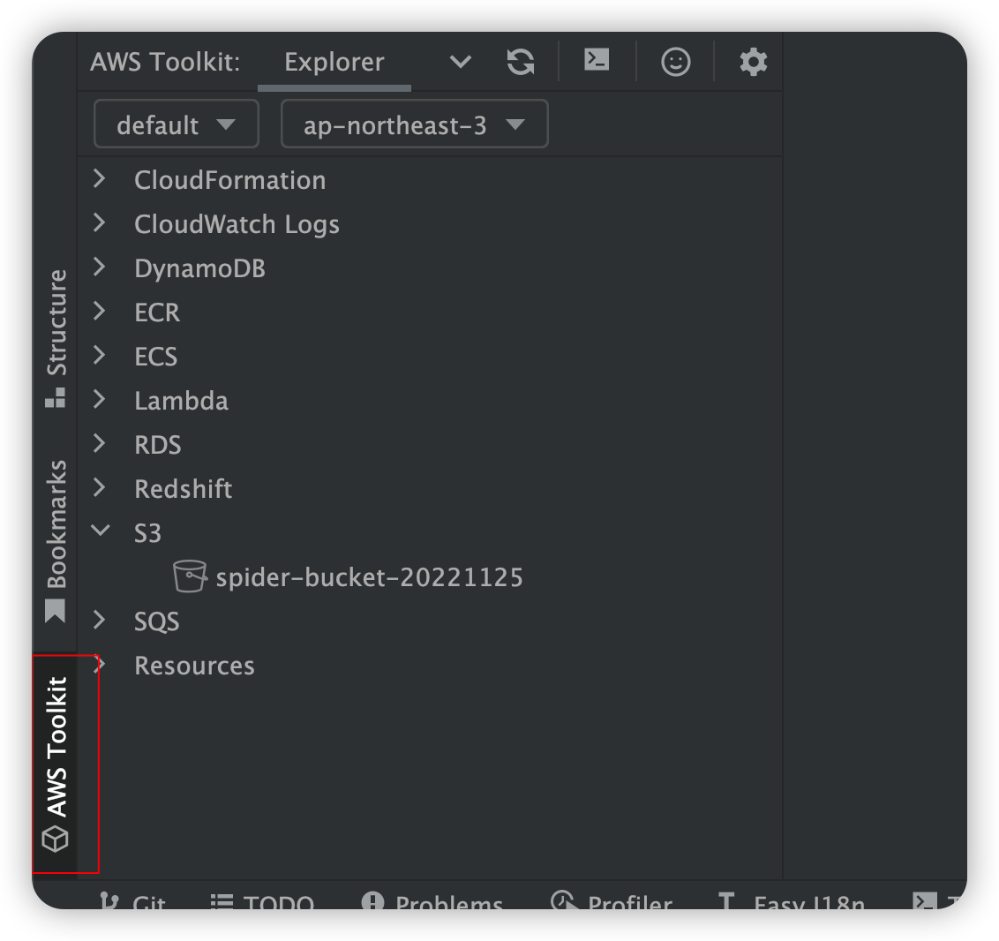

# SWS 的 S3 存储服务的使用

S3: Simple Storage Service 简单存储服务

登陆 S3 的控制台 https://s3.console.aws.amazon.com/s3/buckets?region=us-east-1
点击 【创建存储桶】


对创建的存储桶进行命名。 其中 AWS 所在区域选择距离客户较近的区域。
为了简化应用，我们禁用权限控制


其他属性保持默认，之后点击保存就可以创建了。
创建好的 S3 信息如下，我们选中，某个文件，可以得到该文件的访问路径，根据该 URL 路径，我们可以在浏览器中访问到对应的资源。


通过上面复制的 URL 我们在浏览器访问，会提示如下信息，说明，AWS 的 S3 对资源的访问策略设置的不对。


我们可以通过 S3 提供的存储桶策略编辑器编辑相关的策略。






之后将生成的存储策略保存到该存储桶的【Permissions】属性中。

```
  {
    "Version": "2012-10-17",
    "Id": "Policy1669441695359",
    "Statement": [
        {
            "Sid": "Stmt1669441692726",
            "Effect": "Allow",
            "Principal": "*",
            "Action": "s3:*",
            "Resource": "arn:aws:s3:::spider-bucket-20221125/*"
        }
    ]
}
```

之后，我们可以通过 Java 代码利用 AWS 提供的 SDK 来上传文件到 S3 桶中。
我们也可以通过 python 代码来进行文件上传。



## Java 开发程序访问 AWS 得 S3 服务的过程

1. 本地环境环境配置密钥的文件 mac 系统的路径是：/Users/lpf/.aws/credentials
不同操作系统文件存放的路径是不同的


2. 通过 AWS 得 SDK 代码上产文件到 S3 服务中
3. 上传成功后，对应的 url 是：
   String url = "https://" + bucket + ".s3." + Region.AP_NORTHEAST_3 + ".amazonaws.com/" + key;
   其中的 bucket 是桶的名称， key 是文件的相对路径。

## 在 AWS 的应用实例（EC2）中，查看服务器中有没有绑定 S3 存储。

```shell
  $> aws s3 ls
```

进入到存储桶中：

```shell
  $> aws s3 ls  存储桶的名称（s3://abc）
```

将服务器中的文件复制到 s3 中的存储桶中

```shell
  $> aws s3 cp  localfile s3://abc
```

## 在 idea 中使用 AWS

1. 安装插件 AWs Toolkit
2. 通过 [视图] --> [工具窗口] --> [AWS Explorer]
   1. View --> Tool --> Windows -- AWS Explorer
3. Idea 使用凭据文件链接到 AWS 账户。 类似于 AWS 命令行界面（CLI）
   效果如下：
   

参考资料：

- 使用 Amazon S3 进行开发
  - https://docs.aws.amazon.com/zh_cn/AmazonS3/latest/userguide/developing-s3.html
- Amazon S3 控制台
  - https://console.aws.amazon.com/s3/
- python 操作 AWS 的 S3 的说明
  - https://boto3.amazonaws.com/v1/documentation/api/latest/guide/quickstart.html
