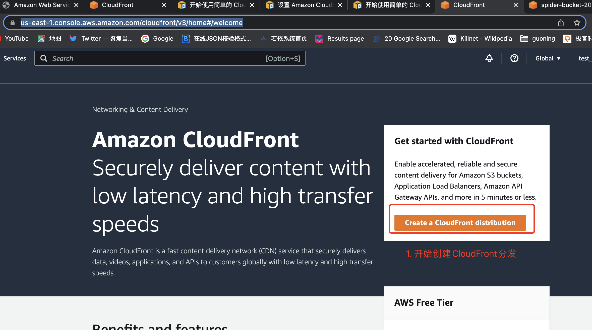

# FrontCloud创建流程.md

登陆AWS服务器的FrontCloud控制台

1. 开始创建CloudFront Distributer （内容分发器）

2. 配置CloudFront 的数据来源。 这里配置的是自己之前配置的S3的服务器

3. 其他配置保持默认，不进行配置。 

4. 创建好的CloudFront 分发器信息如下： 其中 Distribution domain name 是CloudFront 默认分配的 域名。可以通过这个地址加上 S3 中存储图片的相对路径，可以在浏览器中顺利访问到图片。 

5. 创建好CloudFront 之后，可以配置自己的域名
这里创建的域名，需要注意，不能有https或http 前缀， 同时需要确保该域名是一个签名过的域名。 同时还需要将签名得到的CA证书上传上去。 
这里要注意 ，上传CA证书的时候，需要IAM用户有想过的上传权限。

在添加自己的域名的时候，有一些注意事项。 如下：

