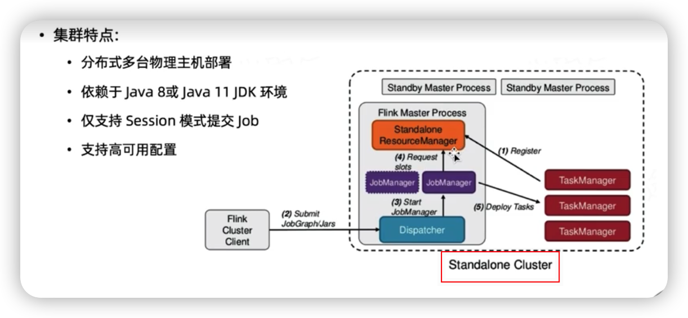

 

# Flink 核心技术与实战

该学习笔记是学习极客时间Flink核心技术与实战整理的笔记和一些自己的一些理解

本套课程基于Flink的版本是： 1.11 

## 第一章 Apache Flink 介绍

### 大数据处理计算模式

### 流计算和批计算对比

* 数据实效性不同
  * 流式计算实时，低延迟，批量计算非实时，高延迟
* 数据特征不同
  * 流式计算的数据一般是动态的，没有边界的，而批处理的数据一般则是静态数据
* 应用场景不同
  * 流式计算应用在实时场景，实效性要求比较高的场景，如实时推荐，业务监控..., 批量计算一般说批处理，应用在实时性要求不高，离线计算的场景下，数据分析，离线报表等
* 运行方式不同
  * 流式计算的任务持续进行，批量计算的任务则一次性完成。 流式计算将成为主流的原因

### 为什么流式计算将成为主流

* 数据处理时延要求越来越高，实时性要求越来越高
* 流式处理技术日趋成熟，同时越来越容易上手
* 批计算带来的计算和存储成本
* 批计算本身就是一种特殊的流计算，批和流本身就是相辅相成的

### 适用于流处理的应用场景

金融机构实时跟踪股市波动，计算风险价值，然后根据股票价格变动自动重新平衡投资组合。 

#### 流计算框架与产品

第一类：商业级流计算平台（IBM InfoSphere Streams ｜IBM StreamBase等）

第二类：开源流式计算框架

* Strom： Twitter开发的第一代流处理系统
* Heron：Twitter开发的第二代流处理系统

* Apache Storm： 基于Record级别处理数据的流处理引擎，延迟非常低
* samza：一种与Apache Kafka消息系统紧密绑定的流处理框架
* Spark Streaming：是Spark核心API的一个扩展，可以实现高吞吐量，具备容错机制的实时流数据的处理
* Flink：针对流数据和批数据的分布式处理引擎，同时支持原生流处理
* Apache kafka：为处理实时数据提供一个统一，高通量，低等待的平台，目前主要用作消息中间件。 

### 主流的流式框架：Storm

* 最早使用的流处理框架，社区比较成熟
* 支持原生流处理，即单事件来处理数据流（所有记录一个接一个处理）
* 延迟性低（毫秒级）
* 消息保障能力弱，消息传输可能重复单不会丢失。
* 吞吐量比较低

### Spark Streaming的特点

* Spark Streaming 属于Spark API的扩展
* 以固定时间间隔（如几秒种）处理一段段的批处理作业（即，微批处理）
* 延迟性较高（秒级），但能够保障消息传输及不会丢失也不会重复
* 具有非常高的吞吐

### Flink特点

* 真正的流处理框架（DataFlow Model）
* 延迟性比较低（毫秒级），且能狗保证消息传输不丢失不重复
* 具有非常高的吞吐
* 支持原生流处理

在众多的流处理框架中选择Flink的原因：

* 低延迟
  * 毫秒级延迟
* 高吞吐量
  * 美秒千万级吞吐量
* 处理准确性
  * Exactly-once语义
  * Event time 处理
* 易用性
  * 可以通过SQL/Table API/ DataStream API 来实现

### 流计算框架对比

##  Flink发展历史与应用场景

在 2014年12月，该项目成为Apache软件基金会顶级项目，在2015年9月发布第一个稳定版本0.9. 

### Flink应用场景

* 实时监控
  * 用户行为预警，app crash 预警，服务器攻击预警
  * 对用户行为或者相关事件进行实时检测和分析，基于风控规则进行预警
* 实时报表
  * 双11，双12等活动直播大屏
  * 对外数据产品： 生意参谋等
  * 数据化运营
* 流数据分析
  * 实时计算相关指标反馈及时调整决策
  * 内容投放，无线智能推送，实时个性花推荐等

* 实时数据仓库

  * 数据实时清洗，归并，结构化
  * 数仓的补充和优化

  

## Flink核心特性

* 统一数据处理组件栈，处理不同类型的数据需求（Batch，stream， Machine Learning， Graph）
* 支持事件事件（Event time），接入时间（Ingestion Time），处理时间（Process Time）等时间概念
* 基于轻量级分布式快照（snapshot）实现的容错
* 支持有状态的计算
* 支持高度灵活的窗口（window）操作
* 带反压的连续流模型
* 基于JVM实现独立的内存管理
  * Flink在JVM中实现了自己的内存管理
* 应用可以超出主内存的大小限制，并且承受更少的垃圾收集的开销
* 对象序列化二进制存储，类似于C对内存的管理

## Flink部署与应用

### 目录

* Flink集群架构
* Flink集群部署模式（Session， Per-Job，Application）
* 集群资源管理器支持（Standalone，Yarn，Kubernetes）
* Standalone 集群原理与实践
* Flink On Yarn 集群原理与实践
* Flink On Kubernetes集群原理实践
* Flink集群高可用配置

### Flink集群架构

* JobManager： 管理节点，每个集群至少一个，管理整个集群计算资源，Job管理与调度执行，以及Checkpoint 协调
* TaskManager： 每个集群有多个TM，负责计算资源提供
* Client： 本地执行应用main() 方法解析JobGraph对象，并最终将JobGraph提交到JobManager 运行，同时监控Job执行的状态

### Flink集群架构-JobManager

* Checkpoint Coordinator
* JobGraph--》Execution Graph
* Task 部署与调度
* RPC通信（Actor System）
* Job接收（Job Dispatch）
* 集群资源管理器（ResourceManager）
* TaskManager注册与管理

## Flink集群架构--TaskManager

* TaskExecution
* Network Manager
* Shuffle Environment管理
* Rpc通信（Actor system）
* Heartbeat with JobManager And RM
* Data Exchange
* Memory Management
* Register TO RM
* Offer Slots To JobManager

### Flink集群架构--Client

* Application`s main() Method() 执行
* JobGraph Generate
* Execution Environment管理
* Job提交与运行
* Dependency Jar Ship
* RPC with Job Manager
* 集群部署（Cluster Deploy）

### Flink集群架构-JobGraph

* 通过有向无环图（Dag） 方式表达用户程序
* 不同接口程序的抽象表达
* 客户端和集群之间的Job描述载体
* 节点（Vertices） ，Result 参数
* Flink 1.11 之前只能在Client中生成

### 07_Flink集群运行模式

根据以下两种条件将**集群部署模式**分为三种类型：

1. 集群的生命周期和资源隔离
2. 根据程序main（） 方法执行在client还是JobManager

* Sessioon Mode
  * 共享JobManager 和TaskManager， 所有提交的Job都在一个Runtime中运行
* Per-Job Manager
  * 独享JobManager 和TaskManager，好比为每个Job单独启动一个Runtime
* Application Mode（1.11版本提出）
  * Application的main（） 运行在Cluster上，而不是客户端
  * 每个Application对应一个Runtime，Application中可以含有多个Job

### Session集群运行模式

* Session集群运行模式
  * JobManager与TaskManager共享
  * 客户端通过RPC或Rest API 连接集群的管理节点
  * Deployer需要上传依赖的Dependences Jar
  * Deployer 需要生成JobGraph，并提交到管理节点
  * JobManager的生命周期不受提交的Job影响，会长期运行
* Session运行模式优点
  * 资源充分共享，提升资源利用率
  * Job在Flink Session集群中管理，运维简单
* Session运行模式缺点
  * 资源隔离相对较差
    * 某一两个任务可能会将系统的资源全部占用，其他任务无法获得资源来进行执行
  * 非Native类型部署，TM不易拓展，Slot计算资源伸缩性较差

​		

### Application Mode 集群运行模式的特点

### Application Mode 集群运行模式

#### 优点：

* 有效降低带宽消耗和客户端负载
* Application 实现资源隔离，Application中实现资源共享

#### 缺点

* 仅支持Yarn和kubunetes 

### Flink集群资源管理器支持

通过本课程将学习Flink在不同集群资源管理器上面的部署的支持。 

Flink集群部署--Cluster Management支持

Flink支持一下资源管理器部署集群

* Standalone
* Hadoop Yarn
* Apache Mesos
* Docker
* kubernetes

#### Flink 集群部署对比

#### Native集群部署

* Session集群根据实际提交Job资源动态申请和启动TaskManager计算资源
* 支持Native部署模式的有Yarn，kubernetes， Mesos 资源管理器
* Standalone不支持Native部署

### 09_Standalone原理讲解与实操演示

#### Standalone集群特点

* 分布式多台物理主机部署
* 依赖于Java8 或Java 11 JDK环境
* 仅支持Session模式提及Job
* 支持高可用配置

#### Standalone（单机）集群部署

* JobManager和TaskManager全部在一个机器上运行
* 支持Linux和Mac OS X 上部署
* 依赖于Java8 或者Java 11 环境
* 仅适合于本地测试，不适用于 生产环境
* 仅支持Session模式提交Job
* 不支持高可用

#### Standalone（单机）集群部署步骤

#### Standalone（多机） 集群部署-部署步骤

### 10_Flink On Yarn 部署讲解

### 暂时先不看，没有环境

### 11_Flink On Yarn 实操演示

### 12_Flink on kubernetes 部署讲解

### 暂时先不看

### 13 Flink on kubernetes 实操

### 14FLink on k8s Per-job 模式

### 15

### 16

### 17 Flink高可用配置原理讲解

生产环境必须考虑Flink集群高可用， HA能狗快速恢复集群服务

#### FLink集群高可用-Job持久化

* Submit job
* Persist execution graph
* Write handle to zookeeper
* Deploy tasks

#### F林肯集群高可用--handling Checkpoints 

