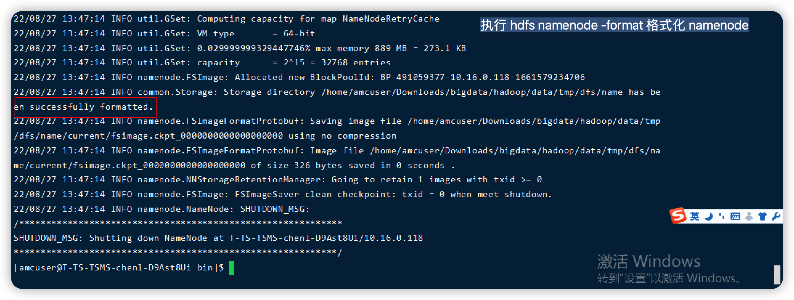
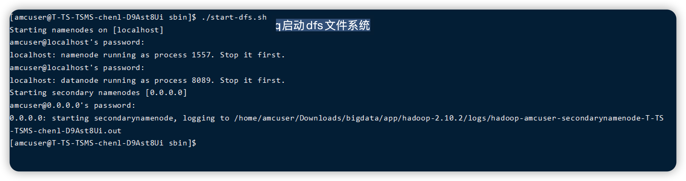
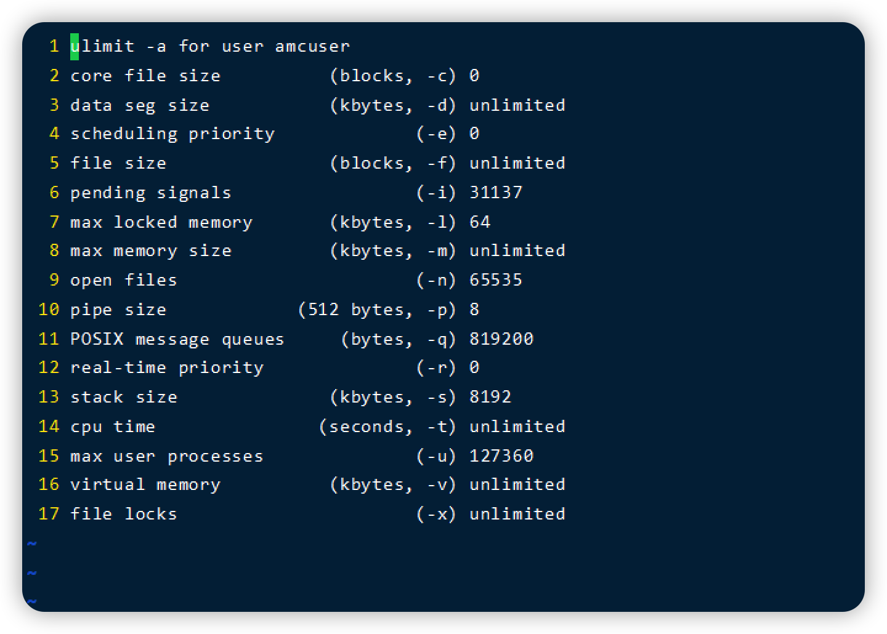
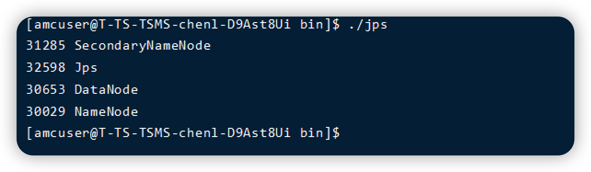
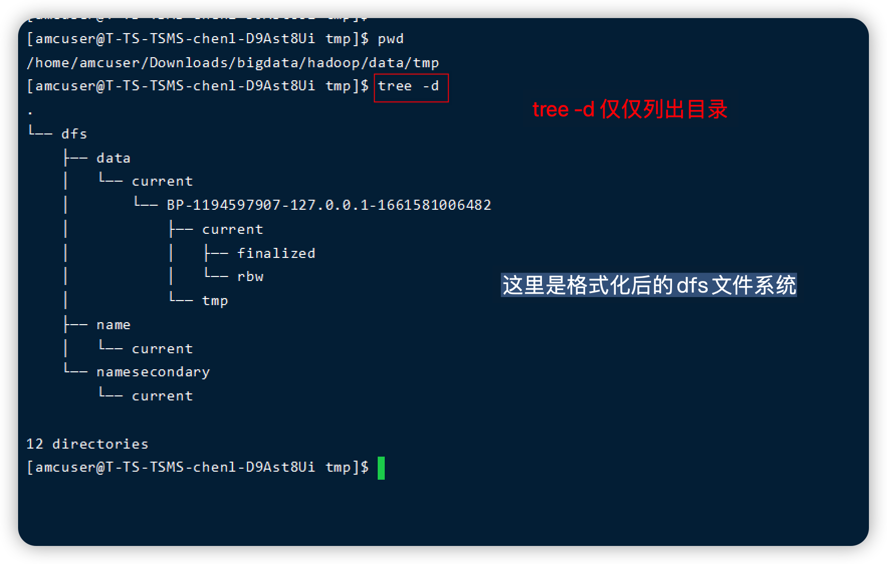
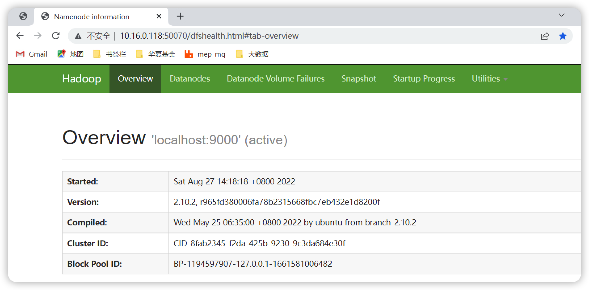
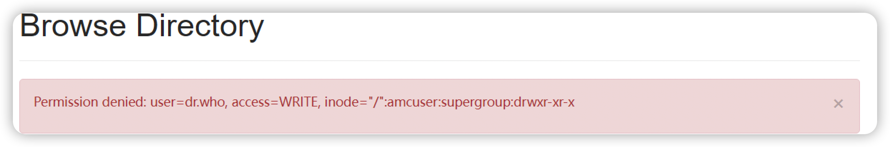

# Hadoop伪分布式模式的安装

Hadoop可以在单节点上以伪分布式的方式运行，Hadoop进程以分离的Java进程来运行，节点既作为NameNode，也作为DataNode，同时读取的是HDFS中的文件。


Hadoop的配置文件默认位于 /usr/local/hadoop/etc/hadoop 目录下。 伪分布式模式需要修改两个配置文件： **core-site.xml** 和 **hdfs-site.xml** 。 


etc/hadoop/core-site.xml

```xml
# etc/hadoop/core-site.xml

<configuratoin>
	<property>
  	<name>hadoop.tmp.dir</name>
    <value>file:/home/amcuser/Downloads/bigdata/hadoop/data/tmp</value>
    <description>Abase for othre temporary directories.</description>
  </property>
  <property>
  	<name>fs.defaultFS</name>
    <value>hdfs://localhost:9000</value>
  </property>
  <!-- 配置HDFS网页登录使用的静态用户为“你想要进行删除操作的用户名” -->
  <property>
    <name>hadoop.http.staticuser.user</name>
    <value>amcuser</value>
  </property>
</configuratoin>

```

Pdfs-site.xml

```xml
<configuration>
  <property>
  	<name>dfs.replication</name>
    <value>1</value>
  </property>
  <property>
  	<name>dfs.namenode.name.dir</name>
    <value>file:/home/amcuser/Downloads/bigdata/hadoop/data/tmp/dfs/name</value>
  </property>
  <property>
  	<name>dfs.datanode.data.dir</name>
    <value>file:/home/amcuser/Downloads/bigdata/hadoop/data/tmp/dfs/data</value>
  </property>
</configuration>
```


配置修改完成后，重启hadoop，然后执行如下命令来格式化NameNode：

```shell
# 格式化NameNode只有在第一次启动hdfs的时候才需要，之后就不再需要了（不需要也不能再进行格式化，否则数据会丢失）
$> hdfs namemode -format
```

​	

   出现 successfully formatted 说明格式化成功。 


格式化成功后，执行如下命令来启动NameNode和DataNode

```shell
$> ./sinb/start-dfs.sh
```



相关的日志内容如下：




启动成功之后，通过jps 来查看启动情况，我们可以看到NameNode和DataNode对于的java进程




成功启动NameNode和DataNode后，可以访问Web界面 http://localhost:50070 查看NameNode和DataNode信息。 


### 停止dfs

通过 stop-dfs.sh 停止dfs的时候，需要停止 namenode，datanode，secondarynamenode三个组件。 


格式化好的dfs文件系统：

从这里可以看到dfs/下有data，name，namesecondary 三个目录。 



## 验证

通过浏览器访问 http://master节点的ip:50070 端口查看dfs文件系统的相关信息。 




在伪分布式模式下，读取的是HDFS上的数据，要是有需要现在HDFS中创建用户目录：

```shell
# 这里创建的目录是基于某个特点的目录开始的，而不是基于linux的文件系统
# 1. 在ddfs文件系统上创建目录
$> ./bin/hdfs dfs -makir -p /usre/hadoop
```

​	  将要处理的文件上传到hdfs文件系统

```shell
$> ./bin/hdfs dfs -mkdir  -p input
$> ./bin/hdfs dfs -put ./etc/hadoop/*.xml. input
```

​	查看文件列表

```shell
$> ./bin/hdfs dfs  -ls input
```

​	执行如下命令来运行mapreduce。 

```shell
# 执行hadoop的认为
$> ./bin/hadoop jar ./share/hadoop/mapreduce/hadoop-mapreduce-examples-2.10.2.jar grep input output 'dfs[a-z]+'
```

​		上面的命令执行结束后，会生成一个output目录，里面有计算得到的结果。 

 	 查看执行结果

```shell
$> ./bin/hdfs dfs -cat output/*
```


## 遇到的问题

1. 权限不足: Permission denied : use=dr.who, access=WRITE,inode="/"

   

​				解决办法：在 hadoop的core-site.xml 文件中添加如下内容

```xml
<!-- 配置HDFS网页登录使用的静态用户为“你想要进行删除操作的用户名” -->
  <property>
    <name>hadoop.http.staticuser.user</name>
    <value>amcuser</value>
  </property>
```


## 注意

1.  如果需要为hadoop单独指定一个JDK，那么可以修改 {HADOOP_HOME}/etc/hadoop/hadoop-env.sh 文件。

在该文件中为JAVA_HOME指定路径。 

2. 在伪分布式模式下，也需要设置免密登陆，自己ssh登陆自己也要设置为免密登陆，否则在执行hadoop的一些命令时，每次都需要输入密码。 比如 sbin/start-dfs.sh 或 sbin/stop-dfs.sh 

   

　

| 日期       | 类型 | 说明                                                         |
| ---------- | ---- | ------------------------------------------------------------ |
| 2022-08-25 | 新增 | 参考书籍编写相关文档                                         |
| 20220827   | 完善 | 在虚拟机中动手实操了安装伪分布式的操作，现在可以正常安装和运行<br/>完善了一些关于免密登陆方面的操作 |
|            |      |                                                              |

