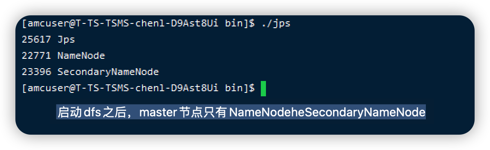
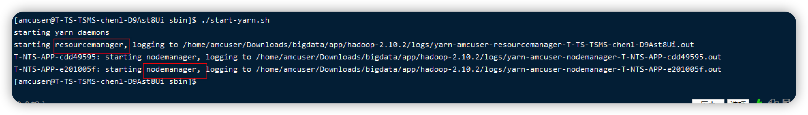
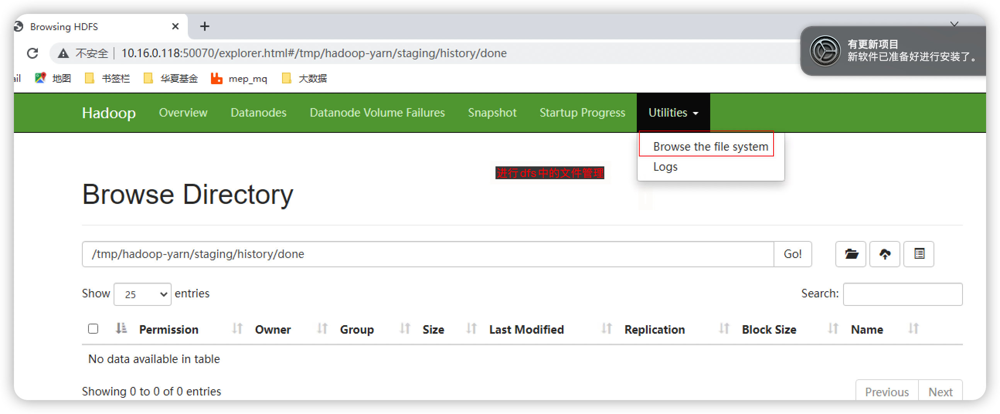

# Hadoop完全分布式模式即集群模式安装

## 安装前准备

hadoop： hadoop 2.10.2

jdk：openJDK11


## 安装规划

Hadoop集群安装在Linux操作系统 ,JDK使用OpenJDK11 。

| ip          | 说明   | 备注                |
| ----------- | ------ | ------------------- |
| 10.16.0.118 | master | centOS7(Maipo)<br/> |
| 10.16.4.7   | slave  | centOS7(Maipo)      |
| 10.16.4.8   | slave  | centOS7(Maipo)      |
|             |        |                     |


## 安装

### 安装JDK


### 配置SSH免密登陆

配置 /etc/hosts 文件

1. 编辑所有机器的/etc/hosts ，配置主机名和ip的对应关系

```shell
## 先执行如下命令修改/etc/hosts 文件的访问权限
$> sudo chmod 777 /etc/hosts
## 再编辑 /etc/hosts 文件，在文件中添加ip 和对应主机名的对应关系
## 接着恢复 /etc/hosts文件的访问权限
$> sudo chmod 644 /etc/hosts
```

2. 分别在多台机器上面分别执行如下命令：

```shell
$> ssh-keygen -t rsa -b 4096 -C "hadoop@abc.com"
# 上面的命令可以简化为 ssh-keygen  -t rsa
```

3. 在master节点：执行 如下命令将master节点的ssh公钥，上传到要登陆的目标机器

```shell
$> ssh-copy-id -i 目标机器的用户名@主机名或ip地址
```

​		在执行过程中，需要输入目标主机的登陆密码

​		执行成功后，在目标主机的 /home/userName/.ssh/authorized_keys 文件中，就有了master节点机器所生成的公钥。 

​		依次在其他的slave节点执行ssh-copy-id -i 命令。 

### 安装hadoop

将下载好的hadoop压缩文件，解压。 

解压之后，将hadoop的默认配置文件通过如下的zip命令进行压缩

```shell
# 这了的HADOOP_BASE是hadoop安装的基本路径. 这了的-r 表示递归进行压缩，可以保证路径下所有文件都被压缩
$> zip  -r  $HADOOP_BASE/etc/hadoop/ hadoop.zip
```

### 修改配置文件

完全分布式模式需要修改 /usr/local/hadoop/etc/hadoop 中五个配置文件 

* slavese
*  core-site.xml
*  hdfs-site.xml
*  mapped-site.xml
*  yarn-site.xml 

这里仅配置了正常启动必需的配置项。 

#### 配置slaves文件

配置那些机器作为slave节点。 

如果保留localhost，则Master节点同时作为NameNode和DataNode

#### 配置core-site.xml

```xml
<configuration>
  <property>
		<name>fs.defaultFS</name>
    <value>hdfs://Master:9000</value>
  </property>
  <property>
  	<name>hadoop.tmp.dir</name>
    <value>file:/home/amcuser/Downloads/bigdata/hadoop/data/tmp</value>
    <description>Abase for other tempory directories</description>
  </property>
</configuration>
```

#### 配置hdfs-site.xml 文件

```xml
<configuration>
	<property>
  	<name>dfs.namenode.secondary.http-address</name>
    <value>Master:50090</value>
  </property>
  <property>
  	<name>dfs.replication</name>
    <value>2</value>
  </property>
  <property>
  	<name>dfs.namenode.name.dir</name>
    <value>file:/home/amcuser/Downloads/bigdata/hadoop/data/tmp/name</value>
  </property>
  <property>
  	<name>dfs.datanode.name.dir</name>
		<value>file:/home/amcuser/Downloads/bigdata/hadoop/data/tmp/data</value>
  </property>
</configuration>
```

#### 配置mapred-site.xml

将mapred-site.xml.template 进行重命名

```xml
<configuration>
  <property>
  	<name>mapreduce.framework.name</name>
    <value>yarn</value>
  </property>
  <property>
  	<name>mapreduce.jobhistory.address</name>
    <value>Master:10020</value>
  </property>
  <property>
  	<name>mapreduce.jobhistory.webpap.address</name>
    <value>Master:19888</value>
  </property>
</configuration>
```

#### 配置yarn-site.xml

```xml
<configuration>
	<property>
  	<name>yarn.resourcemanager.hostname</name>
    <!--master 节点的主机名 -->
    <value>Master</value>
  </property>
  <property>
  	<name>yarn.nodeanager.aux-services</name>
    <value>mapreduce_shuffle</value>
  </property>
</configuration>
```

注意：上面说的5个配置文件，需要在所有部署hadoop的机器上进行配置

注意：在所有的hadoop机器上，都要安装并配置好JAVA_HOME，否则hadoop的某些功能可能会启动报错。 


## 启动

首次启动Hadoop时需要先在Master节点格式化NameNode

```shell
$> hdfs namenode -format
```

接着，在master节点上启动hadoop

```shell
$> start-dfs.sh
$> start-yarn.sh
$> mr-jobhistory-daemon.sh start historyserver
```

通过访问yarn的web页面可以看到作业执行情况。 

执行 start-dfs.sh 的相关日志




在完全分布式集群中，dfs启动之后 hadoop的master节点，只运行 NameNode和SecondaryNameNode两个进程，不再运行DataNode，DateNode被分配到slave节点上运行了。 


start-yarn.sh 命令运行



运行start-yarn.sh 从日志中，可以看到，在master节点会运行 resourcemanager，而在slave节点运行 nodemanager。 


运行 mr-jobhistory-daemon.sh start historyserver

只会在master节点运行 JobHistoryServer。 


通过网页管理dfs：



通过http://master:50070 下的 Utilities 下面的browse the file system 来查看dfs上的文件。并且进行简单的管理。 


| 日期       | 类型 | 说明                                                         |
| ---------- | ---- | ------------------------------------------------------------ |
| 2022-08-03 | 新增 | 新增Hadoop完全分布式模式的安装步骤                           |
| 2022-08-27 | 完善 | 动手在三台机器上进行了相关的操作，可以顺利搭建好hadoop完全分布式集群 |
|            |      |                                                              |

