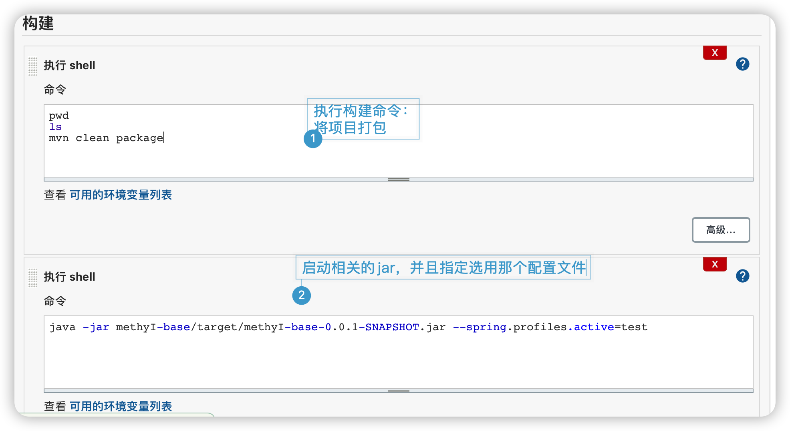

# Jenkins的使用

## 安装

### Mac系统安装

通过brew命令进行管理 

* 安装Jenkins的稳定版本： brew install jenkins-lts

* 启动安装的Jenkins稳定版 brew services start jenkins-lts
* 重启Jenkins稳定版： brew services  restart jenkins-lts
* 更新Jenkins的版本： brew upgrade jenkins-lts

### 通用安装

从如下地址

https://www.jenkins.io/download/ 

下载最新的jenkins的war包。

之后通过 java -jar jenkins.war  命令来启动Jenkins


### Jenkins 忘记密码

进入 Jenkins主目录，备份 config.xml 

修改config.xml 文件

找到关键字 usesecurity，把取值true设置为false。 

重启jenkins。

mac下重启jenkins的命令如下：

```shell
$> brew services restart jenkins-lts
```

之后，就可以无账号和密码登录Jenkins了。 


## 修改Mac系统下Jenkins开机自启的一些参数


修改 /Users/lpf/Library/LaunchAgents 路径下，homebrew.mxcl.jenkins-lts.plist 文件中的参数，相关内容如下。


其他图示：


## Jenkins的使用

### 微服务项目

1. 首先在主页面创建一个视图，用于管理多个构建任务

   如下图：

   


1. 创建好视图之后，可以对创建任务

   

   

   

   

   

   

   

   

   

   

   

   

   **General**

   

   

   

   

​				**源码管理**

​	


​			   **构建触发器**

​				**构建环境**

​				**构建**





​				**构建后操作**


## 不足之处

1. mac系统下通过brew 没有卸载的操作
2. 


