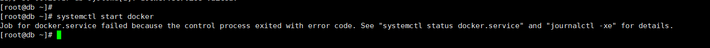
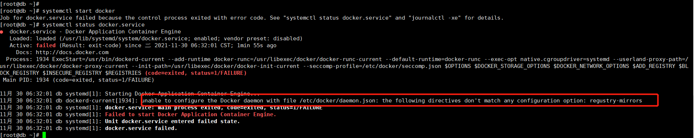

# Docker的安装与运维

## 安装

### Centos7 系统安装Docker


## 遇到的问题

* docker启动的时候报错

  docker 设置开机自启后，通过systemclt start docker 启动docker启动失败。 

  Job for docker.service failed because the control process exited with error code. See "systemctl status docker.service" and "journalctl -xe" for details.

  

​	

​	具体错误如下



通过日志分析，发现是docker的镜像仓库的地址不对。需要调整。

修改/etc/docker/daemon.json，内容如下

```json
{
  "registry-mirrors": [
    "https://registry.docker-cn.com",
    "http://hub-nmirror.c.163.com",
    "https://docker.mirrors.ustc.edu.cn"
  ]
}
```

修改配置文件后，重启执行如下命令

```shell
$> sudo systemctl daemon-reload
$> sudo systemctl restart docker
```

