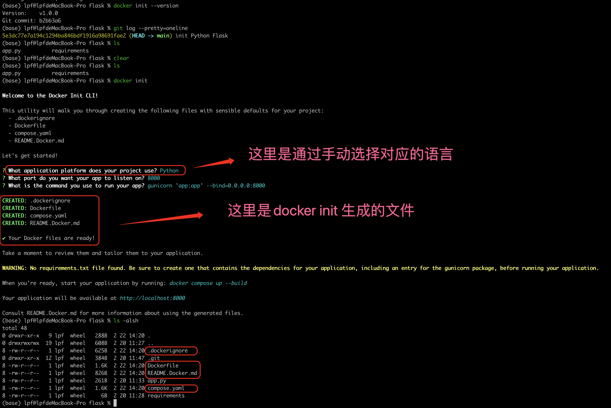
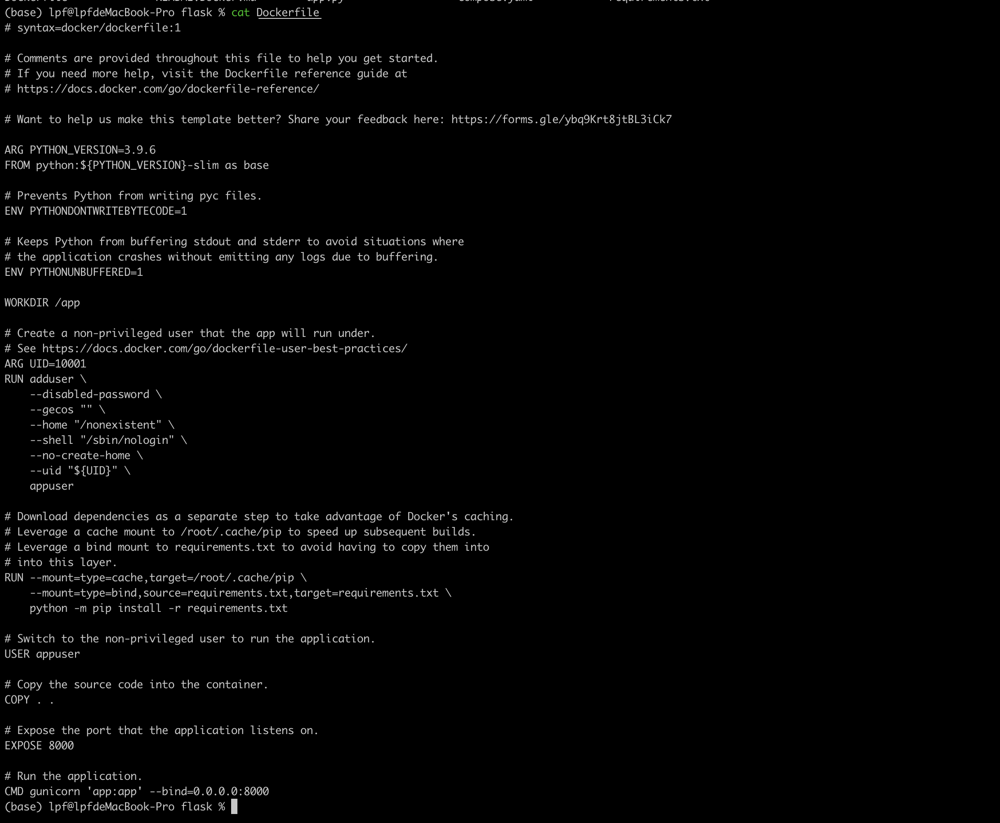
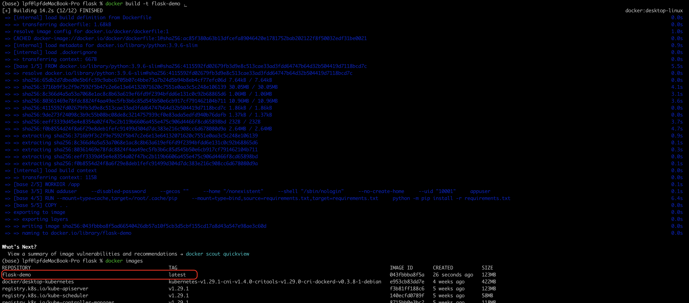

# Docker CLI 

参考资料： https://docs.docker.com/reference/cli/docker/ 

## docker init

docker init: Creates Docker-related starter files for your project.  

使用docker init  ， 不再需要手动编写 Dockerfile 文件, 可以很大的提高工作效率。减轻编写 Dockerfile 文件的复杂度。 

Docker ClI 支持为 ASP.NET, Go, Java, Node, PHP, Python, Rust 编程语言生成默认的docker 相关的文件




**.dockerignore 文件**： You can use `.dockerignore` file to exclude files and directories from the build context 

**Dockerfile**:   Docker can build images automatically by reading the instructions from a Dockerfile

**Compose.yaml** : Docker Compose relies on a YAML configuration file, usually named `compose.yaml` 


生成的dockerfile文件的内容如下：




之后利用如下命令来生成对应的镜像文件

```shell
$> docker build -t flask-demo .
```




利用docker init 生成的 Dockerfile 文件还需要根据时间情况进行调整， 才能保证生成的镜像文件可以正常生成容器来运行。 