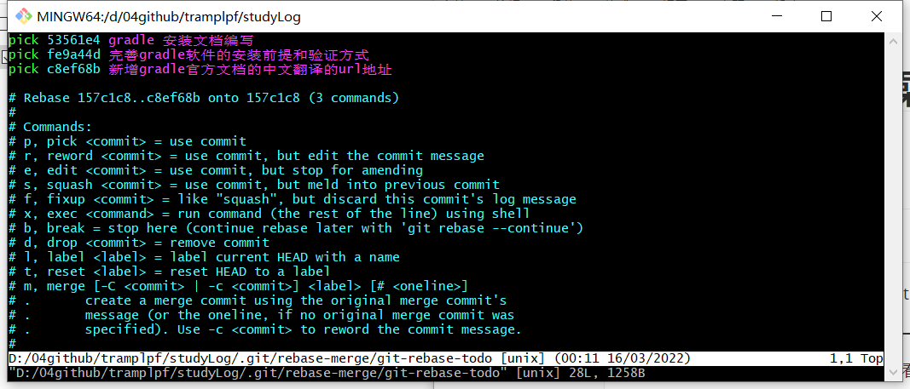
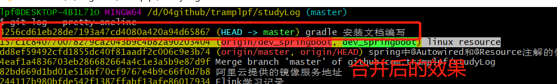
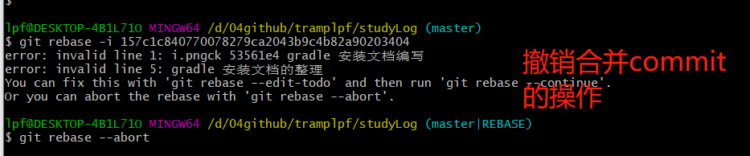

# Git常用的一些操作

[TOC]


## 常用的命令

通过git 命令查看配置列表：
    git config --list

通过 git 命令设置系统上登录github的用户名和邮箱
    git config  --global user.name
    git config --global user.email 'y邮箱名'  ## 这里的邮箱名其实就是密码

将系统中，某个文件夹设置成git的本地仓库
    $ cd  gitRepo   #切换到 gitRepo 目录
    $ git init   # 将文件夹设置成仓库，此时在目录下，会出现一个 .git 目录

将文件保存到本地仓库中，也就是所谓的暂存区
    $ git add 文件名   # 将文件保存到电脑上的暂存区

 版本的回退：
    修改文件后，将文件保存到本地仓库    $：git add  文件名
    查看提交记录   $ git log
    版本回退：  $ git reset --hard HEAD^    这个命令是回退到上一个版本
                $ git  reset --hard  版本号  回退到某个版本号(版本号头几位就行)

  与远程仓库连接： ssh方式连接或者  用户名/密码


    在实际工作中，项目可能需要几周才能完成， 每天只能写部分代码，如果立刻提交，则代码并没有写完，别人也不能用。
    如果等代码写完再提交，又有丢失每天进度的风险。则可以新建一个属于自己的分支，别人看不到，等代码写完，一次性合并到原来的分支上。
输入 git checkout -b dev 命令行，创建好一个dev开支。然后输入 git branch查看现有的分支
    如果项目已经完成，可以输入 git branch  -d dev 来删除 dev 分支


然后输入git merge dev 把dev分支合并到master分支


## 常做的一些操作

### 合并多个commit为一个commit

```shell
$> git rebase -i commitId
```

上面的命令可以压缩合并多次提交。 

格式：

```shell
$> rebase -i [startpoint] [endpoint]
```

这里的-i 的意思是 --interactive，即弹出交互式的界面让用户编辑完成合并操作。 [startpoint] [endpoint]指定了一个编辑区间，如果不指定[endpoint],则该区间的终点默认是当前分支HEAD所指向的commit （注意：这里的区间是一个前开后闭的区间）。 


```
// 合并从当前head到15f745b(commit id)
git rebase -i 15f745b
或:
// 合并最近的两次提交
git rebase -i HEAD~2
```


执行这个命令后会跳到一个vi编辑器
里面的提示有：
pick：保留该commit（缩写:p）
reword：保留该commit，但我需要修改该commit的注释（缩写:r）
edit：保留该commit, 但我要停下来修改该提交(不仅仅修改注释)（缩写:e）
squash：将该commit和前一个commit合并（缩写:s）
fixup：将该commit和前一个commit合并，但我不要保留该提交的注释信息（缩写:f）
exec：执行shell命令（缩写:x）
drop：我要丢弃该commit（缩写:d）


**git rebase -i HEAD~2** 这里的 HEAD~2 表示合并最近两次的提交, 如果想合并最近三次的提交修改为: **git rebase -i HEAD~3**


需要做的是，**将第二行的 pick 改为 s**, “s” 为 “squash” 的缩写,“squash” 的意思是将这个提交压缩为最后一次提交


**操作**：

通过git log  --pretty=oneline 来查看提交记录，显示效果如下


这里要将前三个commit 合并为一个commit，并且修改提交信息。 

执行如下的命令

```shell
$> git rebase -i HEAD~3
```

该命令会将最新的三个commit合并为一个commit

执行后弹出如下交互界面：



接下来，输入i，使得vim进入编辑模式，将第三个pick 修改为s ,然后按ESC， 之后输入:wq 来保存自己的修改。


之后会再次弹出一个交互界面，在该交互界面中，输入你要修改的comit 信息


执行完之后，效果如下




如果在执行合并策略的时候，编辑错误的话，可以通过git rebase --abord 来撤销自己的操作。 




### 分支相关的命令

* git 删除远程分支    

```shell
$> git push origin --delete [branch_name]
```


## 未分类

使用git 命令对config 进行CRUD操作：
增加：
    git config --levenName --add configName configValue
    $:  git config --global --add user.name=用户名
    可以为一个变量可以有多个不同的值。 比如 user.name
删除：
    git config --global --unset configName  (只针对存在唯一值的情况)

查询：
    git config --system --list   # 查询系统级config
    git config --global --list   # 查看全局级 config
    git config --local  --list   #查看仓库级 config
    git config --list  # 查看当前生效的配置
     git config configName  #查询实际生效的配置值
    git config --levelName configName   # 查询指定级别下： 实际生效的配置值
    git config --get configName  # 查询实际生效的配置值  （？？？？不懂）
    git config --list --levelName  # 查询指定级别下： 所有的配置（包括不生效的）

    获取一个配置项：
        git config [-local| -global | -system] -get section.key (默认是获取local配置的内容)
            如果获取一个section不存在的key值，不会返回任何值  section不存在
            如果获取一个不存在section的key值，则会报错。       section存在，但是它的key不存在。


修改：
    git config --levelName  configName configValue  (只针对唯一量)

     当要修改的变量，有多个不同的取值的时候，可以通过 添加  --replace-all 或者  --add 参数来进行批量修改


编辑： 通过 --edit   （-e） 参数来进行编辑
    格式： git config [-local|-global|-system] -e
    执行这个命令的时候，git会用配置文件中设定的编辑器打开配置文件
    编辑仓库级config： git config  -local -e,  与 -list 参数不同的是，git config -e 默认是编辑仓库级的配置文件
    编辑全局级的config ： git config --global -e
    编辑系统级config:  git config  --system -e


背景知识： git里面一共有3个配置文件， 首先是： 仓库级配置文件，该文件位于当前仓库下， 路径 .git/, 文件名为 config
第二个文件是全局级配置文件，位于用户目录下，在C：\user\
最后是系统级配置文件： 位于本地git 安装目录下。 (具体的位置，根据版本的不同，有一定的区别)
    上述配置文件的权重是： 仓库 >  全局  > 系统  分别对应  --local   --global --system


## Git相关的词汇

暂存区 : 为了可以减少和github上代码的交互。
tag  ： 不清楚它的目的
patch : 不知道这个补丁是干什么的？？

合并 ： merge 

变基：
衍合：


参考资料：

github 官网介绍  https://docs.github.com/en/get-started

