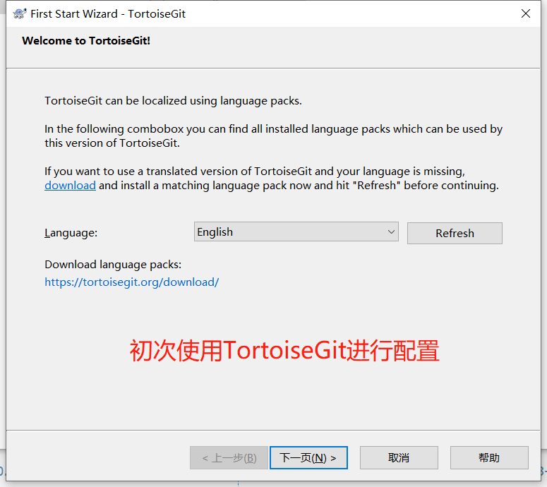

# Git图形界面工具的安装和使用

Git 我推荐使用的图形界面工具是  tortoisegit， 可以从它的官方 https://tortoisegit.org/ 下载最新的版本。 

使用这个图形界面的原因是因为git图形界面，进行图形界面操作的时候，会提示相关的底层命令，这样有助于自己对Git的深入学习。 

软件

* TortoiseGit-2.14.0.1-64bit.msi

## 安装

###  规划

安装在 D:\01software\Git\tortoisegit  目录下，和Git基本软件安装在一起。  

 其中 D:\01software\Git\GIT下安装的是git的基本软件。 

### 安装

**安装 TortoiseGit，必须先安装完成 git并将其配置好。**

软件的信息

#### 1. 配置信息的配置

1. 双击软件安装包

阅读软件使用协议来了解大概的约束信息。 

选择一种ssh客户端软件

选择好ssh客户端之后，依然可以在安装好之后，进行调整。 如下图(安装好后可配置)

选择项目--右键--settings： 

修改软件的安装路径，和上面规划的安装路径保持一致

#### 2. 准备安装

​     已经将相关的changelog保存到该文档的同级目录下。 相关的changelog 也可以在软件安装后的目录下找到。 

#### 3. 初次使用时的配置

 

通过这个页面我们在tortoise官网找到了一些官方文档(PDF版本)，放在该文档的同级目录下。 

**注意：** 使用的时候，需要在空白区域移动鼠标，否则会卡主不动

### 验证

验证软件是否安装成功。 

在桌面 右键 查看，如果出现如下效果，则说明安装成功。 

如果出现了 Git Clone ，Git Create repository here， TortoiseGit 则说明安装成功。 

更新代码

## 配置

如果希望使用putty的ssh客户端，则需要配置对应的ppk秘钥，使用puttygen来进行配置。

如果直接使用git自带的ssh客户端，则直接使用ssh-keygen 来生成秘钥就可以。 

## 帮助文档

tortossegit 官方提供的帮助连接  https://tortoisegit.org/support/

