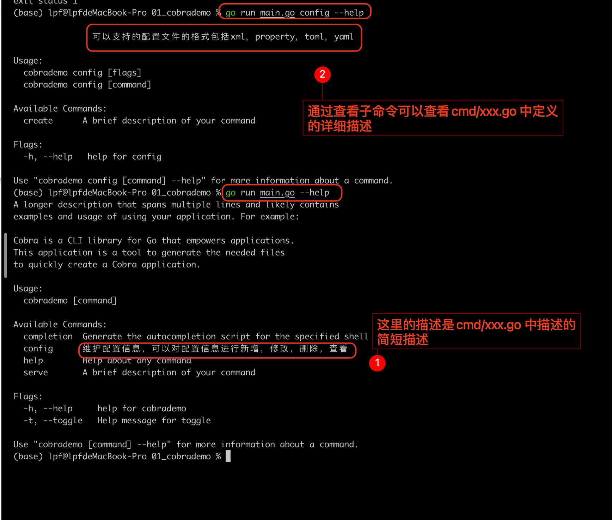

# 使用 cobra-cli 搭建 go 语言版的命令后工具

## cobra-cli 使用

安装 cobra-cli，并且使用该工具搭建一个 go 语言版的命令行项目

``


相关的命令如下：

```shell
# 安装 cobra-cli
$>  go install github.com/spf13/cobra-cli@latest
# 创建一个应用
$> mkdir myapp && cd myapp
# 初始化 go mod
$> go mod init myapp
# 使用 cobra-cli 搭建手脚架
$> cobra-cli init
```

这里要注意：新创建的命令相关的代码位于 cmd 目录下，且文件名和命令名一致

使用 cobra-cli 新增命令
``

相关命令如下：

```shell
$ > cobra-cli add XXX
```

查看新增的命令
``

相关命令如下：

```shell
$ > go run main.go
```

为命令新增子命令
``

相关命令如下：

```shell
# 为命令新增子命令，这里-p 指定父命令
$ > cobra-cli add xxx -p  "xxxCmd"
```

新增子命令对应文件内容如下，在 func init() 方法中，通过 xxx.AddCommand(xxx) 定义了命令之间的父子关系
如下图， configCmd.AddCommand(createCmd), 说明，configCmd 是 createCmd 的父命令
``

查看子命令的相关信息
``



安装该项目到系统，并且通过二进制文件执行对应的命令
``

## 参考资料

cobra-cli 的 github 地址： https://github.com/spf13/cobra-cli

cobra 的 github 地址： https://github.com/spf13/cobra

cobra-cli 使用说明： https://zhuanlan.zhihu.com/p/584711857?utm_campaign=shareopn&utm_medium=social&utm_oi=1659316067334934528&utm_psn=1745725048126844928&utm_source=wechat_session

## 操作记录

| 日期       | 操作类型 |                            操作内容 |
| :--------- | :------: | ----------------------------------: |
| 2024-02-27 |   新增   | 使用 cobra-cli 搭建命令行项目的过程 |
| 日期       |  文本 5  |                              文本 6 |
