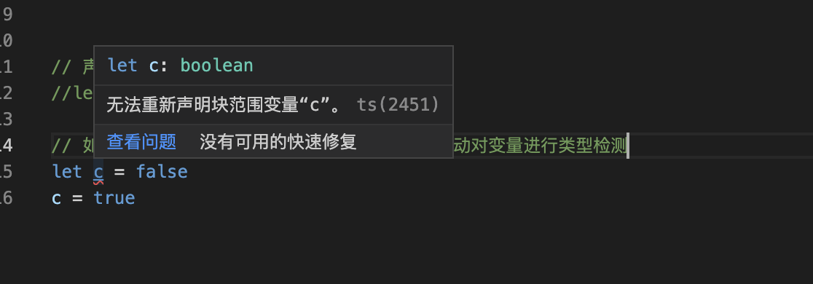

# Typescript学习

## 概念

TypeScript是什么

* 以Javascript为基础构建的语言
* 可以在任何支持JavaScript的平台中执行
* 一个JavaScript的超集
* TypeScript扩展了JavaScript并添加了类型。

TS经过编译后可以转换为JS，可以在目前主流的浏览器上面运行。 目前TS还不能直接在主流浏览器上面运行。 


TypeScript增加了什么

* 类型
* 支持ES的新特性
* 强大的开发工具
* 添加ES不具备的新特性
* 丰富的配置选项


## TypeScript开发环境搭建

1. 下载Node

2. 安装node.js

3. 使用npm全局安装typescript

   ```shell
   $> npm install -g typescript
   # 查看typescript编译器tsc的版本
   $> tsc --version
   可以查看版本，说明tsc安装成功了
   ```

4. 创建一个ts文件

```shell
1. 创建一个ts文件 hello.ts， 文件后缀是ts
2. 在hello.ts文件中添加如下内容：
		console.info("Hello TS");
3. 使用tsc编译器对ts文件进行编译得到js文件
$> tsc hello.ts 
	 如果没有语法错误的情况下，会生成一个相同名称，以js结尾的文件
4. 
```

1. 使用tsc对ts文件进行编译
   * 进入命令后
   * 进入ts文件所在目录
   * 执行命令 tsc xxx.ts


## 基本类型

* 类型声明

  * 类型声明是TS非常重要的一个特性

  * 通过类型声明可以指定TS中变量（参数，形参）的类型

  * 指定类型后，当为变量赋值时，TS编译器会自动检查值是否符合类型声明，符合则赋值，否则报错

  * 简而言之，类型声明给变量设置了类型，使得变量智能存储某种类型的值

  * 语法

    ```text
    let 变量: 类型
    let 变量：类型 = 值
    function fn(参数：类型， 参数：类型)：类型 {
    
    }
    ```

* 自动类型判断

  * TS拥有自动的类型判断机制
  * 当对变量的声明和赋值是同时进行的，TS编译器会自动判断变量的类型
  * 所以如果你的变量的声明和赋值时同时进行的，可以省略类型声明

* 类型

  | 类型    | 例子              | 说明                           |
  | ------- | ----------------- | ------------------------------ |
  | number  | 1，-33，2.5       | 任意数字                       |
  | string  | 'hi','HI'         | 任意字符串                     |
  | boolean | true，false       | 布尔值true或false              |
  | 字面量  | 其本身            | 限制变量的值就是该字面量的值   |
  | any     | *                 | 任意类型                       |
  | unknown | *                 | 类型安全的any                  |
  | void    | 空值（undefined） | 没有值（或undefined）          |
  | never   | 没有值            | 不能是任何值                   |
  | object  | {name:'章三'}     | 任意的JS对象                   |
  | array   | [1,2,3]           | 任意JS数组                     |
  | tuple   | [4,5]             | 元素，TS新增类型，固定长度数组 |
  | enum    | enum{A,B}         | 枚举，TS中新增类型             |

  


## 遇到的问题

1. 在使用[vscode](https://so.csdn.net/so/search?q=vscode&spm=1001.2101.3001.7020)编写ts是，编写完成之后，使用tes 文件名.ts之后，就会看到变量名下面出现了红色的波浪线，提示的内容是无法重新声明块范围变量。

   

   解决方法：**只需要使用tsc --init生成tsconfig.json文件就可以解决了**。


