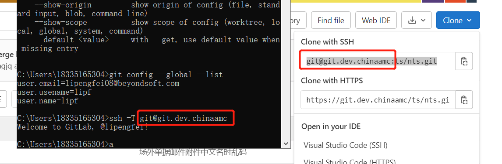
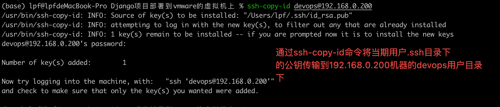

# SSH相关命令


```shell
$> ssh -T git@github.com
```

此条命令是查看主机是否与[github](https://so.csdn.net/so/search?q=github&spm=1001.2101.3001.7020)网站之间的ssh通信是否连接成功




```shell
$> ssh-copy-id 远程主机
$> ssh-copy-id  xxx@192.168.2.31

$> ssh-copy-id -n xxx
只做测试，不实际替换
```

ssh-copy-id 可以把本地主机的公钥复制到远程主机的 authorized_keys 文件上。ssh-copy-id 也会给远程主机的用户主目录（home）和 ~/.ssh 和 ~/.ssh/authorized_keys 设置合适的权限。


