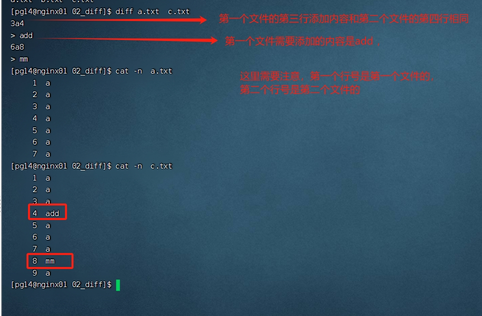
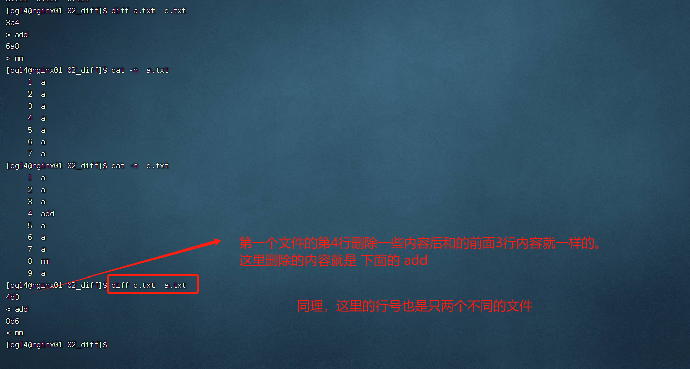
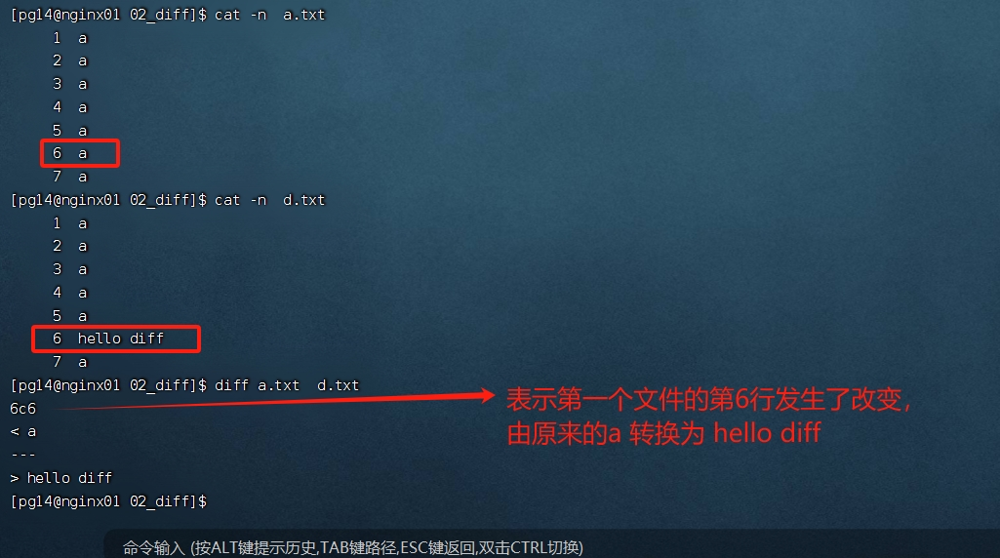
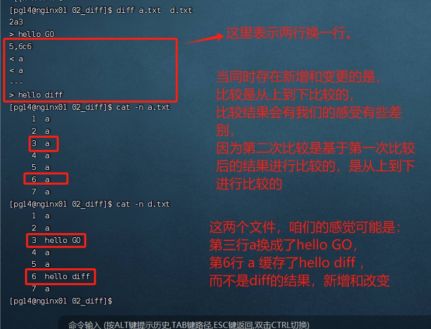
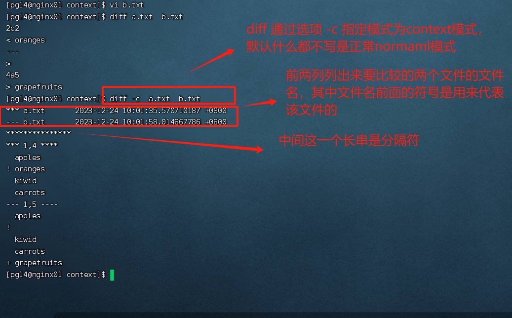
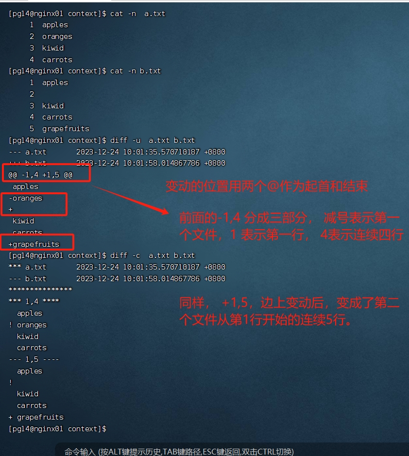

# Linux下对文件进行比较

## diff命令

Linux diff (difference)  命令用于比较文件的差异。 

diff以逐行的方式，比较文本文件的异同处。 如果要指定比较目录，则diff会比较目录中相同文件名的文件，但不会比较其中子目录。 

### normal模式

按照计算机的思维，一行一行的比较。 结果稍微有点难理解。 

场景一： 第二个文件比第一个文件内容多

场景二： 第二个文件比第一个文件内容少

**场景三： 同一行内容发生改变**

**场景： 同时存在内容新增以及内容修改**

### context模式

上下文模式使用方法加入 c 参数(代表 context)： diff -c  f1    f2

在比较结果中，文件内容的每一行最前面，都有一个标记为，如果为空，表示改行无变化

如果是感叹号(!), 表示该行有改动

如果是减号(-), 表示该行被删除

如果是加号(+), 表示该行行为新增

### Unified模式

合并格式的diff。 

使用命令行 -u来执行 unified模式得到比较，其比较结果与Context模式很相似，但是简化了一些输出。 

## GIT命令的diff 

类似于unified模式

