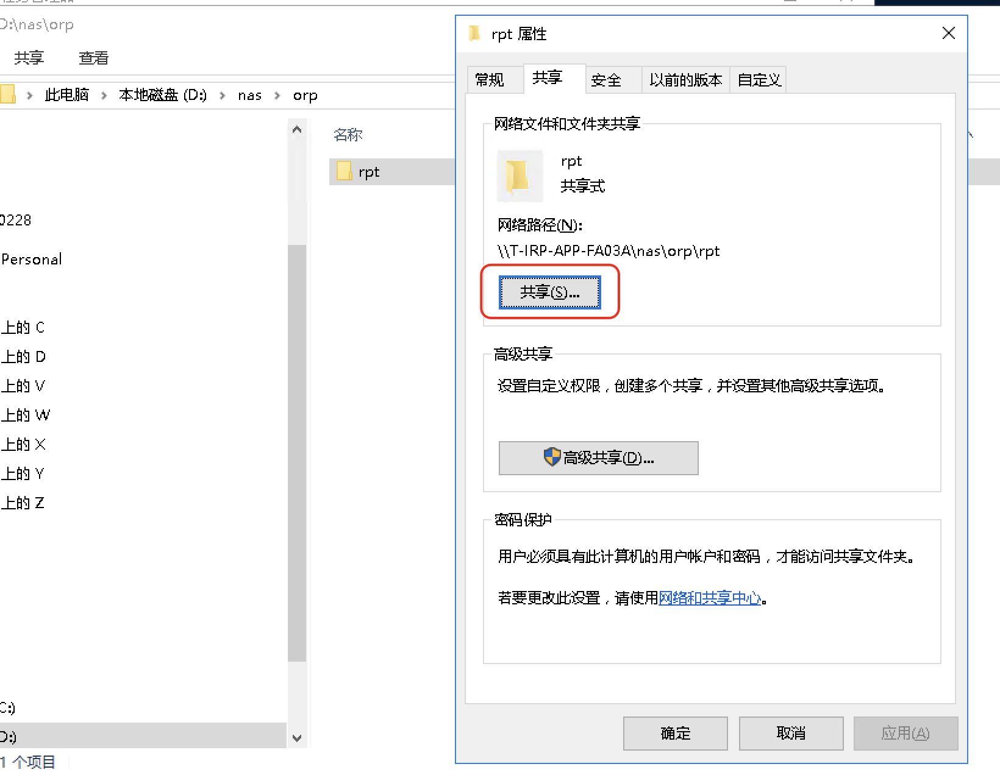
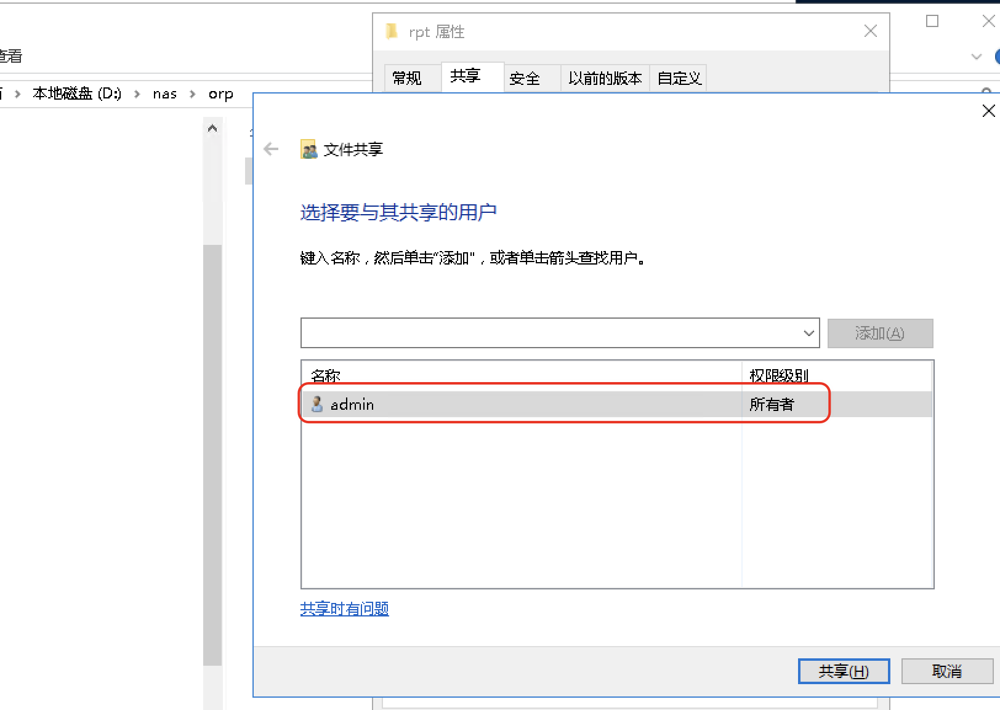
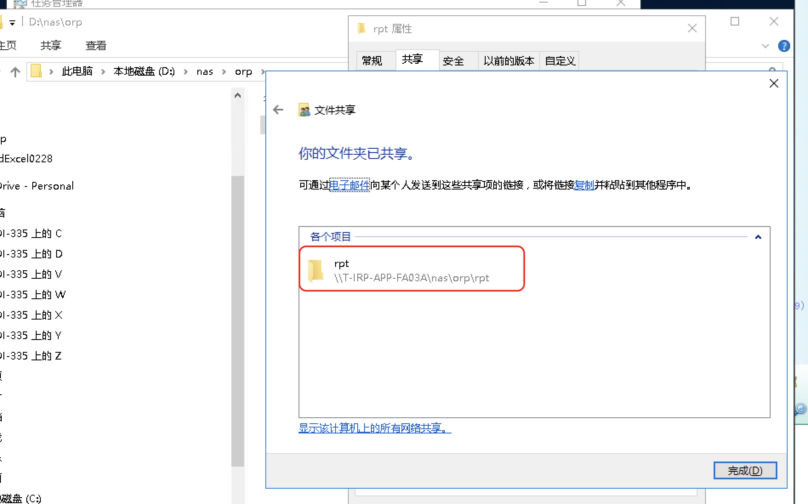
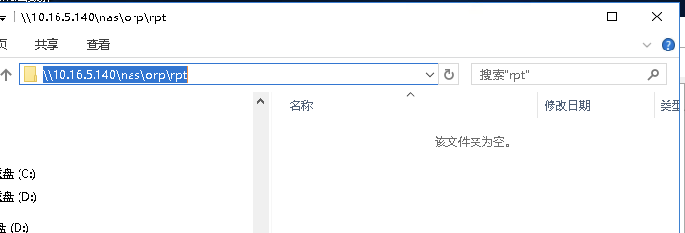
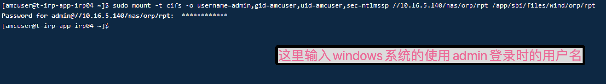
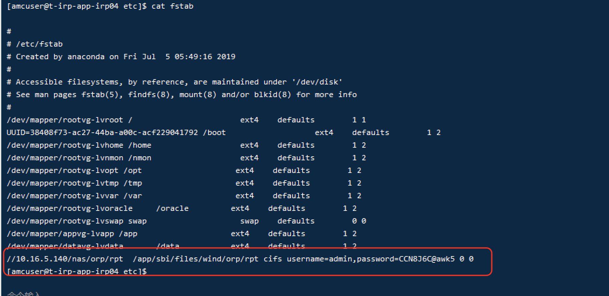

# Linux系统挂载磁盘


## Linux系统挂载windows共享盘

### windows系统设置共享盘

1. 选中要共享的文件夹，右键选择属性

2. 在属性面板，选择[共享]tab 页签，点击共享按钮。如下图

   

3. 在新打开的页面指定共享的用户，后续linux挂载的时候，需要输入该用户以及对应的密码，如图

   

4. 点击共享，之后就共享成功

   

5. 验证文件夹是否共享成功，登录windows机器的ip，例如

   

		6. 验证具体的共享地址		


### 	Linux挂载windows共享盘

   1. 明确要在Linux的哪个目录下挂载共享盘，创建路径，并且切换到其他路径，

   2. 执行linux命令进行挂载

      

​		相关的命令如下：

```shell
$>sudo mount -t cifs -o username=admin,gid=amcusr,uid=amcuser, sec=ntlmssp //10.16.5.140/nas/orp/rpt /app/sbi/files/wind/orp/rpt 

输入密码： CCN8J6C@awk5
```

​      到此，配置完成。  这种配置方式是临时挂载，linux重启后，会失效，还需要重新挂载。 

  优化方法是：编辑/etc/fstab 文件 .内容如下，不过如果fstab编辑错误的话，Linux会启动不起来。 （因此谨慎进行编辑）




编辑之后，通过如下命令验证是否编辑成功

```shell
$> sudo mount -a 
```

这个命令会尝试挂载 fstab 文件中列出的所有文件系统Q。如果 fstab 文件中的条目有任何错误，该命令将会报错并显示相应的错误信息

