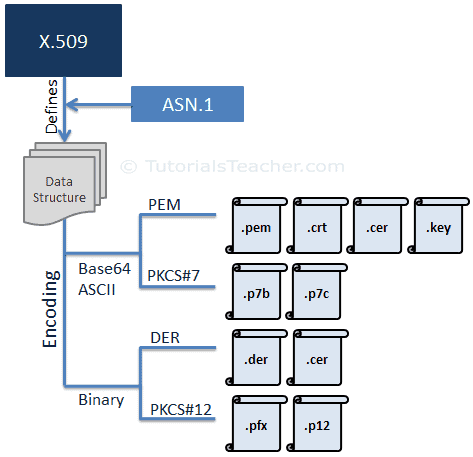
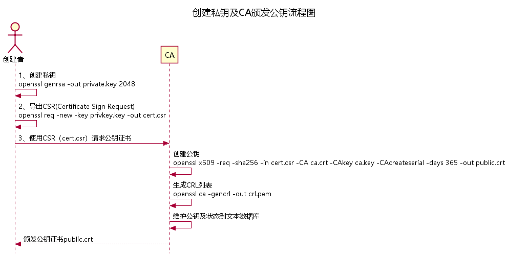

# SSL基础知识

SSL: （Secure Socket Layer）安全套接层，ssl是一套安全协议，被应用层调用，当http调用ssl协议时被称为https，当ftp调用ssl协议时被称为sftp


x本质上SSL证书是一个X.509 证书，是定义证书数据结构的标准。

在X.509 标准下，包括Base64 ASCII 文本与二进制两种文件存储方式，根据使用的格式和编码，证书文件具有不同的扩展名。 


**X.509 主流证书的编码格式和文件扩展名**



对于Nginx和Tomcat 最常使用的是PEM（nginx）与PKCS#12 (Tomcat),除此之外，Tomcat还支持基于JDK keytool 加密的JKS格式。 


## 文件格式

### PEM格式

pem文件可以在单个文件中包含<font color="red">服务器证书</font> ，<font color="blue">中间证书</font>和<font color="green">私钥</font>（不包含公钥）。服务器证书和中国证书也可以放在单独的.crt或者.cer 文件中，私钥可以放在.key 文件中。 

### PKCS#7 

PKCS#7 格式是一种“加密消息语法标准”。 PCKS#7 证书使用Base64 ASCII编码，文件扩展名为 .p7b 或者 .p7c，这种格式只能存储证书，不能存储私钥。一般主要来做数字信封。 

### DER格式

DER证书采用二进制格式，只包含证书信息，不包含私钥。文件扩展名为 .der 或 .cer.  这些证书主要用于Java Web 服务器。 

### PKCS#12

PKCS#12证书采用二进制格式，文件扩展名为 `.pfx` 或 `.p12`，支持将 `服务器证书`、`中间证书` 和 `私钥` 存储在一个具有密码保护的文件中，主要用于Windows平台。


## SSL/TLS证书分类

SSL/TLS证书可以分为三种类型：

<font color="red">DV（域名验证）证书</font> : DV证书只验证域名所有权

<font color="blue">OV（组织验证）证书</font>: OV证书进行了更严格的身份验证

 <font color="green">EV（增强验证）证书</font>: EV证书则需要进行更加深入的身份验证，以确保所持有人的身份和组织的真实性。


## 自签发SSL证书与CA数字证书

通过openssl 生成自签发证书，自签发证书不薄啊汗CSR中国证书，直接生成公钥。自签发的证书在网络上不可信，但是内网测试与试验是可以的。

```shell
#生成RSA私钥
openssl genrsa -out private.key 2048
#自签发公钥
openssl req -new -x509 -key private.key -out public.pem -days 1095 #3年有效期
```

<font color="red">CA 数字证书</font>是由创建者提供 CSR（Centificate Signing Request）给CA机构签发下来的公钥. (用户创建公钥，CA颁发公钥的流程)




将此CSR交给 CA机构 ，由CA签名后获得公钥，使用公钥和私钥就可以部署 HTTPS 服务了。


## 注意点

申请SSL证书前，都需要先进行<font color="red">域名验证</font>，确保您拥有该域名的所有权或管理权


## 相关术语

CA：  数字证书颁发机构CA


 

## 参考资料

[SSL基础知识及Nginx/Tomcat配置SSL ](https://www.cnblogs.com/hellxz/p/15234125.html)

[学习HTTPS](https://www.tutorialsteacher.com/https)

[证书介绍](https://blog.csdn.net/u010674101/article/details/142464422)

[openssl制作ECC证书](https://baijiahao.baidu.com/s?id=1806898915198771221&wfr=spider&for=pc)

[OpenSSL生成p12、jks、crt等格式证书的命令个过程](https://blog.csdn.net/yongzhewunan/article/details/42168421)

[用WireShark简单看看SSL/TLS协议](https://cloud.tencent.com/developer/article/2010810)


