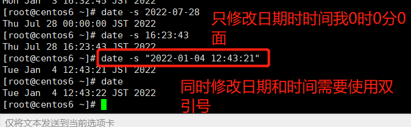
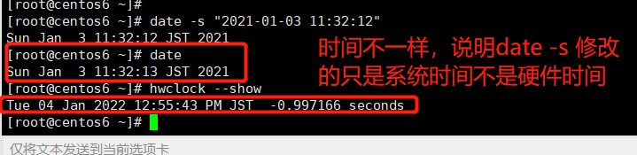
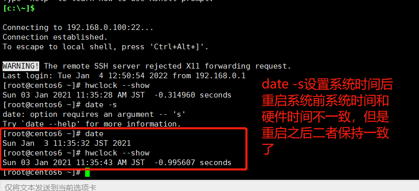
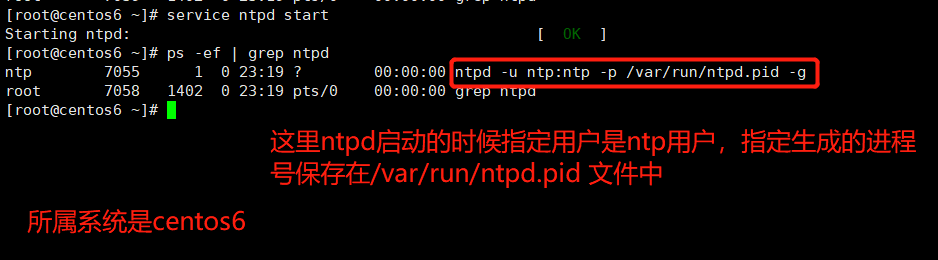

# Linux系统搭建NTP时间服务器

## 测试环境

操作系统：centos6/centos7 

## 介绍

### ntp:

NTP： Network Time Protocol 

NTP是linux系统上的时间服务器。

在Linux系统中，可以通过ntpdate 和ntpd 两种命令方式实现NTP时间同步。

* ntpdate 为断点更新。对于新的服务器，可以使用ntpdate同步时间
* ntpd为步进式地逐渐调整时间。对已经承载有运行中业务的实例，建议使用ntpd同步时间。

### 时区

CST是Chinese Standard Time，是我们通常所说的北京时间。它相当于UTC +8 时区

不管通过任何渠道我们想要同步系统的时间,通常提供方只会给出UTC+0的时间值而不会提供时区(因为它不知道你在哪里).所以当我们设置系统时间的时候,设置好时区是首先要做的工作.

### 时钟

在一台计算机上我们有两个时钟:一个称之为硬件时间时钟(RTC),还有一个称之为系统时钟(System Clock)

硬件时钟是指嵌在主板上的特殊的电路, 它的存在就是平时我们关机之后还可以计算时间的原因
系统时钟就是操作系统的kernel所用来计算时间的时钟. 它从1970年1月1日00:00:00 UTC时间到目前为止秒数总和的值 在Linux下系统时间在开机的时候会和硬件时间同步(synchronization),之后也就各自独立运行了


## 设置时区

在Linux下glibc提供了我们事先编译好的许多timezone文件, 他们就放在/usr/share/zoneinfo这个目录下,这里基本涵盖了大部分的国家和城市。 

* 删除系统本地的时区文件 /etc/localtime.
  * 注意：这里的localtime 不是一个文本文件，无法通过vim 查看其内容 
* 编辑 /etc/sysconfig/clock 

```text
Zone=Japan
```

* 将时区文件链接到 /etc/localtime

```shell
# cp /usr/share/zoneinfo/$主时区/$次时区 /etc/localtime 
# 这里有的时区不区分主次时区
$> ln -sf /usr/share/zoneinfo/Japan /etc/localtime
```

* 执行 hwclock -w 更新硬件时钟 (RTC)
* 执行reboot重启。(自己亲测，发现不需要重启)
* 执行命令 date -R 查看时区信息是否生效。
  * 执行date 命令可以查看当前时间
  * 执行 date -R 可以查看当前时区是基于UTC 偏移多少个时区


## 手动修改系统时钟和硬件时钟

### 通过date命令修改系统时钟

```shell
# 注意，这里执行这些命令是通过root账号执行的。
# 只修改日期
$> date -s 2022-07-28
# 执行修改时间
$> date -s 16:23:43
# 同时修改日期和时间。 （同时修改日期和时间需要使用双引号）
$> date -s  "2022-01-03 16:21:43"
```







这里： hwclock --show 显示系统的硬件时间。

这种情况下，重启系统后，再次查看系统时间和硬件时间发现二者的时间一样 了。和关机前的系统时间保持一致了。

**重新启动系统，硬件时间会读取系统时间同步，如果不重新启动的系统，要用hwclock或clock命令实现同步。**


这里注意：

下面的两个命令，都可以查看硬件时钟的时间和日期

```shell
# 查看硬件时钟
$> clock --show 
$> hwclock --show
```


### 通过hwclock修改硬件时钟

```shell
# 设置硬件时钟
$> hwclock --set --date="2022-07-28 21:00:00"
# 使用hwclock 也可以单独设置日期或者时间
```


### 硬件时钟和系统时钟

```shell
# 将硬件时钟的时间设置为系统时钟的时间
# hwclock --hctosys

# 反之，将系统时钟的时间，设置为硬件时钟的时间
# hwclock --systohc

# 通过hwclock 设置硬件时间
# hwclock --set --date "mm/dd/yy hh:mm:ss"

# 通过date 命令设置系统时间
# date -s "dd/mm/yyyy hh:mm:ss"
```


## 自动修改系统时钟和硬件时钟

要自动修改系统时间和硬件时钟，需要借助网络时间服务器(ntp)

### 安装ntp和ntpdate

这里需要注意，我们可以自己搭建ntp服务器也可以使用互联网上有名的ntp时间服务器。

如果本地安装ntp作为时间服务器，我们在客户端也同样需要安装ntp服务。同时参考的时间服务器指向我们自己搭建的时间服务器。 

```shell
# yum install ntp ntpdate -y 
```

### 修改配置

NTP建议我们为了保障时间的准确性,最少找两个个NTP Server

```shell
# 修改ntp的配置文件 /etc/ntp.conf ，修改之前先备份
# cp /etc/ntp.conf /etc/bak/ntp.conf.bak_日期
查找互联网上比较靠谱的时间服务器：在配置文件中，为server 指定其值,如下，采用阿里云的提供的时间服务器
server 	ntp.aliyun.com
```


### ntp服务常用命令

```shell
# centos6 中启动ntpd服务
$> service ntpd start
# centos6 中设置ntpd服务器开机自启
$> chkconfig ntpd on
# 查看ntp服务是否启动
$> ntpstat

```


centos6 下，执行命令ntpq -p可查看NTP服务对等端的列表信息；执行命令sudo chkconfig --list ntpd可查看NTP服务的运行级别。

### ntp安全设置

一些基本的安全设置还是很有必要的，如下

* 我们只允许局域网内一部分的用户连接到我们的服务器. 
* 这些client不能修改我们服务器上的时间

```ntp.conf
# 编辑 /etc/ntp.conf

# 对于默认的client拒绝所有的操作
restrict default kod nomodify notrap nopeer noquery
# 运行本机地址一切的操作
restrict 127.0.0.1
# 只允许局域网内的一部分用户连接到我们服务器
restrict 192.168.1.0 mask 255.255.255.0 nomodify
```


### 同步硬件时钟

NTP一般只会同步system clock，但是，如果我们也要同步系统时钟的话，只需要把下面的选项打开就可以了。

```shell
# vi /etc/sysconfig/ntpd 
SYNC_HWCLOCK=yes
```


## 验证

执行命令`ntpq -p`可查看NTP服务对等端的列表信息

```shell

$> ntpq -p 

通过date 命令查看linux系统同步后的时候，看看是否正确
$> date 
```


## 其它

### ntpdate和ntpd的区别

ntpd在实际同步时间时是一点点的校准过来时间的，最终把时间慢慢的校正对。而ntpdate不会考虑其他程序是否会阵痛，直接调整时间。
一个是校准时间，一个是调整时间。


时钟的跃变，有时候会导致很严重的问题。许多应用程序依赖连续的时钟??毕竟，这是一项常见的假定，即，取得的时间是线性的，一些操作，例如数据库事务，通常会地依赖这样的事实：时间不会往回跳跃。
不幸的是，ntpdate调整时间的方式就是我们所说的”跃变“：在获得一个时间之后，ntpdate使用settimeofday(2)设置系统时间，这有几个非常明显的问题：

第一，这样做不安全。ntpdate的设置依赖于ntp服务器的安全性，攻击者可以利用一些软件设计上的缺陷，拿下ntp服务器并令与其同步的服务器执行某些消耗性的任务。由于ntpdate采用的方式是跳变，跟随它的服务器无法知道是否发生了异常（时间不一样的时候，唯一的办法是以服务器为准）。

第二，这样做不精确。一旦ntp服务器宕机，跟随它的服务器也就会无法同步时间。与此不同，ntpd不仅能够校准计算机的时间，而且能够校准计算机的时钟。

第三，这样做不够优雅。由于是跳变，而不是使时间变快或变慢，依赖时序的程序会出错（例如，如果ntpdate发现你的时间快了，则可能会经历两个相同的时刻，对某些应用而言，这是致命的）。
因而，唯一一个可以令时间发生跳变的点，是计算机刚刚启动，但还没有启动很多服务的那个时候。其余的时候，理想的做法是使用ntpd来校准时钟，而不是调整计算机时钟上的时间。

```shell
# 更新系统时间(不会更新硬件时间)
$> ntpdate cn.pool.ntp.org
```


NTP服务器监听端口为123，支持的协议是UDP协议。

因此我们在生产中，需要开放相关的端口，具体操作如下：

```shell
# 编辑 /etc/sysconfig/iptables 添加如下内容
-A INPUT -m state --state NEW -m udp -p udp -dport 123 -j ACCEPT
```

在centos6 中重启 ntp 服务器：

```shell
# 在centos6中，修改了ntp的配置文件/etc/ntp.conf 文件之后重启ntp服务器
$>  /etc/init.d/nptd restart
```


## 参考资料

关于ntpd.conf 的帮助文档  

https://www.freebsd.org/cgi/man.cgi?query=ntp.conf&sektion=5 

ntp的官网： https://www.eecis.udel.edu/~mills/ntp/html/index.html


## 补充：

1. Centos6 中启动ntpd服务的命令




### 变更记录

| 日期       | 说明                                                         | 类型 |
| ---------- | ------------------------------------------------------------ | ---- |
| 2022-07-28 | 介绍了centos6中关于日期时间调整的方案，包括手动调整和自动调整两种方案 | A    |
|            |                                                              |      |
|            |                                                              |      |
|            |                                                              |      |
|            |                                                              |      |

​											**A: 新增 				  M：修改 			D：删除**

### 下一步要做的

* ntp服务防火墙相关开启(目前是直接将防火墙关闭)

  需要开启 UDP 123 端口

* 还没有很好的看到ntpd服务器逐步调整时间的效果

* 自己只是动手实践了关于ntpd作为客户端的操作，其作为服务端的配置还没有动手操作
