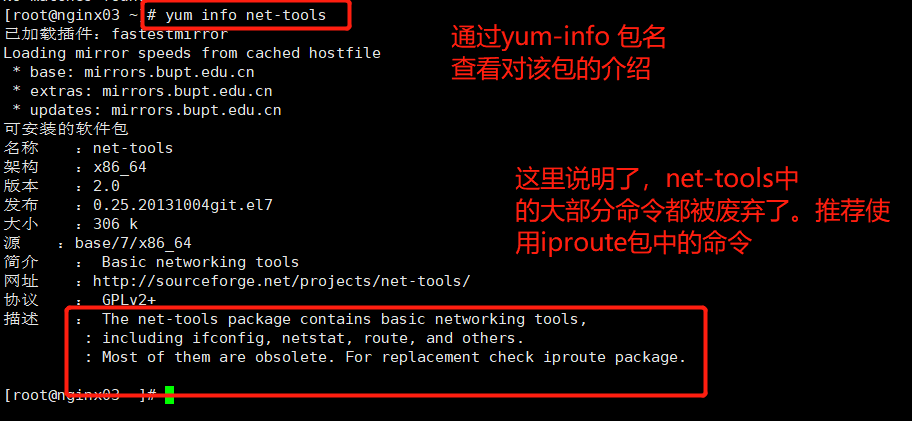
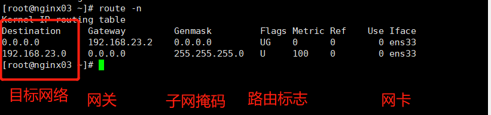

# Linux系统中route命令讲解

首先说明，route命令在centos7之后，就不被推荐使用。推荐使用ip命令进行网络管理。 

通过如下命令查询对linux系统中包名的介绍

```shell
#  yum-info 包名(net-route) 
```




这里之所以要继续学习，是因为在一些老的服务器上面，没有最新的iproute 包，只能使用route命令来查看路由信息。同时，在一些其他的操作系统，例如Mac中，依然存在该命令。 


## 一些知识点：

*  一个linux路由表中可以加多个网关，但是只能有一个网络生效
* 一台linux上如果有双物理网卡，请问可不可以以啷个网卡配置同网段的不同IP呢？
  * 不能


## route命令讲解

1. 查看linux系统内核中的路由表信息

```
#> route -n 
```

显示结构中Flags的取值解释

Up:  表示路由是启动状态

U：该网关为路由器



 

2. 删除和添加路由表中的网关

   临时添加

```shell
#> route add default gw 192.168.23.2
#> route delete default gw 192.168.23.2
```

​     永久添加

​	  编辑 /etc/sysconfig/network-script/ifcfg-ens

​		GATEWAY=x.x.x.x

​	 或者在 /etc/sysconfig/network 文件中，配置全局信息。

​     或者： 编辑 /etc/rc.local 

​	route add default gw x.x.x.x

​	注意： 

1. 加网关只能添加你已经有的路由网段里面的一个IP地址
2. 加网关可以不用指定子网掩码(因为是一个已有网段的ip，所以掩码已经确认了)
3.  

对一个网络添加一个新的路由(另一个网段)

```shell
对一个网络添加一个新的路由(另一个网段)
#> route add -net 192.168.2.0/24 dev eth0 
```

对一个具体的ip添加路由

```shell
#> route add -host 192.168.3.1 gw 192.169.1.110 
```

##  实验

环境准备：

**node1**： 10.1.1.1 和192.168.0.1 作为网关服务器，开启路由转发功能 /proc/sys/net/ipv4/ip_forward

**node2**: 172.16.0.254

**node3**: 10.12.0.254

要求： 实现不同网段(10.12.0.0/24 和 172.16.0.254/24) 之间的互通，使用第三方主机node1作为路由进行转发 


开启linux系统的路由转发功能：

**临时开启**

使用如下命令开启网关服务器的路由转发功能

```shell
#> echo 1 > /proc/sys/net/ipv4/ip_forward
```


永久开启：

编辑 /etc/sysctl.conf 

设置 ipv4.ip_forward = 1     0 代表不开启路由转发功能，1 表示开启路由转发功能。 


