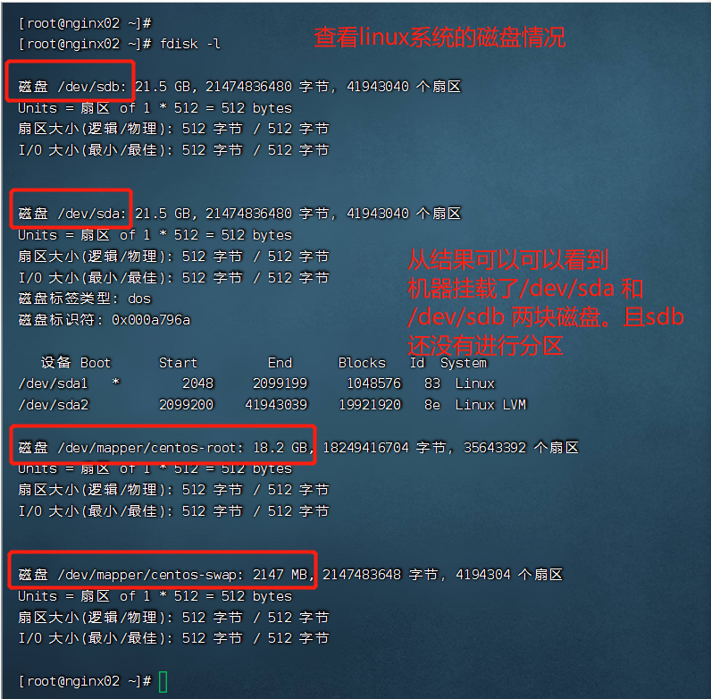
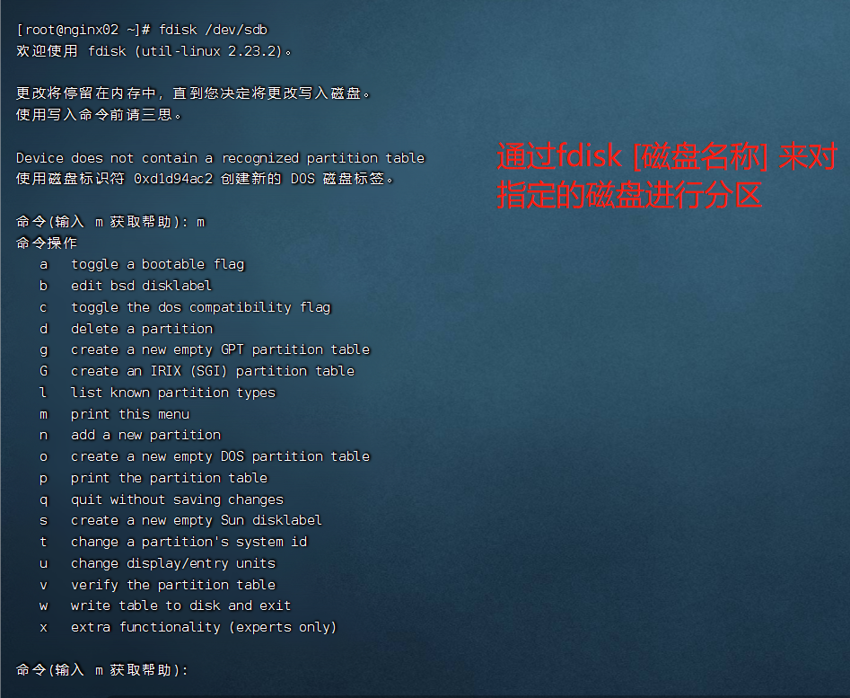
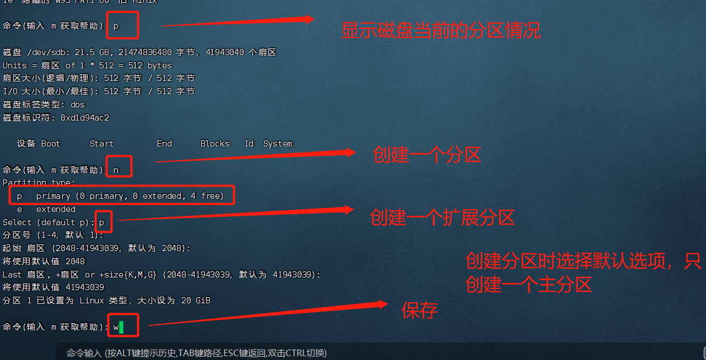
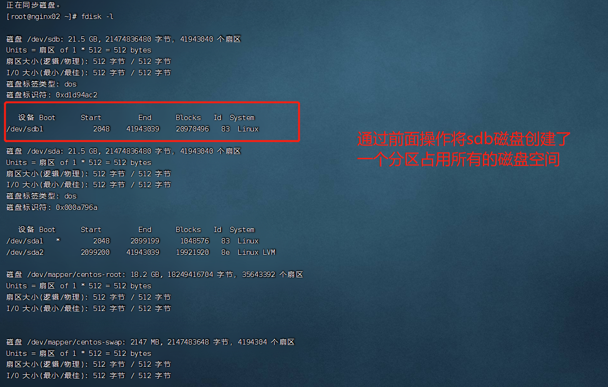
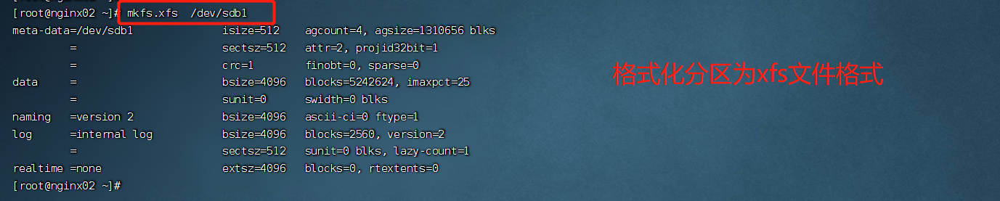
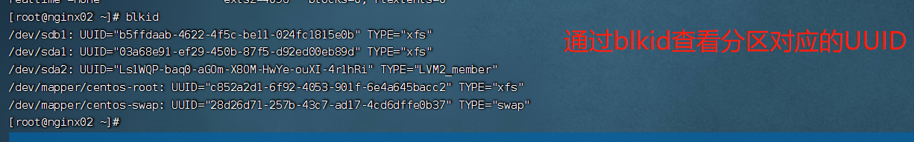
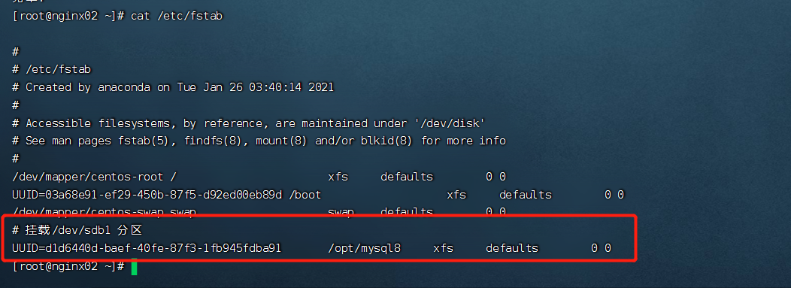
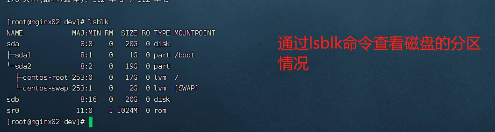

# linux系统添加磁盘并进行格式化

## 说明
本实验通过Vmware进行学习，磁盘的添加是通过软件操作进行添加的。
自己缺少实际给服务添加硬盘的经验。 


## 操作步骤


操作步骤：
* 安装新的磁盘
* 对磁盘进行分区
* 对新创建的分区进行格式化
* 编辑/etc/fstab来挂载格式化好的分区 


<br/>
<br/>
<br/>
通过fdisk查看linux中磁盘的大小，分区等信息
```shell
    $> fdisk -l 
```


通过上图，可以知道，我们新安装的磁盘被Linux识别出来了，不过该磁盘到目前为止还没有进行分区。  
新安装的磁盘，被识别为sdb，可以在/dev目录下找到。对应的是/dev/sdb

* 对新挂载的磁盘进行分区
通过fdisk命令对磁盘进行分区
命令如下
```shell
#> fdisk /dev/sdb
```


进入fdisk命令后  
通过p命令查看磁盘当前分区情况  
通过n命令创建新的分区，接着通过p命令确定创建的新分区时primary key。 

这里只创建一个分区。之后，通过w命令将分区信息进行保存。 

在创建分区时，只能有一个Primary key，可以有多个扩展分区。 


分区创建之后，再次通过fdisk -l 可以查看之前创建的/dev/sdb磁盘已经创建了一个/dev/sdb1分区。



分区创建好之后，需要进行格式化，才能存储数据。   
这里我们通过如下命令来格式化分区
```shell
    #> mkfs.xfs /dev/sdb1
```
效果如下：


分区创建好之后，我们就需要将创建好的分区挂载到相关的目录下。  
为了保证系统启动时，可以将分区挂载到指定目录，我们需要编辑/etc/fstab  
我们需要知道分区对应的UUID。 我们可以通过blkid命令查询相关分区的UUID， 如下图   


安装如下图编辑/etc/fstab文件 



接下来我们通过lsblk命令来查看磁盘的分区情况，效果如下
