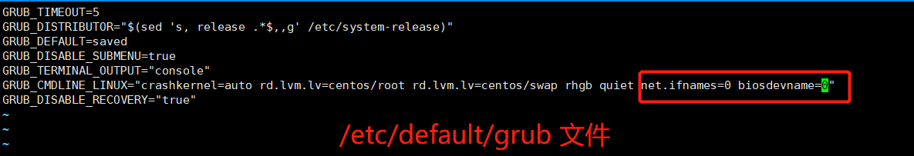

# Centos7 修改网卡名称


CentOS 7 系统安装好之后，默认的网卡名称和之前的网卡名称ethX不一样，默认是ens0123456 的形式。我们可以通过修改grub文件的形式修改网卡的名称。 


## 步骤

* 备份 /etc/sysconfig/grub 文件。

  这里要注意： /etc/sysconfig/grub 文件是 /etc/default/grub 文件的连接文件，因此我们在进行备份的时候要注意，需要备份 /etc/default/grub 文件

* 编辑/etc/sysconfig/grub 文件，在倒数第二行的quit 后面添加 

  net.ifnames=0 biosdevname=0

  修改后内容如下：

  

* 执行如下命令根据grub2的配置信息重新生成grup启动时的配置信息 

  ```shell
  $> grub2-mkconfig -o /boot/grub2/grub.cfg
  ```

  

* 修改  /etc/sysconfig/network-script/ifcfg-ens33 文件
  1. 重命名文件名为 ifcfg-eth0
  2. 修改文件名内DEVICE的取值为eth0
* 执行reboot命令重启服务器
  * 也可以通过CTRL + ALT + DELETE 进行热启动
* 验证
  * 重启之后，通过ip addr 命令查看网络接口的名称，以及看看网络是否是通畅的

## 延伸

* 为虚拟机新增一块网卡，看看效果

  添加网卡之后，外网访问不了。 但是可以访问到外网，不知道该怎么解决

* 网卡名称(NAME)和网卡的设备名称（DEVICE）

  

## 遗留问题

* linux系统添加网卡，不知道该怎么操作。自己操作了一遍，但是没有成功
* 自己没有尝试过，如果 /etc/sysconfig/grub 文件修改错误后，会发生什么情况
* 没有尝试恢复网卡名称的操作


| 日期                 | 类型 | 说明                           |
| -------------------- | ---- | ------------------------------ |
| 2022-07-30（星期六） | A    | 学习为centos7 系统修改网卡名称 |
|                      |      |                                |
|                      |      |                                |

学习耗时1.5小时。