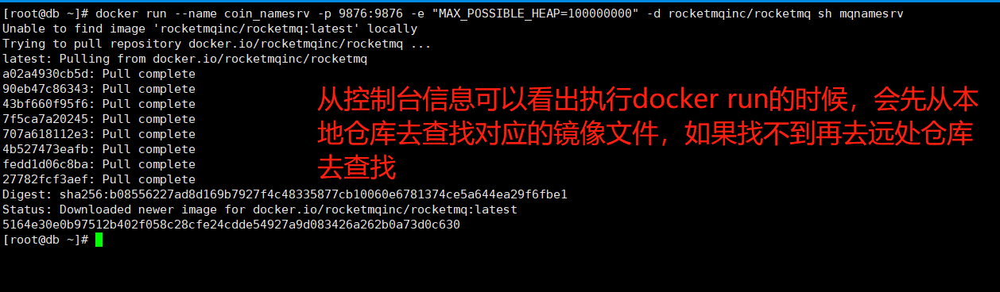
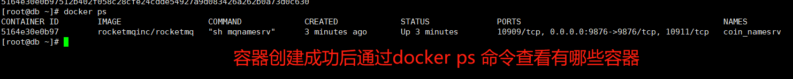
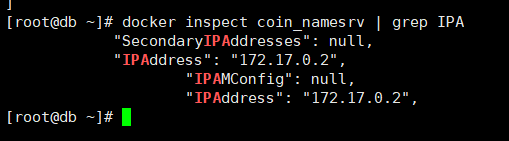

# 通过docker安装rocketmq


```shell
$> docker run --name coin_namesrv -p 9876:9876 -e "MAX_POSSIBLE_HEAP=100000000" -d rocketmqinc/rocketmq sh mqnamesrv
```





通过docker ps 命令查看容器启动情况

效果如下



通过如下命令查看rocketmq-namesrv 的ip地址

```shell
$> docker inspect coin_namesrv | grep IPA
```


