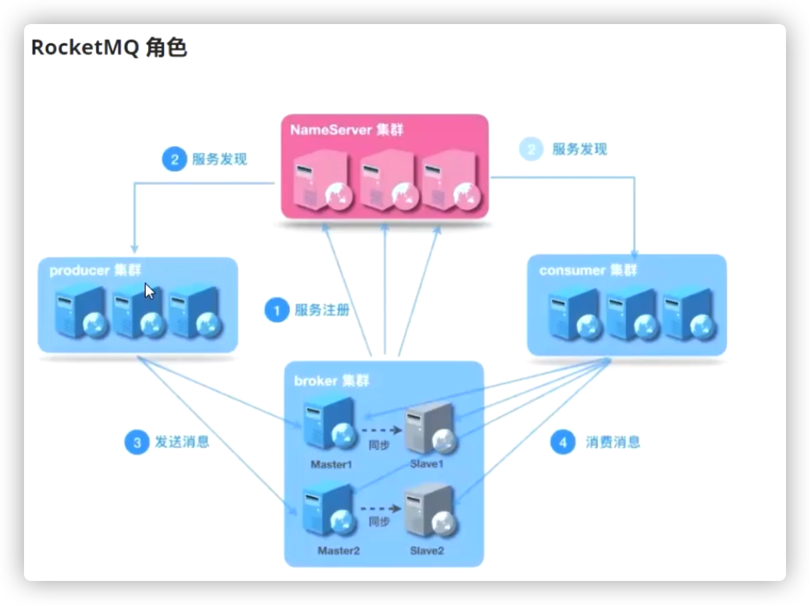

# RocketMQ

针对的rocketMQ的版本是： 4.9.2 


## RocketMQ 的安装


* 启动RocketMQ

  ```shell
  切换到rocketmq的bin目录下启动mqnamesrv.sh 和mqbroker.sh 两个脚本
  $> ./mqnamesrv
  $> ./mqbroker
  ```

* rocketmq启动成功后，通过 bin/tool.sh 来模拟发送消息

* 


## 控制台rocketmq-console编译安装

安装rocketmq-console 需要额外的软件，可以从github下载，地址如下

https://github.com/apache/rocketmq-externals

这个仓库里维护了一些rocketmq的一些插件。可以根据实际使用情况来进行调整。 


 


## RocketMQ启动脚本解析


## RocketMQ中的角色

RocketMQ不遵循JMS 协议规范。 




RocketMQ 起初是参考kafka来完成开发的。 


 