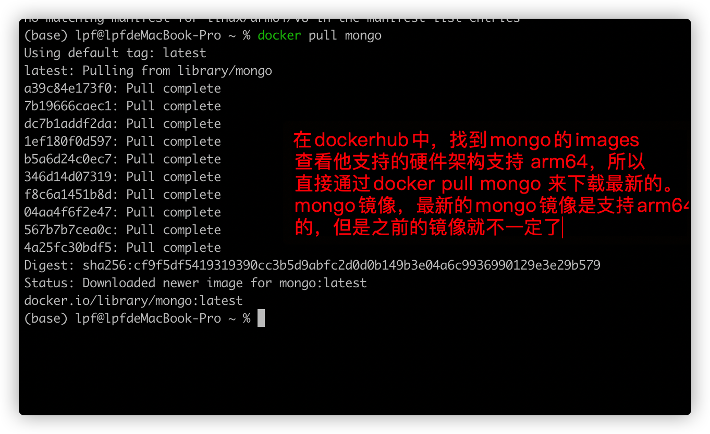
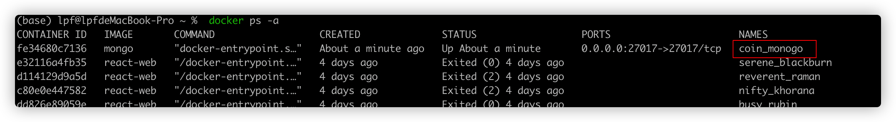
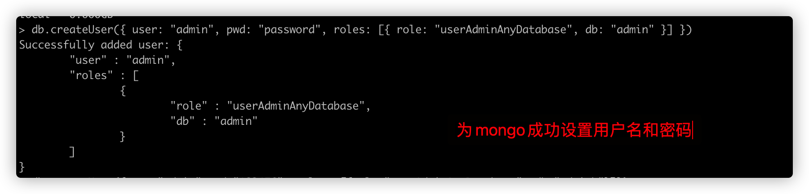

# Mac系统通过docker安装mongoDB


## 安装

通过如下命令安装指定版本的mongo镜像

```shell
$> docker pull mongo
```

这里通过docker的镜像仓库知道最新的mongo镜像是支持arm64 的硬件架构的，因此，直接通过docker pull mongo来更新最新版本的mongo镜像。 这里也可以更新指定tag标签页的mongo。但是需要查看官网，确保它支持arm64 硬件架构。 

效果如下图




## 根据mongo的docker镜像生成mongo容器

根据如下的命令将mongo的镜像生成mongo的容器

```shell
$> docker run --name coin_monogo -p 27017:27017 -d mongo
// 这里的name 参数指定所创建容器的名称， -p 指定主机IP和docker容器ip的映射关系， -d 表示在后台运行。 
// 这里要注意， -d 需要放在镜像名前面
```

通过如下命令查看docker 所有的容器

```shell
$> docker ps
```




## 设置密码

通过如下命令进入到mongo容器内，

```shell
$>docker exec  -it coin_mongo mongo admin
```

执行如下的命令设置用户名/密码以及角色

```mongo shell
> db.createUser({ user: "admin", pwd: "123456", roles: [{ role: "userAdminAnyDatabase", db: "admin" }] })
```

成功设置的效果如下：




## 变更记录

| 类型 | 时间              | 内容                                     |
| ---- | ----------------- | ---------------------------------------- |
| 新增 | 2021-11-30 星期二 | 搭载M1芯片的Mac系统通过docker安装Mongodb |
|      |                   |                                          |
|      |                   |                                          |

