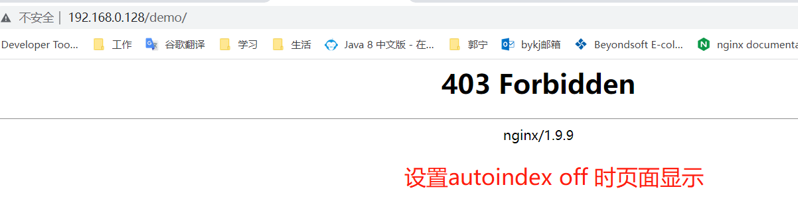
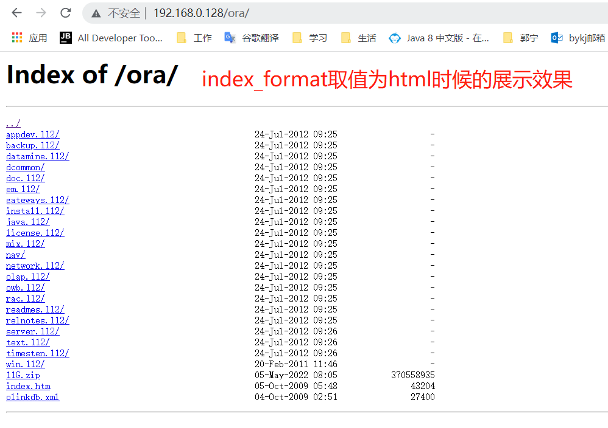

# 001_Nginx模块之auto_index模块


## 模块：

ngx_http_autoindex_module


## 编译进Nginx/从Nginx中取消某个模块


## 模块何时被使用

功能：当浏览器输入的路径文件后面有(/)符号，则将该路径下的文件以列表的形式展示。 如果autoindex 没有开启，则提示禁止访问。 



不过虽然，不支持查看目录下的文件，但是如果知道目录下文件名，还算可以查看文件内容的。


## 提供的配置项

* autoindex

  控制nginx的autoindex功能是否开启

```nginx
Syntax:	autoindex on | off;
Default: autoindex off;
Context: http, server, location
```


* autoindex_exact_size

  控制autoindex功能显示的时候，文件大小的显示方式，如果打开，则显示具体多少字节，如果不打开，则给出基于kb，MB，GB为单位的大概值。 

```nginx
Syntax:	autoindex_exact_size on | off;
Default: autoindex_exact_size on;
Context: http, server, location
```


* autoindex_format

  控制目录显示时，以哪种形式展示， 可以支持多种展示结果。例如html，json

```nginx
Syntax:	autoindex_format html | xml | json | jsonp;
Default:	
autoindex_format html;
Context:	http, server, location
This directive appeared in version 1.7.9.
```

取值为html时的展示效果：



取值为xml时展示效果:


* autoindex_localtime 

  文件类别中文件修改时间的显示方式是否以系统时区的形式展示

  ```nginx
  Syntax:	autoindex_localtime on | off;
  Default: autoindex_localtime off;
  Context: http, server, location
  ```


## 模块提供哪些变量


## 参考资料：

 http://nginx.org/en/docs/http/ngx_http_autoindex_module.html