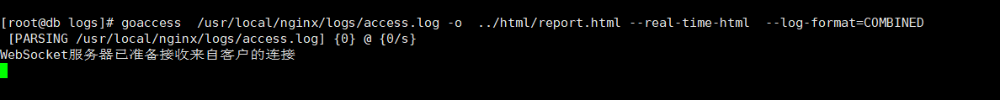
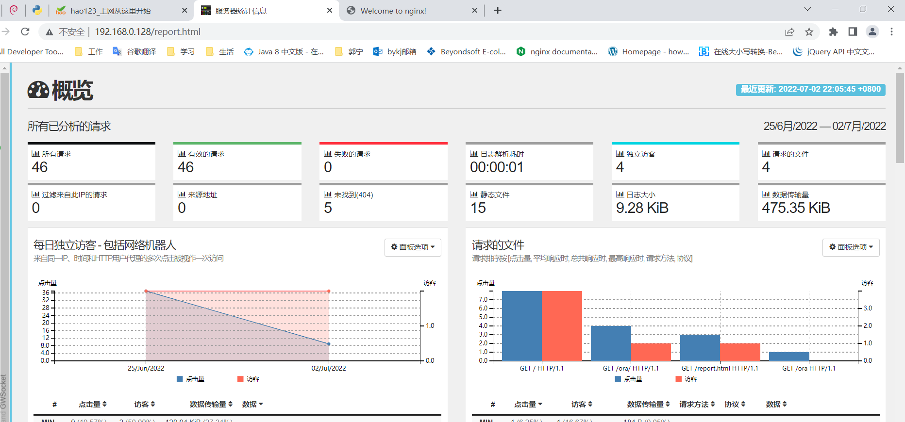
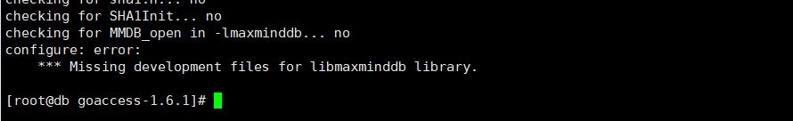
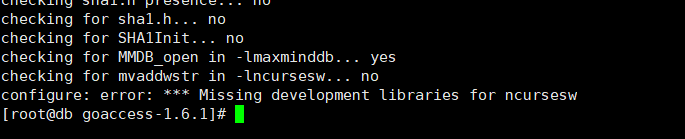
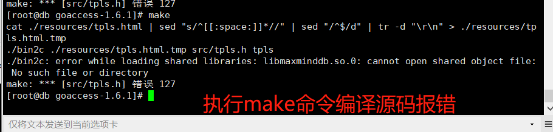

通过GoAccess 来查看统计nginx的access.log 日志


下载并安装goAccess 

```shell
# 下面的 --no-check-certificat 命令时不验证证书
$> wget --no-check-certificate https://tar.goaccess.io/goaccess-1.6.1.tar.gz
# 解压goAccess 文件
$> tar -xzvf goaccess-1.6.1.tar.gz  -C  /usr/local/goaccess

# 安装 libmaxminddb 
$> wget  https://github.com/maxmind/libmaxminddb/releases/download/1.6.0/libmaxminddb-1.6.0.tar.gz
$> mkdir -p /usr/local/libmaxminddb 
$> tar -xzvf libmaxminddb-1.6.0.tar.gz  -C /usr/local/libmaxminddb
$> ./configure
$> make
$> make check
$> sudo make install
$> sudo sh -c "echo /usr/local/lib  >> /etc/ld.so.conf.d/local.conf"
$> sudo ldconfig
$> cd goaccess-1.6.1/
$> ./configure --enable-utf8 --enable-geoip=mmdb
$> make
$> make install
```

执行上面的configure 命令配置好nginx 之后，显示结果如下


## 使用

使用goAccess 软件实时统计分析nginx的访问日志

在不改变nginx 默认access.log 日志格式的情况下，执行如下的命令

```shell
$> goaccess  /usr/local/nginx/logs/access.log -o  ../html/report.html --real-time-html  --log-format=COMBINED
```

效果如下：



这里 -o 指定 生成的报文文件的路径， 

-real-time-html 说明生成的报告是实时生成的

通过上面的命令，我们可以在指定的路径下生成关于访问日志统计结果的文件，接下来，我们可以借助nginx的文件服务器的功能来通过浏览器来访问生成的报告文件。

在nginx.conf 配置文件中的配置内容如下：

```nginx
# 设置goaccess生成html 文件的访问
location /report.html {
    alias /usr/local/nginx/html/report.html;
}   
```

接下来执行 如下命令来让nginx重新加载配置文件

```shell
# 验证一下nginx的语法是否正确，如果什么都没有说明语法正确
$> nginx -t
# 重新加载nginx的配置文件
$> nginx -s reload
```


重新热部署之后，通过浏览器就可以访问统计日志

http://192.168.0.128/report.html 

访问效果如下：




## 遇到的问题

1.  *** Missing development files for libmaxminddb library. 



 原因： 在通过configure 进行配置的时候，设置 

因此需要系统中有 libmaxminddb依赖，

解决方案：

从如下网站

https://github.com/maxmind/libmaxminddb/releases

下载最新的版本 ：

wget  https://github.com/maxmind/libmaxminddb/releases/download/1.6.0/libmaxminddb-1.6.0.tar.gz

下载之后，将下载好的libmaxminddb 文件解压到 指定路径下

```shell
$> tar -xzvf libmaxminddb-1.6.0.tar.gz  -C /usr/local/libmaxminddb
```


之后，通过如下的命令安装 libmaxminddb

```shell
$ ./configure
$ make
$ make check
$ sudo make install
$ sudo ldconfig
```


2.  configure: error: *** Missing development libraries for ncursesw



解决方案：安装 ncurses-deve1 

```shell
$> yum install -y ncurses-devel
```


3.  ./bin2c ./resources/tpls.html.tmp src/tpls.h tpls
   ./bin2c: error while loading shared libraries: libmaxminddb.so.0: cannot open shared object file:
    No such file or directory

