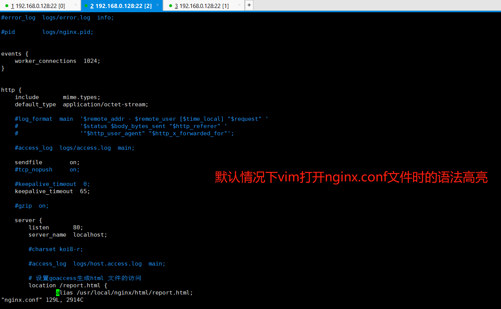
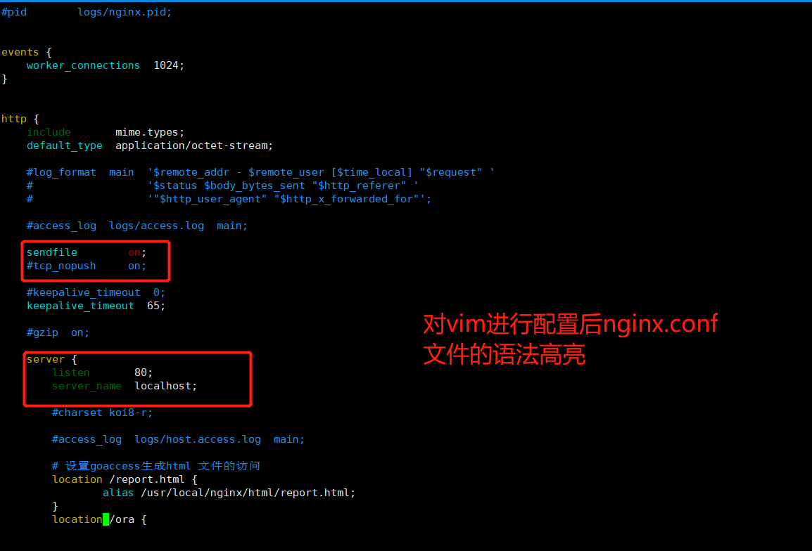

# Nginx设置nginx.conf 文件的语法高亮


nginx 安装包中，提供了对nginx.conf 文件语法高亮的语法支持

配置之前，通过vim 打开nginx.conf 文件打开的效果如下：




配置之后的效果如下




可以看到对vim 进行配置之后，nginx.conf 会有一定的语法高亮提示。 


配置方式:

在 用户的home目录下，创建 .vim 文件夹，然后切换到nginx的源码包中。执行如下命令

```shell
$> cp -r contrib/vim/* ~/.vim/
```


