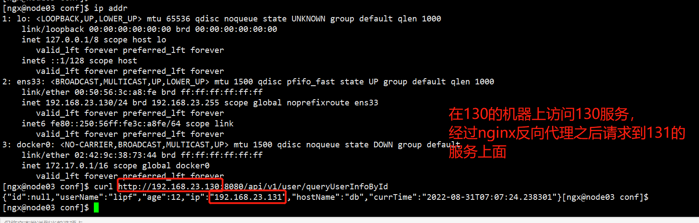
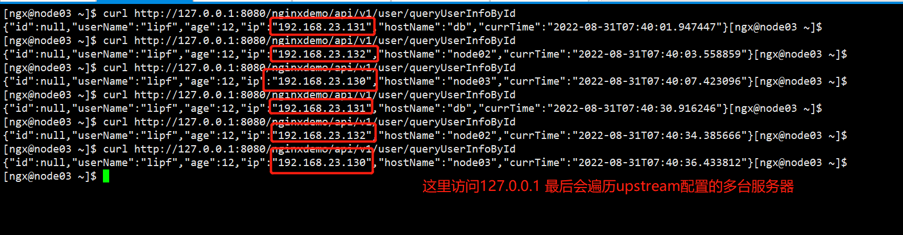
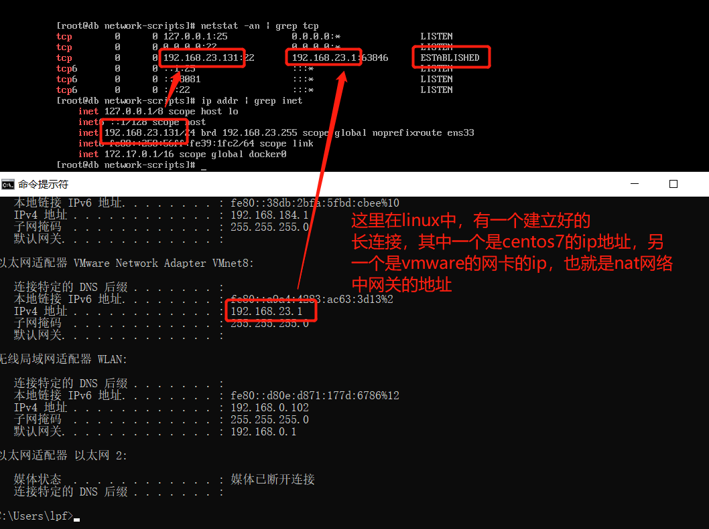

# Nginx设置反向代理


## 样例

### 同一台机器上端口号的转发

最简单的反向代理配置

```nginx
#实现的功能，实现本地机器端口的转发
 location /api2/ {
                proxy_pass http://localhost:8081/api/;
 }
# 解释： 当请求的url中包含 /api2/ 的时候，将请求转发到 相同机器不同ip的另一个地址，并且将api2 转换为 api 作为新的请求url 


```

配置信息如下：


相关的验证脚本如下：


### 02_nginx反向代理将http请求转发到另外一台机器上

#### 相关配置

```nginx
location /api/ {
                proxy_pass http://192.168.23.131:8081/api/;
}
```

#### 验证




### 03_nginx 反向代理多台服务

#### 配置

这里通过upstream配置多个服务器。

注意：这里upstream 需要配置在http模块下，和server同级。 并且配置的是ip：端口。 不能添加http:// 

```
http {
	upstream nginxdemo {
        server 192.168.23.130:8081;
        server 192.168.23.131:8081;
        server 192.168.23.132:8081;
   }
   server {
   		location /nginxdemo/ {
                proxy_http_version 1.1;
                proxy_pass http://nginxdemo;
        }
   }
}
```


#### 验证



默认情况下，会轮循遍历upstream中配置的机器。 


### 03_nginx服务器和上游代理服务器建立长连接

通过如下命令查看linux系统建立的长链接

```
$> netstat -an | grep tcp
```


