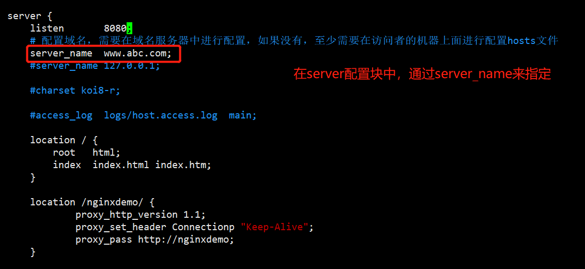
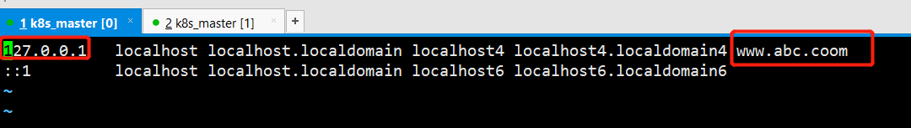
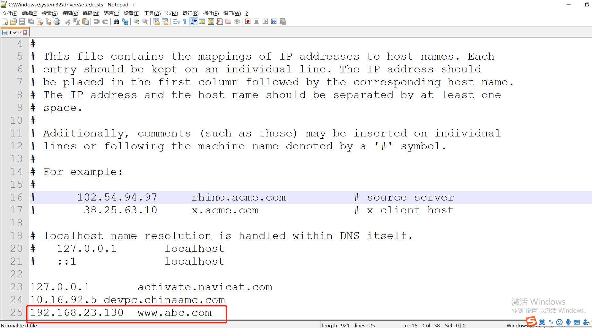
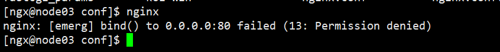
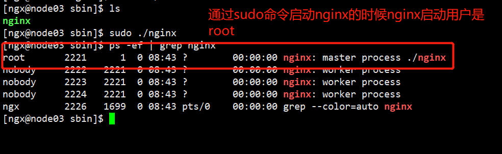
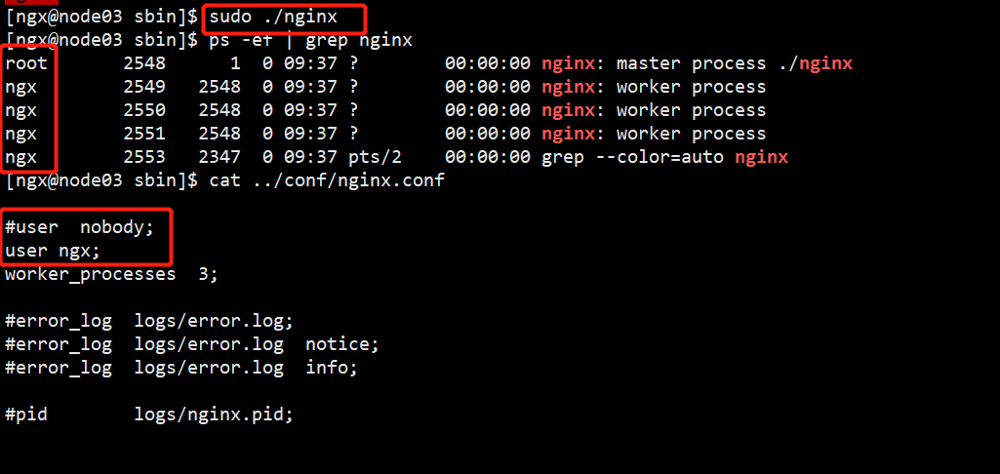
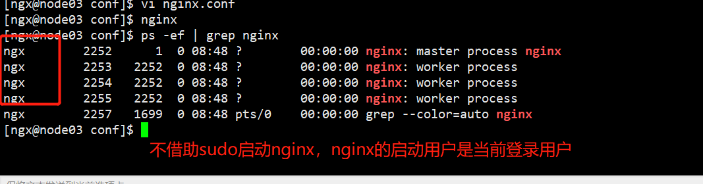
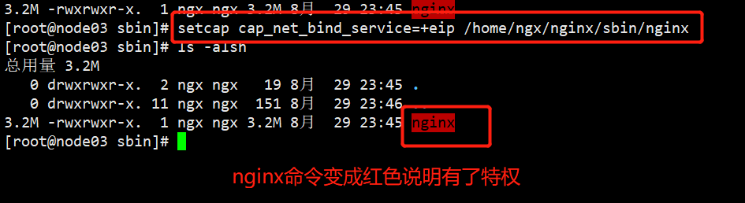
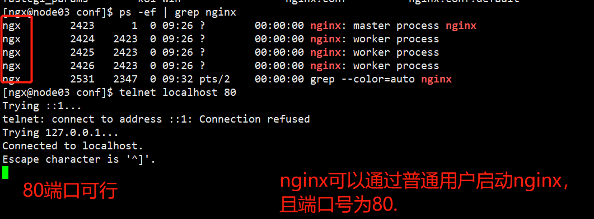

# nginx配置域名


## nginx配置域名并以普通用户监听80端口

想要通过域名来访问nginx代理的服务，需要在nginx的配置文件nginx.conf 文件中进行如下配置


在server配置块中通过server_name来指定





并且在网络所在的域名管理系统中，配置ip和域名的映射关系。 如果没有域名管理系统，需要在所有要访问该系统的电脑的hosts文件中进行配置。 

在windows系统中，配置文件的位置是：C:\Windows\System32\drivers\etc\hosts 

在linux系统中，配置文件的位置是 /etc/hosts 

在hosts文件中，配置的内容格式如下：

```hosts
ip地址    域名
```






之后，就可以通过域名和ip的形式来访问nginx代理的服务了。 

http://192.168.23.130:8080/nginxdemo/api/v1/user/queryUserInfoById

http://www.abc.com:8080/nginxdemo/api/v1/user/queryUserInfoById

这里我们需要注意，我们在通过域名访问的时候，还需要指定端口，否则会报错。 

如果想要不指定端口，那么我们可以通过将端口设置为默认端口80 来实现。 


通过如下的几种方案设置监听80端口。 修改listener 的取值。之后可以通过如下地址来访问：

http://www.abc.com/nginxdemo/api/v1/user/queryUserInfoById

这是因为http默认是通过80端口来访问的。 


疑惑：

1. 当为nginx的端口指定为80 的时候，启动的时候，为什么会提示没有权限

   nginx: [emerg] bind() to 0.0.0.0:80 failed (13: Permission denied)

   

  这里是通过非root用户启动报错的，如果是root用户，则不会有问题。 

原因分析： 默认情况下linux的1024以下端口是只有root用户才有权限占用

解决方案：

方案一：通过sudo命令启动

```shell
$> sudo nginx
```

启动之后，nginx是通过root用户启动的。 如下 图：



这里可以看到master进程是通过root用户启动，而worker进程是通过nobody用户进行启动的，我们可以在nginx.conf 中指定worker进程启动的用户

通过nginx.conf 的user指令来设置。 




补充：通过常规用户启动，nginx是被当前登录用户启动的




这里当使用sudo 命令启动的时候，是以root用户来运行的，所依赖的变量也是root用户所具有的，如果nginx的路径没有在root的环境变量中设置，那么会提示nginx找不到。 


方案二：setcap 授权

Kernel从2.2版本开始，提供了Capabilities功能，它把特权划分成不同单元，可以只授权程序所需的权限，而非所有特权，

```shell
$> setcap cap_net_bind_service=+eip /home/ngx/nginx/sbin/nginx
```




参考：https://blog.csdn.net/weixin_33488806/article/details/116864796 


之后通过nginx 启动nginx即可。 





## nginx配置二级域名

编辑nginx.conf 。 在http 配置块中，添加如下内容：

```nginx
    server {
        listen 80;
        server_name www.demo.abc.com;
        
        location / {
            proxy_set_header x-real-ip $remote_addr;
            proxy_set_header host $http_host;
            proxy_pass http://0.0.0.0:8081;
        }
    }
    server {
        listen 80;
        server_name www.demo01.abc.com;
        
        location / {
            proxy_set_header x-real-ip $remote_addr;
            proxy_set_header host $http_host;
            proxy_pass http://0.0.0.0:8082;
        }
    }

    server {
        listen 80;
        server_name www.demo02.abc.com;

        location / {
             proxy_set_header x-real-ip $remote_addr;
             proxy_set_header host $http_host;
             proxy_pass http://0.0.0.0:8083;
        }
    }
    
```

这里同一个机器的端口80，对应三个不同的二级域名，分别是： www.demo.abc.com     www.demo01.abc.com    www.demo02.abc.com 

同样，这里的三个二级域名需要在DNS域名服务中进行配置，最少也需要在hosts文件中进行配置。 

配置之后，通过不同的域名，可以访问到不同的应用程序。 


### 优化

这里，我们将不同的二级域名保存在了同一个配置文件中，我们可以将其拆分成独立的文件进行单独管理。 

将上面的三个server 单独抽离到三个不同的文件，并且放置在nginx.conf 文件所在目录的nginx.d 目录下，

配置如下:

demo01.conf

```nginx
server {
        listen 80;
        server_name www.demo.abc.com;
        
        location / {
            proxy_set_header x-real-ip $remote_addr;
            proxy_set_header host $http_host;
            proxy_pass http://0.0.0.0:8081;
        }
    }
```

demo02.conf

```nginx
server {
        listen 80;
        server_name www.demo01.abc.com;
        
        location / {
            proxy_set_header x-real-ip $remote_addr;
            proxy_set_header host $http_host;
            proxy_pass http://0.0.0.0:8082;
        }
    }
```

demo03.conf

```nginx
server {
        listen 80;
        server_name www.demo02.abc.com;

        location / {
             proxy_set_header x-real-ip $remote_addr;
             proxy_set_header host $http_host;
             proxy_pass http://0.0.0.0:8083;
        }
}
```


并且在nginx.conf中，通过include指令将三个文件引入都http代码配置块中。 


之后可以通过如下地址访问到对应的服务器

http://www.demo02.abc.com/nginxdemo/api/v1/user/queryUserInfoById


```json
{"id":null,"userName":"lipf","age":12,"ip":"192.168.23.130","hostName":"node03","serverPort":"8083","currTime":"2022-09-13T04:13:09.516180"}
```


http://www.demo01.abc.com/nginxdemo/api/v1/user/queryUserInfoById

```json
{"id":null,"userName":"lipf","age":12,"ip":"192.168.23.130","hostName":"node03","serverPort":"8082","currTime":"2022-09-13T04:12:49.555868"}
```


http://www.demo.abc.com/nginxdemo/api/v1/user/queryUserInfoById

```json
{"id":null,"userName":"lipf","age":12,"ip":"192.168.23.130","hostName":"node03","serverPort":"8081","currTime":"2022-09-13T04:12:15.680748"}
```


## 代码

```java
# springboot项目 com.demo.demo.UserController

package com.demo.demo;

import org.springframework.beans.factory.annotation.Autowired;
import org.springframework.core.env.Environment;
import org.springframework.web.bind.annotation.GetMapping;
import org.springframework.web.bind.annotation.RestController;

import java.net.InetAddress;
import java.net.UnknownHostException;
import java.time.LocalDateTime;

@RestController
public class UserController {

    @Autowired
    private Environment environment;


    /**
     * 根据用户序号查询用户信息
     *
     * http://127.0.0.1:8081/nginxdemo/api/v1/user/queryUserInfoById
     * http://192.168.0.130:8081/nginxdemo/api/v1/user/queryUserInfoById
     * @return
     */
    @GetMapping("api/v1/user/queryUserInfoById")
    AuUser queryUserInfoById(Long id){
        AuUser user = new AuUser();
        user.setId(id);
        user.setUserName("lipf");
        user.setAge(12);
        InetAddress localHost = null;
        try {
            localHost = InetAddress.getLocalHost();
        } catch (UnknownHostException e) {
            e.printStackTrace();
        }
        LocalDateTime now = LocalDateTime.now();
        user.setCurrTime(now.toString());
        if(localHost != null){
            user.setIp(localHost.getHostAddress());
            user.setHostName(localHost.getHostName());
            String serverPort = "";
            if(environment!= null){
                serverPort = environment.getProperty("local.server.port");
                user.setServerPort(serverPort);
            }
            System.out.println(now + " id = " + id + "--IP = " +localHost.getHostAddress() + "--" +localHost.getHostName() + "---serverPort--" + serverPort);
            System.out.println();
        }else{
            System.out.println(now + " id = " + id + "--获取主机信息失败");
        }
        return user;
    }
}

```


```java
package com.demo.demo;

import java.io.Serializable;

public class AuUser implements Serializable {

    private  Long id;

    private String userName;

    private int age;

    private String ip;

    private String hostName;

    /**
     * 端口
     */
    private String serverPort;

    private String currTime;

    public String getCurrTime() {
        return currTime;
    }

    public void setCurrTime(String currTime) {
        this.currTime = currTime;
    }

    public String getIp() {
        return ip;
    }

    public void setIp(String ip) {
        this.ip = ip;
    }

    public String getHostName() {
        return hostName;
    }

    public void setHostName(String hostName) {
        this.hostName = hostName;
    }

    public Long getId() {
        return id;
    }

    public void setId(Long id) {
        this.id = id;
    }

    public String getUserName() {
        return userName;
    }

    public void setUserName(String userName) {
        this.userName = userName;
    }

    public int getAge() {
        return age;
    }

    public void setAge(int age) {
        this.age = age;
    }

    public String getServerPort() {
        return serverPort;
    }

    public void setServerPort(String serverPort) {
        this.serverPort = serverPort;
    }
}

```


## 注意:

这里配置二级域名进行文件抽取的时候，为了避免之前配置的影响，先将原先的nginx通过nginx -s stop 停止，之后，再通过nginx 启动。 


## 变更记录

| 变更时间       | 变更内容          | 备注                                                         |
| -------------- | ----------------- | ------------------------------------------------------------ |
| 20220912星期一 | nginx域名的配置   | 需要进行DNS的相关配置，普通用户启动nginx监听80端口需要进行特殊配置 |
| 20220913星期二 | nginx二级域名配置 | 可以将不同的二级域名配置抽离出不同的问题                     |
|                |                   |                                                              |


