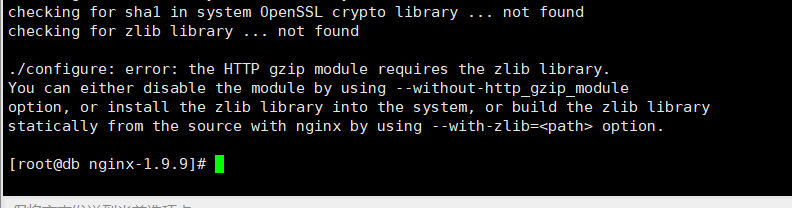

# Centos系统安装nginx服务器


## 通过yum命令来安装nginx

首先安装安装源

rpm -ivh http://nginx.org/packages/centos/7/noarch/RPMS/nginx-release-centos-7-0.el7.ngx.noarch.rpm


## 通过源码安装

从 https://nginx.org/download/ 下载最新版本的nginx的源码

* 通过root用户登录系统

* 执行如下命令下载nginx最新版本的源码包

  ```shell
  $> wget https://nginx.org/download/nginx-1.9.9.tar.gz
  ```

* 执行如下命令将tar.gz 文件解压到指定路径 

  ```shell
  $> sudo tar -xzvf nginx-1.9.9.tar.gz  -C /usr/local
  ```

  经过实践，发现将nginx的压缩包放在 /usr/local 目录下不太友好，容易和生成的nginx编译后的结果造成干扰。

  *  下载并解压后nginx的目录结构如下：


* 安装如下依赖

```shell
$> yum install -y pcre-devel
$> yum install -y zlib-devel
```

* 切换到nginx源码目录下，执行如下的命令

```shell
$> ./configure --prefix=/usr/local/nginx
```

​		配置后，nginx的信息如下：

​		


* 执行make对nginx的源码进行构建

  执行make命令后结果如下：

  


​		

执行make后，切换到nginx的安装路径下，可以看到对应的nginx重要文件

​		

* 安装成功后为了在任意位置都可以找到nginx，在/etc/profile 文件最后添加 如下内容

```shell
# add by lpf 2022年5月5日06:50:35 for nginx 
export PATH=/usr/local/nginx/sbin:$PATH
```

保存，并执行source /etc/profile 命令

执行如下命令启动nginx

```shell
$> nginx -c /usr/local/nginx/conf/nginx.conf
或者执行执行 
$> nginx
```

​			

通过curl命令验证一下nginx启动是否正常

```shell
$> curl 127.0.0.1:80
```

​		


​		


利用nginx搭建本地文件服务器


之后，就可以通过nginx来访问相关的文件


配置nginx访问本地服务器指定路径下的文件


如果有多个地址，可以配置多个访问地址

​	


## 补充说明

### 设置nginx开机自启


### 验证nginx配置文件语法

修改完配置文件后，通过 nginx -t 命令验证参数是否正确，如下图所示则说明参数配置成功


### 其它

1. 如果在离线环境下，可以先将rpm包下载好，然后通过rpm -ivh **.rpm 来离线安装依赖。 

TODO 

2. 执行完make install命令安装好nginx之后，不要将nginx源码包删除，后续有时候需要查看nginx包含了哪些模块。 

3. 遇到的问题


1. 缺少 pcre library 

   

​     解决方案： 执行如下命令安装依赖

```shell
$> yum -y install pcre-devel
```

2.  缺少  error: the HTTP gzip module requires the zlib library.

   

​		解决方案： 安装依赖 zlib-devel

```shell
$> yum install -y zlib-devel
```

