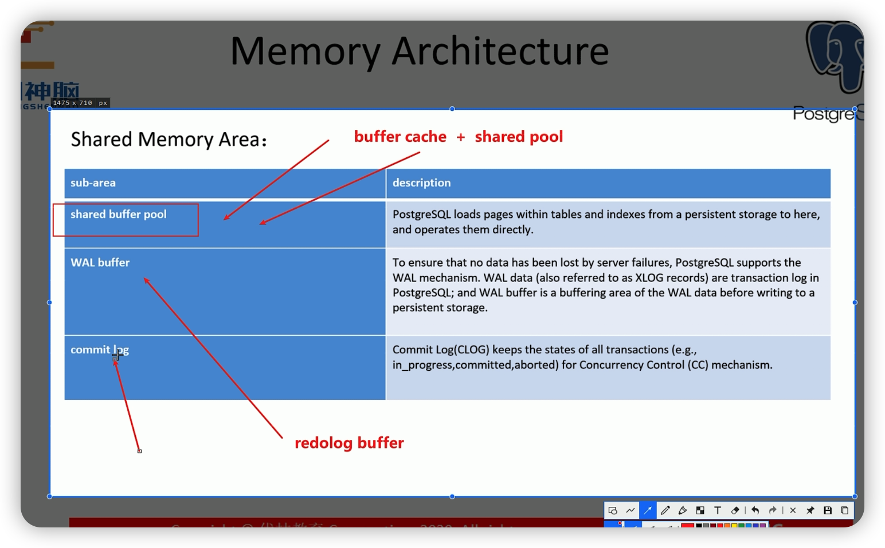
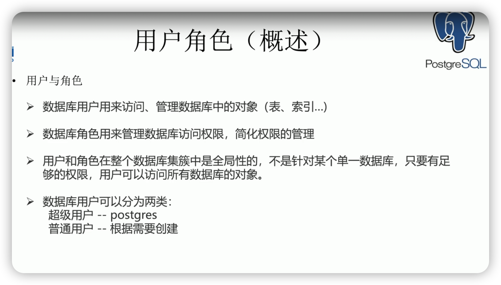

从零学 PostgreSQL

## 第一讲 PostgreSQL 简介

### Objectives

- PostgreSQL 特点
- PostgreSQL 版本介绍
- PostgreSQL 学习资源
- PostgreSQL 客户群分布
- PostgreSQL 软件下载
- 基于 PostgreSQL 国产数据库

PostgreSQL 特点


极限值：

<!--  -->

- 极限值
  - 最大单个数据库大小 不限
  - 最大数据单表大小 32TB
  - 单条记录最大 1.6TB
  - 单字段最大允许 1GB
  - 单表允许最大记录数 不限
  - 单表最大字段数 250-1600 取决于字段类型
  - 单表最大索引数 不限

众多功能和标准兼容性


PostgreSQL 学习资源

<!--  -->

官网： https://www.postgresql.org  
中文社区 http://www.postgres.cn  
功能表： https://www.postgresql.org/about/featurematrix/  
官方下载： https://www.postgresql.org/download/  
在线文档： https://www.postgresql.org/docs/  
官方代码库： https://git.postgresql.org/gitweb/?p=postgresql.git;a=summary  
官方邮件列表： https://www.postgresql.org/list/  
在线其它学习资源： https://www.postgresql.org/docs/online-resources/  
在线其它学习资源： https://db.cuug.com

PG 的客户群


 

## 第二和第三讲 PG 安装和 PG 建库

### Objectives

- 创建用户与环境配置
- 系统内核参数配置
- PostgreSQL 安装


安装的时候，不要使用 root 用户安装，而是使用 pg 用户来进行安装。

useradd 命令新增用户的时候，不指定用户组的情况下，用户默认的用户组和用户名一样么？


内核参数配置与否，不会影响PG数据库的安装，但是会影响后续PG数据库运行的性能。


依赖包检查的命令

```shell
  rpm -qa | grep gcc
```


## 第三讲 PG 数据库的创建

### Objectives

- 创建 PostgreSQL 数据库
- 启动与关闭 PostgreSQL 数据库
- 使用 PostgreSQL 数据库


initdb 的-W 选项： 提示你创建 postgres 超级管理员的秘密。

## 第四讲：PG 实例结构

### Objectives

- PostgreSQL 实例简介
- PostgreSQL 初始化参数文件
- PostgreSQL 内存结构
- PostgreSQL 后台进程

* PG 实例结构
  - 用来访问 PostgreSQL 数据库
  - 一个实例对应一个数据库集簇
  - 由内存和后台进程组成 （Memory structures ） + backgroud process structures


- 建立一个连接和创建一个会话.png

  - 两个进程之间建立连接
  - 建立连接之后，在 pg 的服务器端，创建一个会话
    <!--  -->

- 初始化参数文件
  


查询 pg 数据库中，参数的详细取值

查看 pg_settings 表的表结构

psql> \d pg_settings

```sql
select name, setting from pg_settings;
```

- postgresql.conf 参数文件
  - 两种类型的参数：
    - 显式： 在文件中对参数进行设置
    - 隐式： 文件中没有设置，使用 Postgres 默认值
  - 可以存在多个初始化参数文件
    - 静态参数文件： postgresql.conf
    - 动态参数文件： postgresql.auot.conf
    - 可选参数文件： postgresql.conf.user
  - 读取顺序
  postgresql.conf --> postgresql.auto.conf --> postgresql.conf.user
  <!--  -->

postgresql.auto.conf 参数文件的说明

- 文本文件
- 由 postgres 服务器维护
- 支持用文本编辑器修改（不推荐）
- ALTER SYSTEM 命令修改的参数保存在该文件
- 能够在关闭和启动期间持续进行改进
- 可以实现自我调整参数值
- 默认位置为$PGDATA
<!--  -->

postgresql.auto.conf 参数文件

- 改变一个参数的值，会在文件中自动添加参数
  - alter system archive_mode = on;
- 恢复一个参数默认值，会在文件中自动删除参数
  - alter system reset archive_mode;
  <!--  -->

参数生效的条件

- siggup: 表示需要超级管理员修改，reload 就能够生效
- superuser: 表示使用超级管理员可以为普通用户，数据库，或者超级管理员自己修改（注： 有些参数是可以针对用户，数据库，实例）
- 

PG 的内存架构


本地内存区域


PG 的共享内存区域


13_PG 的进程结构


14_postgresql 所有进程之间的关系


15_postgres_server_process


- 一个 postgres 服务器进程侦听一个网络端口，默认是 5432. 不像 oracle 一样，可以侦听多个网络端口。

16*后端进程

postgreSQL 允许多个客户端同时连接，配置参数 max_connections 控制客户端的最大数量。

所有的后端进程都是 postgres 后端进程的子进程，通过 kill -9 将 postgres 后端进程关闭之后，其他子进程都会被关闭。

17_background_processes.png


飞： 如果建立了多个连接，那么就会有多个后端进程，是不是意味着有多个 background writer， checkpointer 等进程？

18*后端进程之 background_writer.png

background writer 进程将 shared buffer pool 中的数据写入到数据库磁盘文件中。

19*后端进程之 walwriter 进程.png


## 第五讲 PostgreSQL 数据库结构

### Objectives

- PostgreSQL 数据库逻辑结构
- PostgreSQL 数据库物理结构
- PostgreSQL 表空间结构


* pg 数据库 ： 将数据从逻辑上分开存放
* pg 表空间 ： 把数据从逻辑或者物理上分隔存放


查看pg_database 来获取每个对象的标识符号 oid的取值。

数据库集簇的物理结构


pg_class 表中定义了 pg 数据库中所有对象对应的 oid 。


数据库集簇的其他目录结构


PG 数据库的表空间


新建的数据库如果没有指定表空间，那么他的默认表空间是 pg_default。
create database db01;

TODO： 新建一个磁盘，将某个新的数据库中的所有数据都放在新的磁盘上面。
（需要借助表空间来实现）


08_pg 表空间的创建语句.png


09_pg 表空间的寻址.png
是通过软连接进行寻址的。


10*建表或建库时指定表空间.png

创建数据库时指定表空间，那么它的目录将在表空间特定的子目录下创建。

11*建表时表中所有字段都可以为空.png


当为某张表专门指定一个不同的表空间之后，pg 数据库会在两个表空间目录下，创建相同名称的数据目录。 分布存放不同表的数据。

## 第六讲： PG 用户与角色管理

### Objectives

- 创建用户
- 创建角色
- 权限介绍
- 给用户授权
- 给角色授权



oracle 中， 用户管理数据库对象，表，视图，索引等。
角色： 简化权限的管理
而在 pg 数据库中，用户=角色。

- 用户和角色在整个数据库集簇中是全局性的，不是针对某一个单一数据库，只要有足够的权限，用户可以访问所有数据库的对象。
- shu jshuj

02*用户和角色的区分


PG 数据库中创建用户


oracle 新建用户没有任何权限（登陆数据库，建表）
pg 新建用户默认登陆数据库，创建对象的权限（表，索引）


PG 创建角色的语法


06*创建角色的样例.png

查看用户和角色属性的元命令： \du

07*通过数据字典查看用户信息.png

\d pg_user
查看视图： pg_catalog.pg_user

08*修改用户


09*修改用户的样例

只有 createrole 权限的用户可以修改其他用户的名字。

删除用户


oracle 中的角色分为 默认角色和非默认角色。
对于默认角色，角色里面包含的权限登陆时就生效，
对于非默认角色，需要通过 set role 使之生效

PG 中的角色，都需要通过 set role 来生效，其本质是切换用户为某个角色。

11_pg 数据库角色不同之处.png


12*启用角色赋予的权限.png

飞： 如果不授权，直接 set role ，会不会生效？

oracle： 不能把属于自己的表的访问权限给删除
pg：可以把属于自己的表的访问权限给删除，也可以进行授权。

13_pg 中的权限管理.png


pg 权限管理的层次图


oracle 的数据库权限只有： 系统权限和对象权限。
PG 数据库的权限，细分的比较细

## 第 7 讲 PG 用户与 schema 管理

PG 用户与 schema 对应关系

### Objectives

- schema 概念
- 用户与 schema 对应关系
- public shcema
- Schema 管理

PG 用户与 schema 管理


- 用户与模式的对应关系
  - 一个用户可以创建与拥有多个模式
  - 一个模式只能属于一个用户
  - 普通用户创建模式时需要授权在指定的数据库下创建模式的权限
  - grant {{create| connect |temporary | temp },[，...]} on database database_name [,...] to role_specification [,...] [with grant option]


模式管理方式：

- 默认情况下创建表的模式是 public。
- 大而全的模式管理
  - 创建一个与用户名一样的模式，所有的对象都存放在该模式下。 用户名 = 模式名
- 精细化管理
  - 按照表类型进行管理。将不同的表放在不同的模式下。


授权某个模式下的对象访问权限给其他用户，则需要先授权访问该模式的权限给其它用户。

grant USAGE on schema sch_name to role_name;
grant select on schema.tab_name to role_name;

04*模式的管理*删除.png


05_pg 的 public 模式.png


模式使用建议


搜索路径设置

07_search_path 的使用.png


08*搜索路径设置.png


## 第 8 讲： PostgreSQL 对象权限管理

### 目标

- PostgreSQL 对象权限概述
- PostgreSQL 对象权限授权与回收

对象权限概述
最小粒度可以达到列级别


04*对象权限含义.png


05*对象权限授权语法


06*授权示例.png


将所有表都授权给某个用户之后，再新建的表，该用户是否具有所有权限？
没有权限。

07*查看对象权限.png


08*查看对象权限的示例.png


09*回收对象权限的示例.png


10*修改对象宿主.png


## 第九讲： PG 实例连接访问控制

### Objectives

- PostgreSQL 实例访问控制概述
- pb_hba.conf 文件配置


02_pg_hba 文件的名单格式.png


03_TYPE 类型的取值.png


04_DATABASE 的取值.png


05_USER 列的取值.png


06_Address 列的取值.png


07_METHOD 列的取值.png

