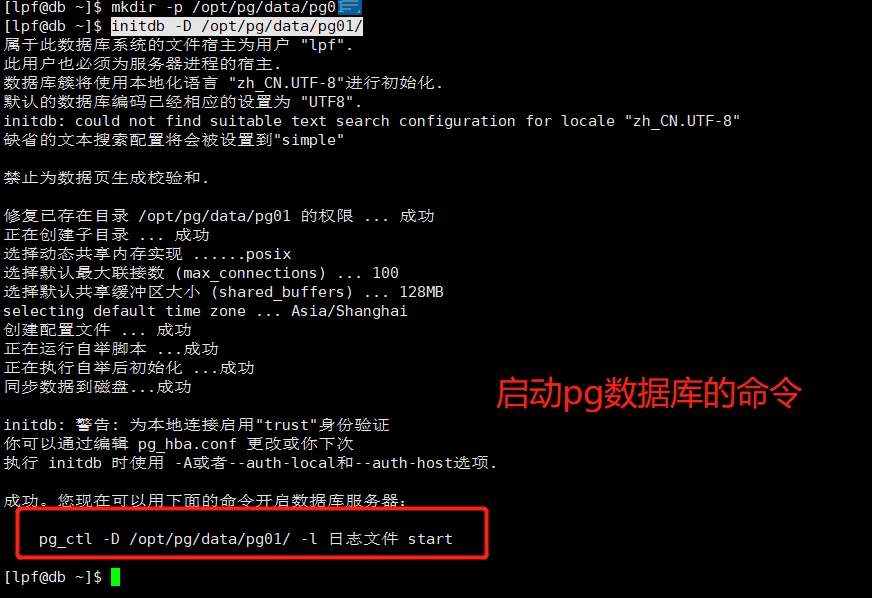

# centOS7安装PostgreSQL数据库12

执行如下的几个命令通过命令行的方式安装PostgreSQL数据库

```shell
# # Install the repository RPM:
sudo yum install -y https://download.postgresql.org/pub/repos/yum/reporpms/EL-7-x86_64/pgdg-redhat-repo-latest.noarch.rpm
# Install PostgreSQL:
sudo yum install -y postgresql12-server
# 设置开机自启(下面的三个命令在没有阅读过postgresql-12-setup 之前，不要轻易执行，
#不然，在后续的使用过程中会影响你对PG的学习)
#sudo /usr/pgsql-12/bin/postgresql-12-setup initdb
#sudo systemctl enable postgresql-12
#sudo systemctl start postgresql-12
```

通过如上命令安装好的PostgreSQL 默认安装到了 /usr/pgsql-12 目录下。 

通过上面的命令，会安装好PG12 并且还会创建一个postgres用户，可以在 /etc/passwd 文件中得知创建了postgres用户。

之后，需要通过 passwd postgres 命令来为postgres 设置密码。从而下次通过postgres登录系统并启动postgreSQL数据库

通过上面的命令创建postgresSQL服务器之后，还需要执行如下操作：

* 修改 /etc/passwd 文件中用户postgres 的Home目录 （/home/postgres）
* 在/home 目录下新建postgres 文件夹，作为postgres用户的Home目录
* 通过postgres用户来登录linux系统


安装好之后，为了在linux的任务位置都可以很方便的调用postgreSQL数据库的命令，需要在 /etc/profile 文件中添加如下配··

```shell
export PATH=$PATH:/usr/pgsql-12/bin
```

此时，可以切换到home 目录下，执行如下命令查看配置是否生效

```shell
$> initdb --version
# 显示效果
initdb (PostgreSQL) 12.9
```


## 通过initdb 命令创建数据库初始化文件

通过一个有权限的用户 lpf ，执行initdb 命令

```shell
initdb -D /opt/pg/data/pg01/
```





启动PostgreSQL 数据库

```shell
$> pg_ctl -D /opt/pg/data/pg01/ -l /opt/pg/log/pg.log start 
```


权限问题， 还是不明白。 


## 疑惑

1. 通过上面的命令开机自启postgreSQL数据库的用户是哪个用户？
2. linux 系统下用户权限是怎么控制的？？