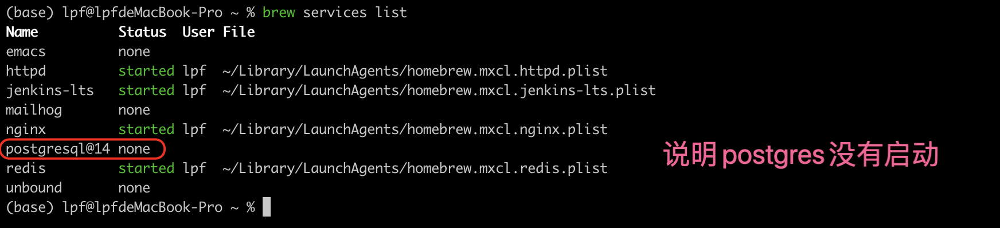

# MAC系统安装postgres数据库

## 使用brew安装postgresql

```shell
base > brew install postgres 
```


通过日志可以知道postgresql安装后默认在 /opt/homebrew/var/postgresql@14 初始化了一个数据库集群

启动postgresql数据库之后，执行oid2name，可以知道默认有一个postgresql


默认用户是操作用户的用户名。 这里是lpf，因此使用如下命令可以登录到pg数据库

```shell
shell> psql -Ulpf  -d postgres
```


## 查看brew安装的服务运行状态

```shell
$> brew services list
```




## 使用brew命令启动postgres


## 使用brew命令停止postgresql数据库


