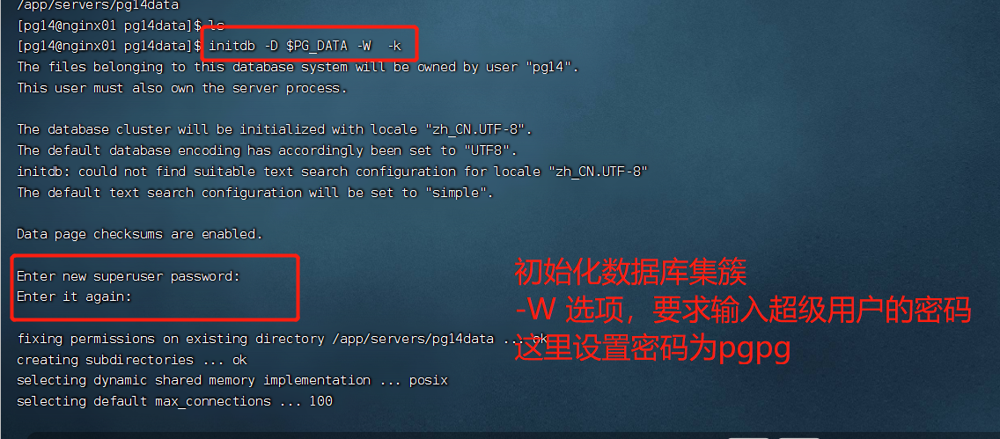
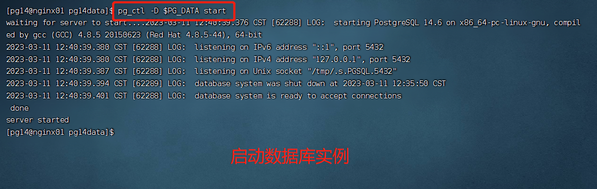
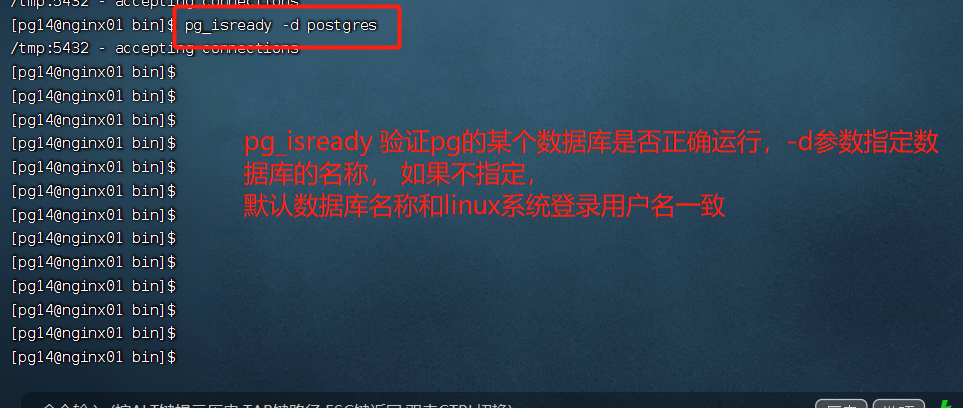
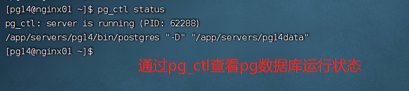
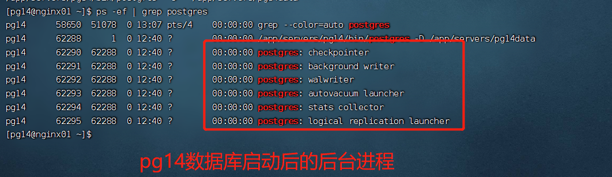
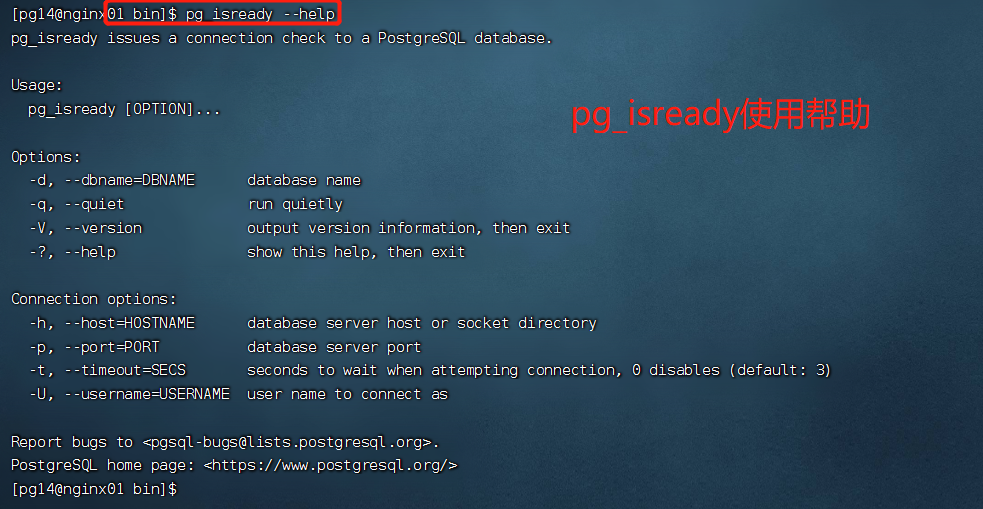
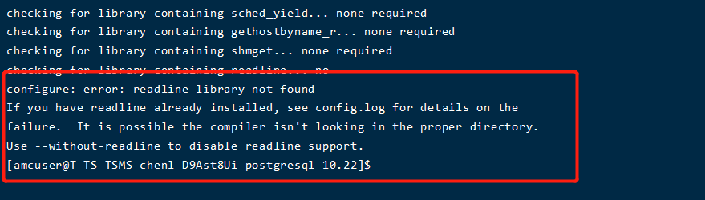

# Centos7 安装 PG14 数据库

## 创建用户

```SHELL
# 创建用户 pg14
#> useradd pg14
# 设置pg14的密码为pg14
#> passwd pg14
# 查看pg14用户的相关信息
#> id pg14
# 显示结果如下，说明直接通过useradd 创建用户，在不通过-g 指定用户组的时候，该用户的默认用户组会新建，并且和用户名一致。 这里都是pg14
# uid=1002(pg14) gid=1003(pg14) 组=1003(pg14)

```

## 软件包准备

在 pg 的官网下载 pg14 的稳定版 【postgresql-14.6.tar.gz】 并且通过 rz 命令上传到 linux 系统的指定目录下。

之后通过 如下命令解压到当前目录

```shell
$> tar -xzvf postgresql-14.6.tar.gz -C .
```

## 环境变量的配置

编辑~ 目录下的 .bashrc 文件内容如下：

```text
# config for pg14
export PG_HOME=/app/servers/pg14
export PGDATA=/app/servers/pg14data
export PATH=$PG_HOME/bin:$PATH
```

## 软件的安装

- configure 配置一些初始化参数

  - ./configure --prefix=/app/servers/pg14 --with-pgport=5432 --with-openssl

- 编译
  - gmake world
  - 这个过程如果机器性能比较差，可能会比较耗时。可以指定并发数来提速
  - 自己在自己虚拟机上， 不使用-j 参数的时候，执行 gmake world 耗时 7 分 27 秒。 执行 gmake world -j16 的时候，耗时 2 分钟。
  -
- gmake check-world (可选)
  - gmake check-world -j 16 并行处理 耗时 3 分钟
- gmake install-world -j16 安装
  - 安装编译好的二进制文件到指定路径

## 数据库建库

执行如下命令来初始化数据库集簇

```shell
# -W 要求输入超级管理员 postgres的密码，这里设置的是pgpg。
# -k 参数对相关文件进行校验
$> initdb -D $PGDATA -W -k
```

注意：这里设置的 postgresql 数据库的 pg14 用户的秘密是 pgpg



- 启动数据库

```shell
$> pg_ctl -D $PGDATA start
```



通过 pg_isready 查看数据库的连接状态。 initdb 默认会初始化一个名为 postgresql 的数据库， pg_isready 默认查看的数据库名称和当前登录数据库的名称一致，（这里是 pg14）。 因此这里使用 pg_isready 需要通过-d 来指定要查看的数据库名称。



通过 pg_ctl status 命令查看 pg 数据库是否正常运行。



PG14 数据库运行后的后台进程



为了可以远程连接 postgresql 数据库，我们还需要做一些配置，来让 pg 数据库运行远程连接。
修改 $PGDATA/pg_hba.conf 文件，运行所有远程机器都可以通过用户名密码来访问所有数据库

```pg_hba.conf
  host  all all 0.0.0.0/0  scram-sha-256
```

修改 $PGDATA/postgresql.conf 文件，监听所有请求

```text
  listen_addresses = '*'
```

## 其他参考资料

pg_isready 使用帮助参数



## 经验

- 创建好 pg 用户之后，为 pg 用户授予 root 权限的时候，需要修改 /etc/sudoers . 该文件 more 是只读文件，之前自己修改的时候，是先通过 chmod 修改文件权限，修改完内容之后，在恢复权限。 现在可以通过编辑之后直接 输入 **wq!** 进行强制保存就可以了

- 使用 vi 编辑配置文件的时候， vi + 文件名 可以快速将光标定位到文件的最后一行。 如果是编辑/etc/sudoers 可以直接定位到 90 行左右， vi +90 /etc/sudoers 。 可以快速定位到要修改的行号。(大概就是 90 行左右)
- linux 系统通过 rz 命令来上传文件到服务器。 安装 rz 命令的命令为： yum Install lrzsz -y
-

## 注意事项

- 通过源码安装好 pg 数据库之后，解压后的源码不要删除，后期进行插件安装的时候，需要借助这个源码。
- 安装的时候，还需要对 linux 的内核参数做一些调整。这里没有调整，后期进行性能优化的时候，再进行调整
- postgresql 的 PGDATA 环境变量指向的路径，在实际生产上最好是一个单独的磁盘。这样方便后续的管理。

## 可能遇到的问题

- 缺失 readline 软件

  

​ yum instlal readline-devel 来进行安装，不建议编译的时候，使用--without-readline 。

## 记录

| 日期              | 操作类型 | 修改内容                                               | 备注 |
| ----------------- | -------- | ------------------------------------------------------ | ---- |
| 2023-03-11 星期六 | A        | 在 centos 上通过源码安装 pg14 数据库                   |      |
| 2023-03-11 星期六 | M        | PGDATE 环境变量修改。(原先是 PG_DATA，这种命名不对)    |      |
| 2023-03-12 星期日 | A        | 修改配置文件让所有其他机器都可以访问 postgreSQL 数据库 |      |
| 2023-03-14 星期二 | A        | PGDATA 指向的路径在生产上最好是一个独立的磁盘          |      |
|                   |          |                                                        |      |
