# pg中连接数的控制_v20230422


# 实验环境

PG14

centos7


## 结论

* max_connections 最大连接数只表示客户端连接，也就是 pg_stat_activity 中backend_type类型为client backend。
  backend_type取值为其他值的连接数不占用max_connections的取值。 

* 为超级用户预留的连接数，必须小于最大连接数(max_connections) 。 否则启动会失败。

* max_connections 是针对一个数据库cluster中，所有用户，所有数据库连接而言的。 

* superuser_reserved_connections 是为超级管理员用户预留的连接数，不管之前超级用户是否连接过，最后superuser_reserved_connections 个连接都会留给超级用户。普通用户是无法使用最后几个连接的。

* 查看pg_stat_activity的时候，使用不同用户，看到的信息会有一些差异，使用非超级用户，有的连接看不到
  backend_type


## 相关的属性

PG控制连接的属性有

* max_connections  
  * 最大连接数
* superuser_reserved_connections
  * 为超级用户保留的连接数 


## PG数据库中的连接

PostgreSQL 使用共享内存的进程结构，客户端与数据库服务器建立一个连接后，数据库服务器就启动一个进程来为这个连接服务。 


如下图：

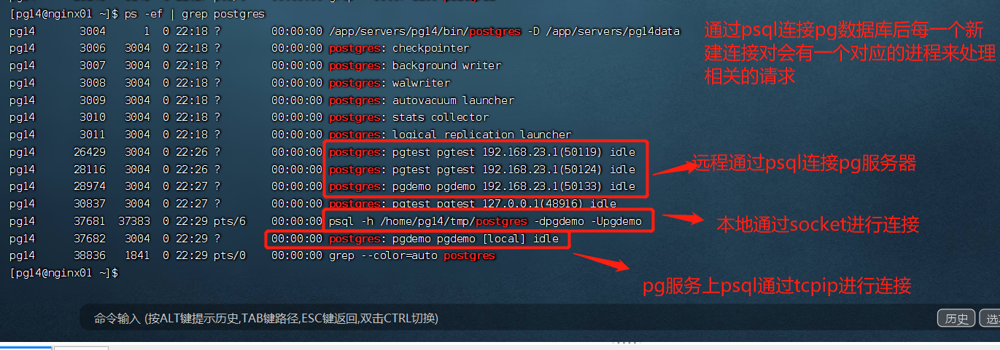


新建一个连接后，在pg_stat_activity视图中会多一条记录。 


## 查看PG数据库的有效的连接

查看pg设置的最大连接数：安装pg数据库后，max_connections的默认值是100. 

```sql
psql> show max_connections;
```

通过查看pg_stat_activity视图来查看有效连接

通过如下命令查看pg_stat_activity的视图结构：

```sql
$> \d pg_Stat_activity; 
```


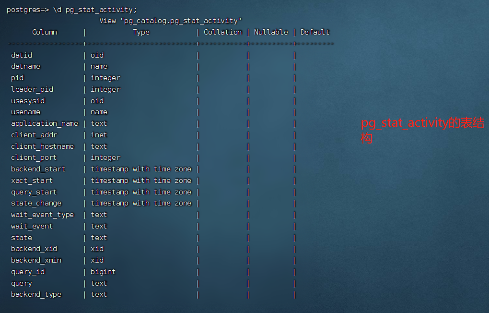


PG数据库真实有效的连接数是backend type 为 **client backend**

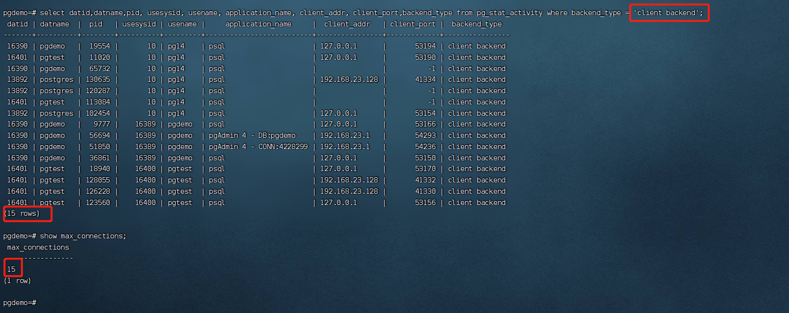


连接PG数据库可以通过tcp/ip 协议或者通过socket来进行连接：

通过client_addr 和client_port 是否有值来区分是tcp/ip 连接还是socket连接。

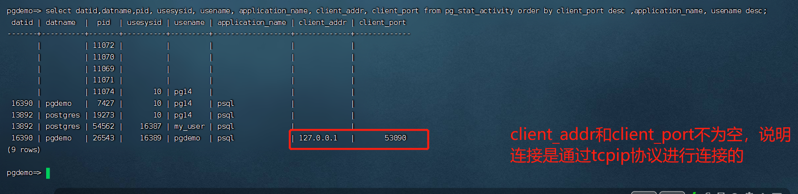


## 修改pg的最大连接数

* 方法一： 
  * 直接修改 $PGDATA/postgresql.conf 文件中 max_connections， 修改完之后，重启PG数据库。 

* 方法二：

  *  执行alter system set max_connections = 30;

  * 修改后通过show max_connections，值还是原来到的值， 需要重启pg数据库才会生效

  * 修改的内容会记录在 $PGDATA/postgresql.auto.conf 文件中

  * 这种方式的好处是，可以让某些参数在下次重启数据库后生效，并且相关的修改也不会遗忘。 

    

    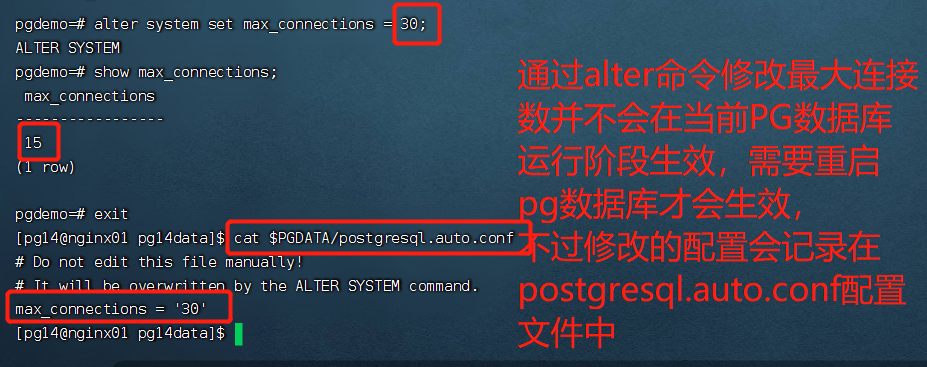
    
    

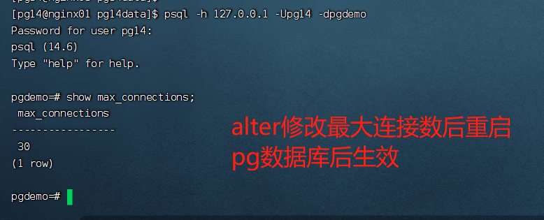 


## 环境准备

创建多个用户，并且创建多个不同的数据库，用来验证pg数据库的max_connections和数据库以及用户是否有关系。

结果是没有关系。 

create user 命令等同于create role。 除了一点： create user 可以隐含LOGIN的权限，而create role 创建的用户不具有登录权限。 使用命令登录后，效果如下：

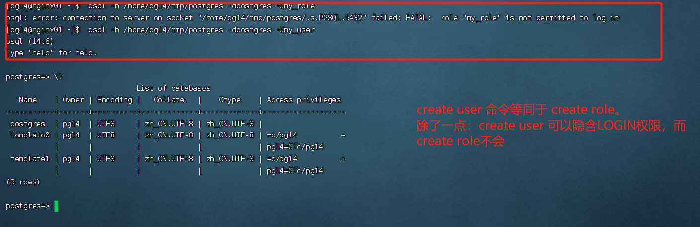


创建用户，然后创建数据库，且该数据库属于刚创建的用户

```sql
postgres=# create user pgdemo with password 'pgdemo';
postgres=# create database pgdemo owner pgdemo;
```


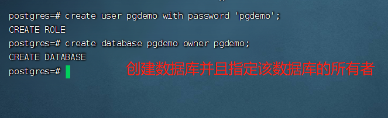


安装上面的命令分别创建 pgdemo，pgtest， pguser01 三个用户以及对应的同名的三个数据库。 分别用三个用户使用tcp/ip 以及socket 的方式连接对应的数据库，查看相关的连接信息。 


## 注意事项

* 设置superuser_reserved_connections 的取值不能大于等于max_connections 的取值， 否则PG数据库启动的时候启动不起来。 


* pg数据库重启后，之前的连接还需要重连

  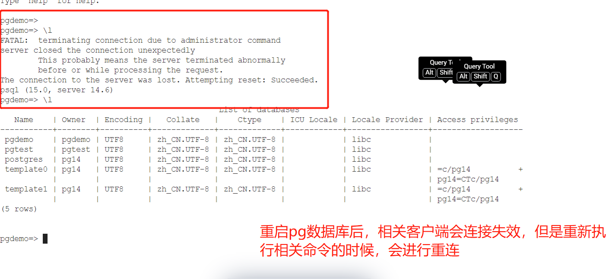

重启PG数据库后，相关客户端会连接失效，但是重启执行相关命令的时候，第一次会失败，之后会进行重连。 


## 其他的sql

查看当前登录用户

* select current_user;
* select user;


## 遇到的问题

* PG启动的时候，对套接字没有写权限

​      pg安装后，默认的套接字地址是/var/run/postgresql ， 在安装pg的时候，如果不指定套接字地址，默认地址就是这个，再数据库再次打开的时候，是没有对该目录的读写权限的，会导致pg数据库启动失败。

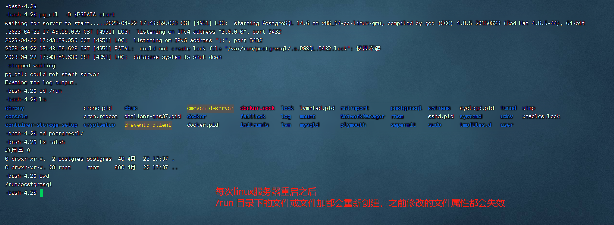

解决方案：

修改 $PGDATA/postgresql.conf 文件中的 unix_socket_directories  为以为用户有读写权限的目录。 

 截止目前，如果这样修改，pg数据库的启动是没有问题的，但是pg数据库的一些和套接字相关的软件，可能无法正常工作。 例如查看PG数据库是否可以正常访问的工具pg_isready。 


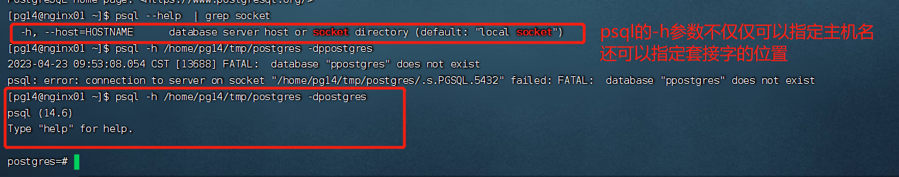

psql的-h 参数不仅仅可以指定主机名还可以指定套接字所在的目录。 

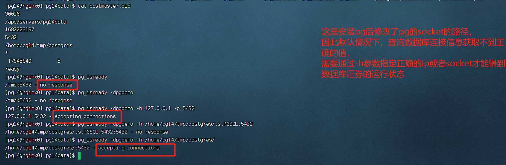

这里直接使用pg_isready 查看pg是不可访问的，但是如果通过-h 指定访问的ip地址或者指定套接字的地址，才可以正常使用。 

为了这类工具使用的简便，我们可以通过设置环境变量 $PGHOST 来和配置文件postgresql.conf 文件中unix_socket_directories 的取值保持一致。这样我们在使用相关命令的时候就可以不借助-h 来指定套接字了，会使用默认的套截止的值。如下图：

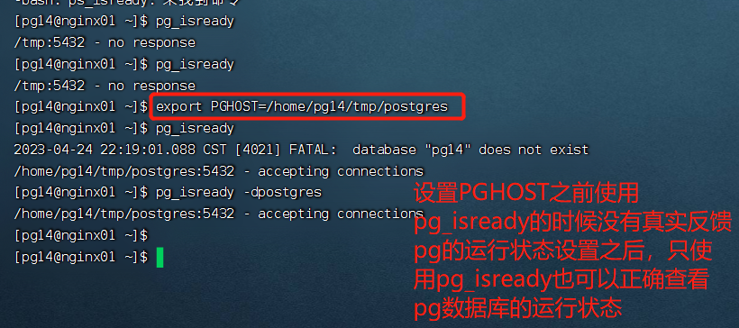

设置PGHOST之后，使用pg_isready 可以不再使用-h 来指定ip地址或者socket 。 


* 疑惑：为什么有的pg_stat_activity 的backend_type 字段取值为空

  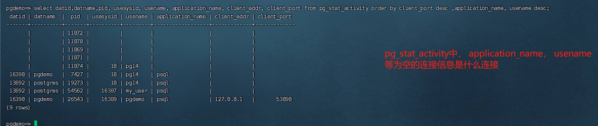

​	原因是： 当前查询用户不是超级用户，权限不足。 使用超级用户登录后，查询pg_stat_activity视图的结果如下：

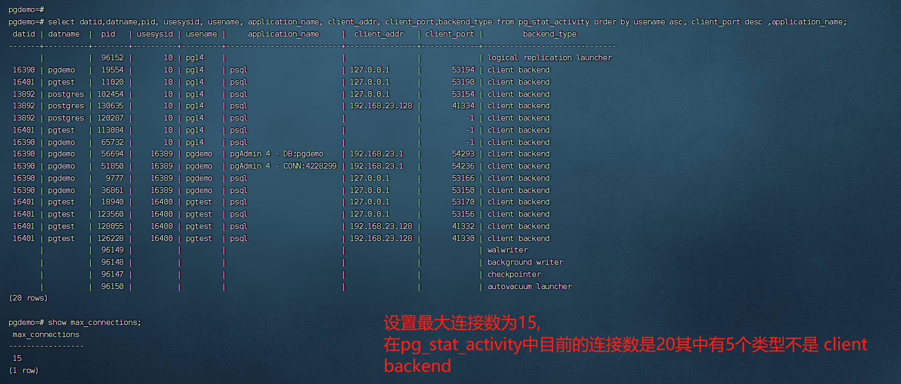

 使用超级用户登录后，可以看到backend_type都有值了， 并且可以通过backend_type区分连接。

在pg_stat_activity 视图中，对max_connections 有效的连接是backend_type为 “client backend”


## TODO

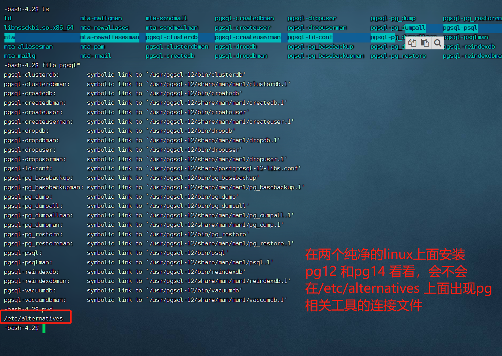

