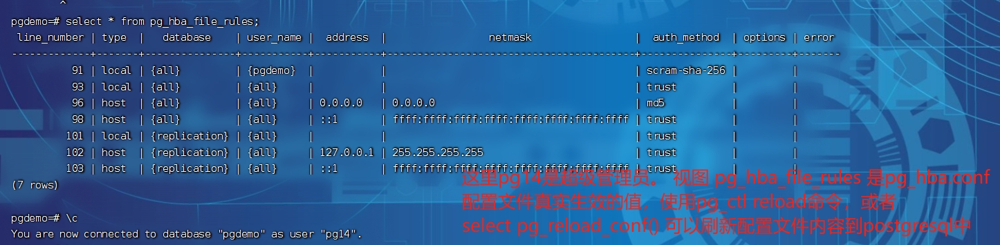
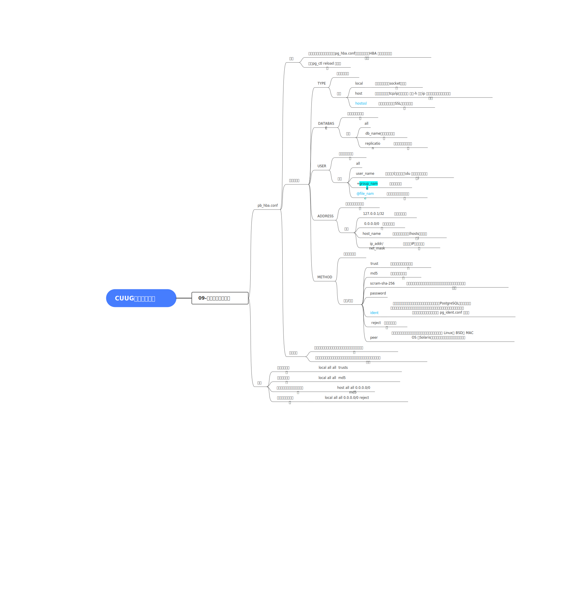

# postgresql 切换加密方式为scram-sha-256


## 概览

scram-sha-256 是比md5更安全的加密方式，并且postgresql 加密方式 password_encryption **由md5 切换为scram-sha-256 的时候，pg_hba.conf 配置的通过md5进行登录的方式依然可以使用原来的密码进行登录**。 


* 当postgresql.conf 中配置 password_encryption 为 md5的时候，pg_hba.conf 中如果配置的Method为scram-sha-256 的用户是无法使用原先的密码进行登录的。

* 但是如果password_encryption 设置为scaram-sha-256 ，pg_hba.conf 配置中国METHOD 设置为md5的连接，依然可以使用原先的密码进行登录


## 切换为scram-sha-256 存在的困难

数据库运行过程中切换为scram-sha-256 存在的困难

* 由于Postgresql 不知道原来的明文密码，将密码加密方式改为 scram-sha-256后，用户必须重新设置密码
* Postgresql 客户端必须支持scram-sha-256 身份认证，因此使用旧的客户端软件进行身份认证将会失败。 


## 切换步骤

1. 升级客户端软件

2. 更改 password_encrytion 参数

   1. 编辑 $PGDATA目录下 postgresql.conf 文件

      ```postgresql.conf
      password_encryption = scram-sha-256
      ```

   2. 重新加载服务器

      方法一：

      ```shell
      $ pg_ctl reload 
      ```

      方法二：

      ```sql
      psql> select pg_reload_conf() 
      ```

      验证修改是否生效

      ```sql
      psql> show password_encryption 
      ```

3.  重新设置经过密码验证的用户必须更改密码。 (使用超级管理员更改)

```sql
psql> \password user_name
```

4.  更改pg_hba.conf 文件中的认证方式
   1.  首先，修改password_encryption为scram-sha-256之后，在 pg_hba.conf 文件中，使用md5加密的认证依然可以通过，不过建议将md5这种加密方式调整为scram-sha-256 


## 补充

1. 超级管理员可以通过查看pg_hba_file_rules 视图查看pg_hba.conf文件中配置的内容，但是真实生效的配置，并不一定是这个。这个是和文件里面的内容，实时更新的。 



2. 


## 思维导图

具体无损svg可查看当前目录下pic目录下的 【03_实例连接访问控制_V20240108.svg】




## 总结

scram-sha-256 和md5 都是两种比较好的加密算法，不过scram-sha-256 更高级也更安全一些。建议使用scram-sha-256 这种加密方式。 


| 日期       | 内容                                                        | 说明                                       |
| ---------- | ----------------------------------------------------------- | ------------------------------------------ |
| 2024-01-08 | postgresql采用更高级加密方式scram-sha-256的原因以及操作步骤 | 推荐使用scram-sha-256这种加密方式          |
| 2024-01-08 | 新增无损svg图，整理相关的思维导图                           | 后续还有很多参数没有进行验证呢，需要去实践 |
|            |                                                             |                                            |

