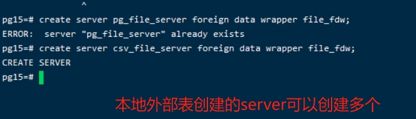

# 本地外部表配置与使用

FDW:  Foreign Data Wrapper


## 操作步骤：

```psql
--- 添加扩展， 这里的扩展file_fdw是固定的。 不能修改
sql >  create extension file_fdw;
--- 创建SERVER FOR file 
sql >  create server pg_file_server foreign data wrapper file_fdw;
```

在创建扩展的时候，如果随意起一个名字，会报错。 


切换到pg源码安装的安装包的 extension 目录下，可以找到一个 file_fdw.control 文件


在pg12 中，该目录下支持的control文件由45个 。 如下图


这里要注意，我们可以创建多个不同名称的server。 




```sql
create foreign table dept_fdw (
		departmentCode varchar(128),
		parentCode varchar(128),
		departmentName varchar(128),
		leaderCode varchar(128)
	) server pg_file_server options(filename '/home/pg15/data/test/dept.csv',  format 'csv', header 'true', delimiter ',')
	
```


这里创建本地外部表，通过回车，可以很好的进行创建。 


创建好本地外部表后，查看本地外部表的表结构.  通过介绍，可以很明确的知道表属于本地外部表。 


通过sql查询本地外部表


同样可以通过explain查看外部表的执行计划。 


可以将本地外部表当成实际的表来查看表结构定义


## 移除本地外部表

```sql
$> DROP froeign table 表名;
```


## 查看FDW中创建的Server


## 删除无用或者错误的server


## 注意

* 不能重复定义server 

  

* 本地外部表指向的文件发送变化后会报错

  

* 

* 定义本地外部表的时候，列的顺序，以及列的数量都要和外部文件保存完全一致。 
  如果列的数量不匹配，查询会报错。 
  如果列的顺序不一致，查询出来的数据不会自动匹配列名。 

  

  

​		


## TODO

1.  扩展的备份。 

   ​		CREATE EXTENSION IF NOT EXISTS file_fdw WITH SCHEMA public;  从这里知道扩展是属于某个模式的，下次尝试在自定义的模式下扩展。 

2. 

## 变更记录

| 日期              | 操作类型 | 变更内容                                   | 备注 |      | 操作用户 |
| ----------------- | -------- | ------------------------------------------ | ---- | ---- | -------- |
| 2024-03-27        | C        | 新增本地外部表的基础操作，以及一些维护命令 |      |      | lipf     |
| 2024-04-14 星期日 | A        | 扩展和模式的关系，以及后续需要做一些练习   |      |      | lilpf    |
|                   |          |                                            |      |      |          |


