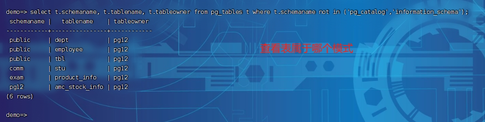

# PostgreSQL数据库的schema


## schema的特点

* schema 是归属于某个数据库
* schema 有一个schema_owner 的概念，说明该schema属于哪个用户，默认属于当前登录用户


## schema的维护


### 创建

不能创建 pg_ 开头的是schema 。

```sql
# 创建一个schema。
psql> create schema myschemaName;

# 创建一个schema并且指定拥有者
psql> create schema myschemaName2 authorization 'lipf';
```


### 删除

删除schema的时候，如果该模式下存在对象，直接删除时删除不掉的。 需要使用cascade关键字

```sql
# 删除schema 
psql > drop schema myschemaName;

# 删除schema并且删除该模式下的对象
psql > drop schema myschemaXXX cascade;
```


### 查询

查询 information_schma 模式下的schemata 表，可以查看到当前数据库下的所有模式，包括pg_ 开头的，以及information_schma  还有用户创建的schema，并请可以查看模式所属的用户。 

```sql

psql> select schema_name, schema_owner from information_schema.schemata where schema_name not like 'pg_%';
```


## search_path

用户设置查询表的顺序。


### 设置search_path 

```sql
# 在psql中，通过set 设置search_path ，作用域只是本地会话 
psql> set search_path to '模式名';
psql> set search_path to '$user',public
```

* 对当前会话生效
  * set search_path to '拼接的模式名'
* 对数据库用户生效(永久生效)
  * alter user 用户名 set search_path = '模式列表'
  * alter user lipf set search_path = comm,"$user",public;
* 对整个数据库生效(永久生效)
  * alter database 数据库名 set search_path = "模式列表";
  * alter database demo set search_path="sch_xxx,'$user',public";
  * 这里要注意，这里指定的数据库必须保证当前用户是该用户的属主


### 查看serch_path的取值

```sql
# 查看search_path， 默认值， "$user", public
psql> show serach_path

# 查看当前schemas
psql> select current_schemas(true);
```


## 模式和权限

默认情况下，用户不能访问他们没有权限的shcema下的任何对象。 

### 授权

授予用户创建模式的权限

```sql
# 授予用户具有创建模式的权限 
psql > grant create on database 数据库名 to '用户';
# 创建模式
psql > create schema 模式名;
```

### 取消授权

```sql
# 取消用户授权
psql > revoke create on database 数据库名 TO 用户名;
```


## 查看表在哪个schema中

```sql
psql>  select t.schemaname, t.tablename, t.tableowner from pg_tables t where t.schemaname not in ('pg_catalog','information_schema');
```




## 疑惑

1. ddl-schemas.html 中的 OPERATOR 不知道什么意思？
2. ddl-schemas.html 中其他没有理解的内容
2.  为用户设置search_path 以及为数据库设置search_path 的优先级是什么样的？ 感觉和执行的先后顺序没有 关系。


## 变更记录

| 日期              | 操作类型 | 内容                 | 备注 |
| ----------------- | -------- | -------------------- | ---- |
| 2024-03-28 星期四 | A        | schema的一些入门知识 |      |
|                   |          |                      |      |
|                   |          |                      |      |

