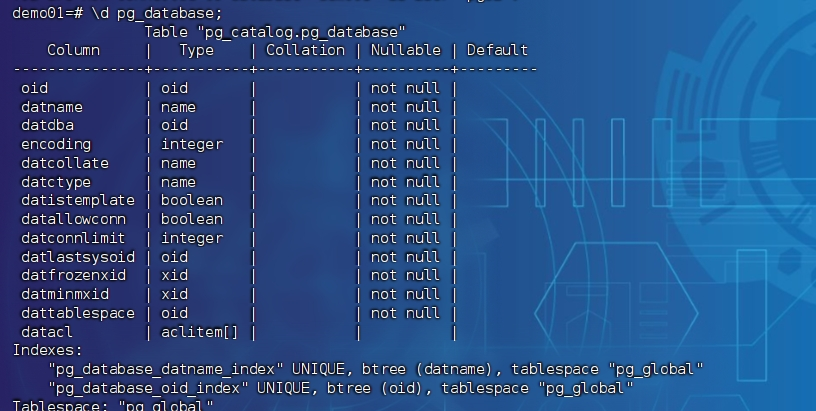
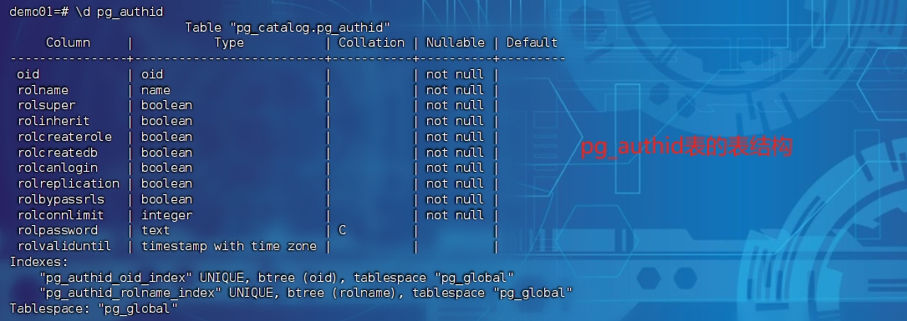
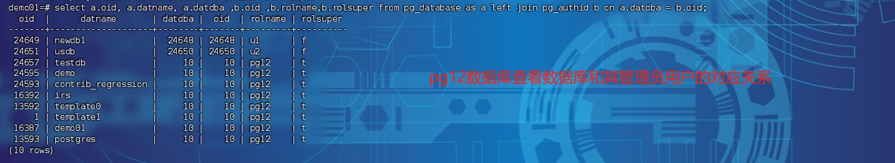

# 查看数据库运维相关的信息常用的sql


## 查看数据库以及其管理员的对应关系

数据库版本： pg12

```sql
psql> select a.oid, a.datname, a.datdba ,b.oid ,b.rolname,b.rolsuper from pg_database as a left join pg_authid b on a.datdba = b.oid;
```

 效果图：


pg_database 表结构




pg_authid 表的表结构



执行后查看效果




## 变更记录

| 日期              | 操作内容                       | 备注 | 操作用户 |
| ----------------- | ------------------------------ | ---- | -------- |
| 2024-04-13 星期六 | 查看数据库及其管理员的对应关系 |      | lipf     |
|                   |                                |      |          |
|                   |                                |      |          |
|                   |                                |      |          |

