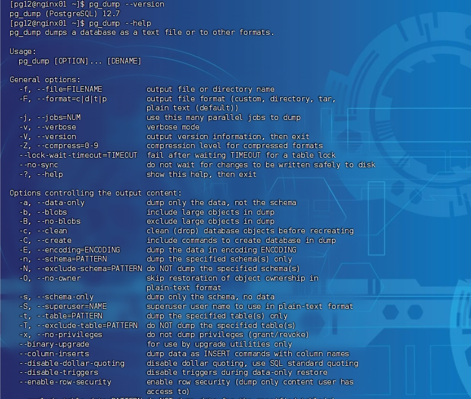
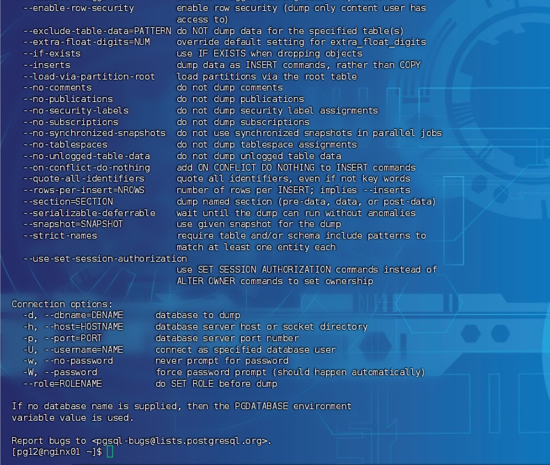
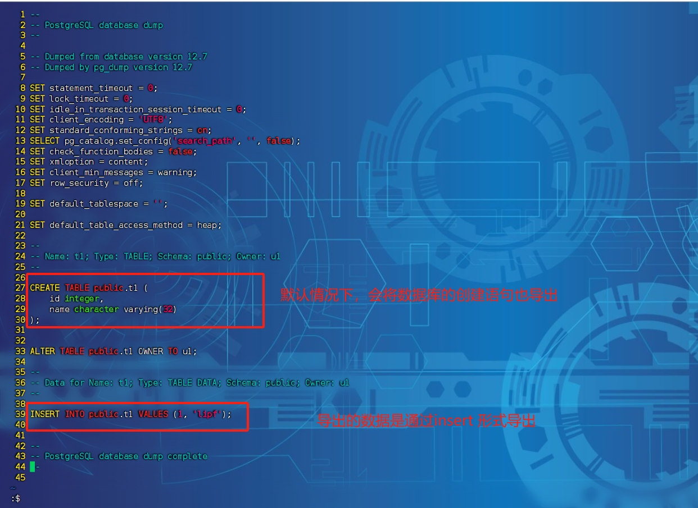
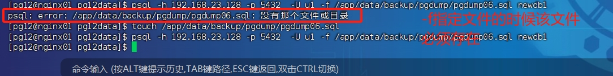
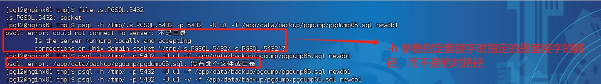
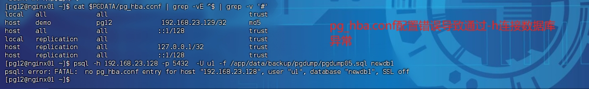
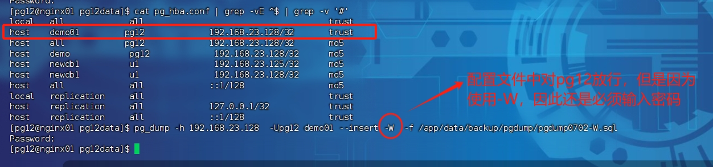
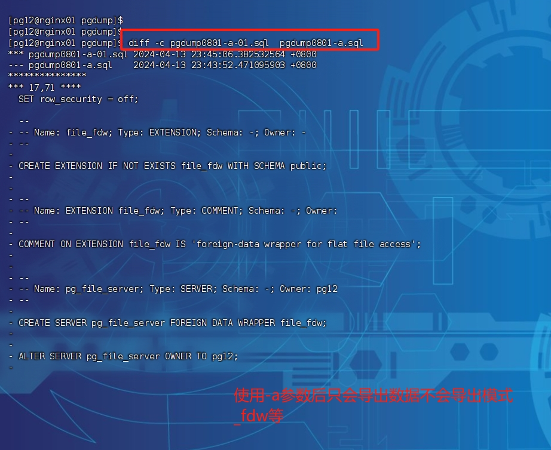

# pg_dump命令详解


## 使用数据库

pg 12.7 


## 作用

pg_dump dumps a database as a text file or to other formats.

pg_dump 将数据库导出为文本文件或者其他格式的文件。 


### 命令详解






## 注意

1. 使用-f 指定文件的时候，该文件必须存在，并且具有访问权限
2. 


## 常规用法

```shell
;; 导出某个数据库的内容为sql脚本，插入数据的方式是insert形式，而不是默认的copy命令
$> pg_dump -Uu1 newdb1 --insert  -f /app/data/backup/pgdump/pgdump04.sql
```

导出效果如下:




### 通用参数说明

-f 指定导出数据保存的文件





### 连接参数说明


#### -h 指定数据库的ip地址或者socket的地址

-h  指定数据库连接地址，适用于未登录到数据库所在服务器的情况


**场景一：**-h 参数指定套接字路径


注意： -h 后面需要连接的是套接字所在目录，而不是套接字的绝对路径。 


报错信息

**错误1(已经解决)**




**场景二：** -h 指定服务器的ip地址

```shell
shell> pg_dump -h 192.168.23.128  -Uu1 newdb1 --insert  -f /app/data/backup/pgdump/pgdump07.sql
```

成功导出。这里会根据$PGDATA/pg_hba.conf 文件里面的配置信息来觉得是否需要输入密码。 


**报错信息**

```text
psql: error: FATAL:  no pg_hba.conf entry for host "192.168.23.128", user "u1", database "newdb1", SSL off
```





#### -w 不提示让输入密码

使用-w，如果pg设置用户登录系统需要输入密码，那么这种情况下会报错。


**报错信息**


这种情况针对用户登录属于trust的情况下，是不会报错的，但是如果要求输入密码，就会报这个错。 解决方案，取消-w，或者修改pg_hba.conf 放开权限。 推荐使用 取消-w 来输入密码的方式解决。 


#### -W 强制要求输入密码




#### --role=*`rolename`* 登录数据库后设置权限

TODO  等对权限有了深入的了解之后再来弄这个。 


### 控制输出文件格式的参数

#### -a 参数

命令：

```shell
shell> pg_dump -h 192.168.23.128  -Upg12 demo01 --insert -W  -f /app/data/backup/pgdump/pgdump0801-a-01.sql -a
```


使用-a参数后只会导出数据不会导出模式_fdw等




## 疑惑

### 疑惑一(未解决)

使用-h 指定套接字的时候，导出的sql脚本为空，不知道为什么

```shell
$> psql -h /tmp/ -p 5432 -U u1 -f /app/data/backup/pgdump/pgdump05.sql -v -d newdb1
```


### 疑惑二（未解决）

感觉$PGDATA/pg_hba.conf 里面的配置没有问题，但是连接不上数据库


### 疑惑三(未解决)

不知道pg为什么会提供一个连接参数 。-w ， --no-password 。 不知道使用场景是什么？


## TODO

* --role=*`rolename  了解权限后再进行验证。 
* 


## 变更记录

| 日期              | 操作内容                    | 备注 | 接下来要研究验证的内容                 | 操作用户 |
| ----------------- | --------------------------- | ---- | -------------------------------------- | -------- |
| 2024-04-13 星期六 | 练习pg_dump命令中的参数信息 | xxx  | pg_dump 一些参数使用存在疑惑，需要解决 | lipf     |
|                   |                             |      |                                        |          |
|                   |                             |      |                                        |          |
|                   |                             |      |                                        |          |


## 
