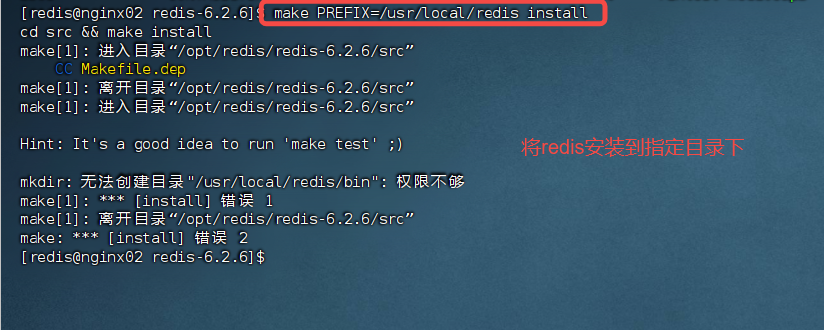

# CentOS7安装Redis6

从redis官网下载Redis的安装包redis-6.2.6.tar.gz


先将redis-6.2.6.tar.gz 文件通过如下的命令解压

```shell
$> tar -xzvf redis-6.2.6.tar.gz -C /opt/redis
```


切换到 /opt/redis目录下，准备编译安装Redis

```shell
$> cd /opt/redis/redis-6.2.6
#! 执行make来对redis的源码进行编译
$> make


```




