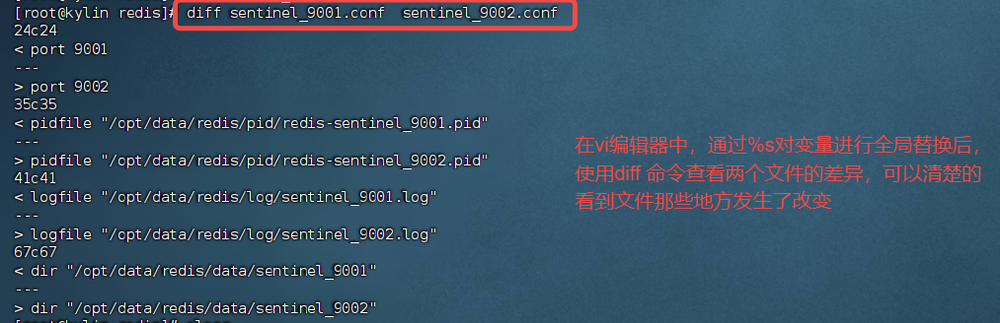

# 麒麟操作系统安装 Redis

环境介绍：
操作系统： 麒麟操作学习
内核信息： 4.19.90-89.11.v2401.ky10.x86_64 (uname -r 命令查询得到的信息)

## 搭建 Redis 单机环境

以 root 用户登录麒麟操作系统，创建/opt/packages

```shell
# mkdir /opt/packages
#! 切换到/opt/packages 目录下，通过rz 命令将redis安装包上传
# rz
#! 将redis的源码解压到/opt/packages 目录下
# tar -xzvf redis-6.2.6.tar.gz  -C /opt/packages

# cd /opt/packages/redis-6.2.6
# make
# make test   （可选）模拟进行安装
#! 将redis相关命令保存到指定的目录下
# make PREFIX=/usr/local/redis install
```

redis 源码安装包解压后目录结构如下图：


执行 make 命令，会默认设置一些文件的保存路径，信息如下


安装完成之后，可以在指定目录找到 redis 相关的命令。 这里需要将该路径添加到 path 环境变量中。
我们通过修改/etc/profile 文件来配置 path 环境变量

```shell
# 在/etc/profile文件中，添加如下的配置
export PATH=/usr/local/redis/bin:$PATH
```

从 redis 源码目录下，将 redis.conf 文件复制到 /usr/local/redis/6379.conf
第一次启动 Redis 前，编辑/usr/local/redis/6379.conf

```redis.conf
# 设置Redis监听的IP地址和端口号，默认监听所有IP地址和6379端口
bind 0.0.0.0

#96 启用保护模式，允许远程访问
protected-mode no

# 101 指定Redis监听的端口号
port 6379

#262 修改为以守护进程模式后台运行
daemonize yes

# 295 修改pid文件名，以守护进程运行的时候，会产生pid文件，默认位置为/run/redis.pid,
# 因为这里在同一台机器上运行多个实例，所以需要指定
pidfile /opt/data/redis/pid/redis_6379.pid

#301 配置日志级别根据需要进行调整
loglevel notice

#460 配置数据存储目录,搜索【dir 】,后面添加一个空格，快速定位，否则会定位到很多的directory
dir /opt/data/redis/data/8379

# 389根据磁盘性能调整持久化选项
save 900 1
save 300 100
save 60 10000

#308 修改日志文件位置
logfile /opt/data/redis/log/redis_6379.log

```

修改完配置文件之后，还需要在指定目录创建相关的目录

```shell
$> mkdir -p /opt/data/redis/log  /opt/data/redis/data/ /opt/data/redis/pid /opt/data/redis/data/8379
```

编辑 /etc/sysctl.conf 文件，然后在文件末尾添加如下内容

```text
# 解决redis启动时的警告信息。 WARNING overcommit_memory is set to 0! Background save may fail under low memory condition.
vm.overcommit_memory = 1
```

保存后，执行

```shell
$> sysctl vm.overcommit_memory=1
```

通过如下的命令启动

```shell
$> redis-server /usr/local/redis/6379.conf
```

验证 redis 安装配置成功

```shell
$> redis-cli -h 192.168.23.110 -p 6379
```

登录成功后，可以通过 keys 等命令查看 redis 中的缓存数据

## 搭建 Redis 主从复制环境

在上面配置文件的基础上，将 redis.conf 文件进行复制，复制后，根据实际部署情况，将端口替换为从节点的端口。
并且在从节点的配置文件 redis.conf 中新增如下配置，来指定从节点从哪一个主节点同步数据

```text
replicaof 主节点的ip 	主节点的端口
```

调整配置文件后，启动从节点。
从节点启动后，通过 redis-cli 登录 redis，之后，通过 info replication 命令查看集群信息


## 搭建哨兵环境(sentinel)

哨兵(sentinel) 是一个分布式系统，是在主从复制的基础上，加上了故障自动切换。 哨兵模式通过监控，自动故障转移和通知机制，帮助 Redis 集群保持高可用性，确保在主节点故障时能够快速恢复，避免服务长时间中断。
<font color="red">监控</font>
哨兵模式的核心功能是持续监控主节点和从节点的监控状态。 它通过周期性的向这些节点发送 PING 命令，检查它们是否能够正常响应，一旦发现某个节点无法响应或异常时，哨兵就会认为该节点发生了故障。
<font color="red">通知</font>:
哨兵还具有<font color="red">通知机制</font>。在故障转移的过程中，哨兵会将故障转移的结果或相关信息通知给客户端，确保客户端能够及时更新和感知集群的状态变化。

### 哨兵模式结构

- 哨兵节点
  - 哨兵系统由一个或多个哨兵节点组成，哨兵节点是特殊的 redis 节点，不存储数据
- 数据节点
  - 主节点和从节点都是数据节点
    当哨兵集群确认主节点客观下线后，哨兵系统会使用 Raft 选举算法来选出一个哨兵作为 Leader。这个 Leader 将负责接下来的故障转移操作。 由于 Raft 算法的选举需要多个节点参与并达成共识，因此哨兵节点的数量必须不少于 3 个，这样才能有效避免选举中的平局或者分歧，确保系统的可靠性。

### 哨兵模式配置

哨兵模式是在主从复制的基础上发展来的，需要先配置好主从复制。 哨兵模式的配置文件是 sentinel.conf

```conf
#（17行） 关闭保护模式， 注释也行
protected-mode no
#（23行） 设置Redis哨兵默认的监听端口
port 90001
# 29行，指定sentinel为后台启动
daemonize yes
# （35行）指定sentinel启动时，进程pid保存文件的位置
pidfile "/opt/data/redis/pid/redis-sentinel_9002.pid"
#（40行） 指定日志存放路径
logfile "/opt/data/redis/log/sentinel_90001.log"
#(66行) 指定数据库存放路径
dir /opt/data/redis/data/sentinel_90001
# (92行)修改指定该哨兵节点监控 192.168.23.110 6379主节点， 这里该主节点的名称是mymaster，后面的2表示至少需要2个哨兵
# 同意，才能判定主节点故障并进行故障转移
sentinel monitor mymaster 192.168.23.110 6379 2
# 135行， 判定服务器down掉的时间周期，默认30000毫秒(30秒)
sentinel down-after-milliseconds mymaster 30000
# （236行）故障节点的最大超时时间为 180000 (180秒)
sentinel failover-timeout mymaster 180000
```

配置文件修改后，通过如下的命令启动

```shell
$> redis-sentinel sentinel.conf
```

启动成功后，需要将对应的 sentinel.conf 文件中，自动生成的部分配置删除，因为后续其他哨兵，需要通过这个配置复制后，修改端口来生成新的配置文件。 哨兵模式启动后，会在 sentinel.conf 为 sentinel 生成一个唯一的 id，这个需要保证哨兵环境中的每个 myid 的值是不一样的。
主观下线
SDOWN:subjectively down,直接翻译的为”主观”失效,即当前 sentinel 实例认为某个 redis 服务为”不可用”状态.

二.客观下线
ODOWN:objectively down,直接翻译为”客观”失效,即多个 sentinel 实例都认为 master 处于”SDOWN”状态,那么此时 master 将处于 ODOWN,ODOWN 可以简单理解为 master 已经被集群确定为”不可用”,将会开启故障转移机制.

### 搭建 Redis Cluster 环境

需要调整 redis.conf 的内容如下，没有涉及到的保持初始化配置即可

```redis.conf
bind 0.0.0.0
protected-mode no
port 5000
daemonize yes
pidfile "/opt/data/redis/pid/redis_5000.pid"
loglevel notice
logfile "/opt/data/redis/log/redis_5000.log"
databases 16
dir "/opt/data/redis/data/5000"
cluster-enabled yes
cluster-config-file cluster-nodes.conf
cluster-node-timeout 15000
```

这里在不同的环境上需要配置 6 个环境，其中三主三从

构建 Redis Cluster 环境的相关命令

```shell
# 先启动6个Redis实例
$> /usr/local/redis/bin/redis-server /usr/local/redis/cluster/5000.conf
$> /usr/local/redis/bin/redis-server /usr/local/redis/cluster/5001.conf
$> /usr/local/redis/bin/redis-server /usr/local/redis/cluster/5002.conf
$> /usr/local/redis/bin/redis-server /usr/local/redis/cluster/5003.conf
$> /usr/local/redis/bin/redis-server /usr/local/redis/cluster/5004.conf
$> /usr/local/redis/bin/redis-server /usr/local/redis/cluster/5005.conf

# 再使用上面创建的6个Redis实例，搭建Redis Cluster
$> redis-cli --cluster create 127.0.0.1:5000 127.0.0.1:5001 127.0.0.1:5002 127.0.0.1:5003 127.0.0.1:5003 127.0.0.1:5004 127.0.0.1:5005 --cluster-replicas 1

# 按照上面的操作就可以搭建好一个Redis Cluster集群。 接着，我们可以通过redis-cli 命令向集群中插入数据
$> redis-cli -p 5000 -c      # 这里添加-c 选项，可以实现在不同redis 实例之间自动跳转

```

启动 Redis Cluster 环境之后，会修改配置文件，修改的是 cluster-config-file 指定的配置文件，这里是 cluster-nodes.conf 文件

```txt
6cbfb7c3aab8c55a2c0f83a0e7c1edd3d6ebd522 127.0.0.1:5003@15003 slave 3a1b13b88924c7506fb524a563e2b06327cb5513 0 1734073161546 1 connected
17156017616afa26d2e9ff118a423cd6e093e80e 127.0.0.1:5002@15002 master - 0 1734073160000 3 connected 10923-16383
4a6e8faaee69fcd8c5a17860c7aa1792cdd4cb92 127.0.0.1:5005@15005 slave 1c11143a917a5e890edda71db2564bf57d1f6da6 0 1734073160538 2 connected
1c11143a917a5e890edda71db2564bf57d1f6da6 127.0.0.1:5001@15001 master - 0 1734073158000 2 connected 5461-10922
3a1b13b88924c7506fb524a563e2b06327cb5513 127.0.0.1:5000@15000 myself,master - 0 1734073159000 1 connected 0-5460
1ced3cd8248297f4e33578b06b146bc305066f60 127.0.0.1:5004@15004 slave 3a1b13b88924c7506fb524a563e2b06327cb5513 0 1734073159529 1 connected
vars currentEpoch 7 lastVoteEpoch 0

```

## 基础的 Redis 运维命令

redis-server /usr/local/redis/6379.conf 根据指定的配置文件启动 redis 服务端

redis-cli shutdown # 停止 redis 客户端

redis-cli -h ip 地址 -p 端口

## 常用的 Redis 命令

info replication 查看 Redis 的集群信息

### 经验

执行 make test 命令，进行了 64 项内容的验证。 自己目前已经将相关的验证内容保存到 make_test.txt 文件中， 后续可以好好的看看，对于自己了解 Redis 的内部原理有好处。自己初略的看了看，是说里面有很多 RDB，AOF 等关键字。

这里的每一项验证，都应该对应 Redis 的一个功能

注意：<font color="red">使用 sentinel 进行了主从切换后，会对 Redis 的 redis.conf 和 sentinel.conf 中的配置文件进行部分内容的自动调整，根据新的 master 节点来调整这些参数文件。</font>

## 遇到的问题

### 问题一

执行 make test 报错

```text
*** [err]: Active defrag in tests/unit/memefficiency.tcl
Expected 34 <= 30 (context: type eval line 68 cmd {assert {$max_latency <= 30}} proc ::test)
```

解决方案，重新执行 make test，就好了

### 问题二

```
erver initialized
2302120:M 10 Dec 2024 14:40:33.986 # WARNING overcommit_memory is set to 0! Background save may fail under low memory condition. To fix this issue add 'vm.overcommit_memory = 1' to /etc/sysctl.conf and then reboot or run the command 'sysctl vm.overcommit_memory=1' for this to take effect.
```

### 常用的命令

**命令一**

cat sentinel_9001.conf | grep -v '#' | grep -v '^$' 查看 redis 配置文件中的有效配置， 去除掉空格和注释

**命令二**

在 vi 编辑器中，进行全局替换

可以使用`:%s/原字符串/新字符串/g`在整个文件中进行替换。这里是通过 :%s/9001/9002/g 将整个文档中的 9001 替换为 9002，替换之后，通过 diff 命令查看文件的差异



**命令三**

```shell
# 根据pid目录下的pid文件，将对应的进程批量杀死
$> cat pid/* | xargs kill -9
```

## 参考资料

https://blog.csdn.net/2301_80613136/article/details/142262425

https://blog.csdn.net/weixin_30580341/article/details/97680229 (比较详细)
