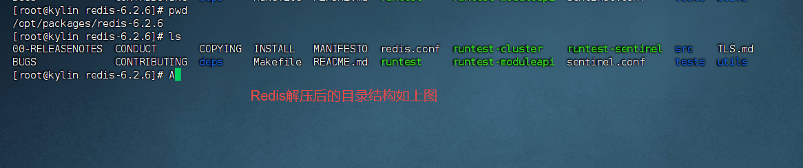
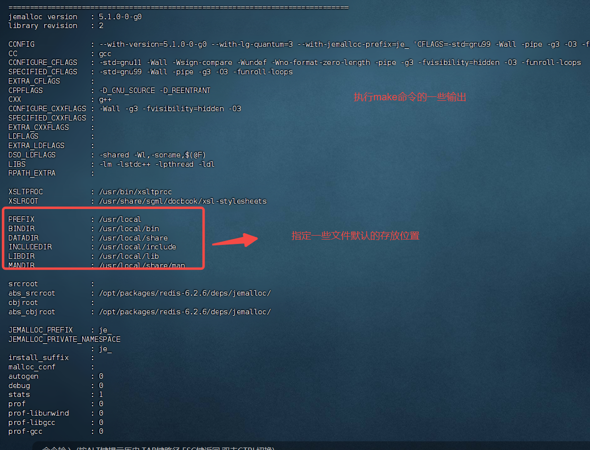
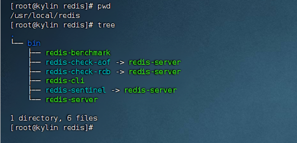
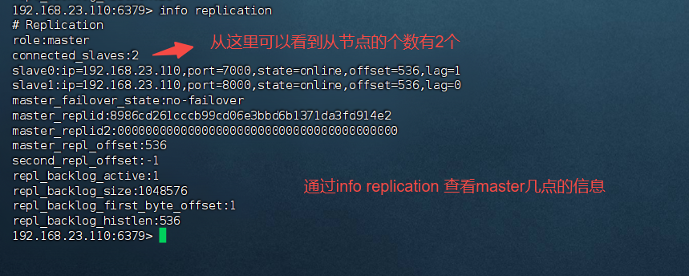
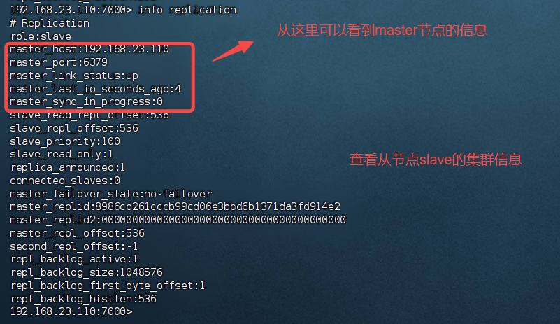

# 麒麟操作系统安装Redis


## 搭建Redis单机环境

以root用户登录麒麟操作系统，创建/opt/packages 

```shell
# mkdir /opt/packages 
#! 切换到/opt/packages 目录下，通过rz 命令将redis安装包上传
# rz
#! 将redis的源码解压到/opt/packages 目录下
# tar -xzvf redis-6.2.6.tar.gz  -C /opt/packages

# cd /opt/packages/redis-6.2.6
# make 
# make test   （可选）模拟进行安装
#! 将redis相关命令保存到指定的目录下
# make PREFIX=/usr/local/redis install 


```

redis源码安装包解压后目录结构如下图：




执行make命令，会默认设置一些文件的保存路径，信息如下






安装完成之后，可以在指定目录找到redis相关的命令。 这里需要将该路径添加到path 环境变量中。 

我们通过修改/etc/profile 文件来配置path环境变量

```/etc/profile
# 在/etc/profile文件中，添加如下的配置
export PATH=/usr/local/redis/bin:$PATH
```


从redis源码目录下，将redis.conf 文件复制到  /usr/local/redis/6379.conf 


第一次启动Redis前，编辑/usr/local/redis/6379.conf

```redis.conf
# 设置Redis监听的IP地址和端口号，默认监听所有IP地址和6379端口
bind 0.0.0.0

#96 启用保护模式，允许远程访问
protected-mode no

# 101 指定Redis监听的端口号
port 6379

#262 修改为以守护进程模式后台运行
daemonize yes

# 295 修改pid文件名，以守护进程运行的时候，会产生pid文件，默认位置为/run/redis.pid,
# 因为这里在同一台机器上运行多个实例，所以需要指定
pidfile /opt/data/redis/pid/redis_6379.pid

#301 配置日志级别根据需要进行调整
loglevel notice

#460 配置数据存储目录,搜索【dir 】,后面添加一个空格，快速定位，否则会定位到很多的directory 
dir /opt/data/redis/data/8379

# 389根据磁盘性能调整持久化选项
save 900 1
save 300 100
save 60 10000


#308 修改日志文件位置
logfile /opt/data/redis/log/redis_6379.log


```

修改完配置文件之后，还需要在指定目录创建相关的目录

```shell
$> mkdir -p /opt/data/redis/log  /opt/data/redis/data/ /opt/data/redis/pid /opt/data/redis/data/8379
```


编辑 /etc/sysctl.conf 文件，然后在文件末尾添加如下内容

```text
# 解决redis启动时的警告信息。 WARNING overcommit_memory is set to 0! Background save may fail under low memory condition.
vm.overcommit_memory = 1
```

保存后，执行

```shell
$> sysctl vm.overcommit_memory=1
```


通过如下的命令启动

```shell
$> redis-server /usr/local/redis/6379.conf
```


验证redis安装配置成功

```shell
$> redis-cli -h 192.168.23.110 -p 6379
```

登录成功后，可以通过keys等命令查看redis中的缓存数据


## 搭建Redis主从复制环境

在上面配置文件的基础上，将redis.conf 文件进行复制，复制后，根据实际部署情况，将端口替换为从节点的端口。 

并且在从节点的配置文件redis.conf 中新增如下配置，来指定从节点从哪一个主节点同步数据

```text
replicaof 主节点的ip 	主节点的端口
```

调整配置文件后，启动从节点。 


从节点启动后，通过redis-cli 登录redis，之后，通过info replication 命令查看集群信息







## 基础的Redis运维命令

redis-server /usr/local/redis/6379.conf		根据指定的配置文件启动redis服务端

redis-cli shutdown			# 停止redis客户端

redis-cli -h ip地址 -p 端口


## 常用的Redis命令

info replication    查看Redis的集群信息


### 经验

执行make test 命令，进行了64项内容的验证。 自己目前已经将相关的验证内容保存到make_test.txt 文件中， 后续可以好好的看看，对于自己了解Redis的内部原理有好处。自己初略的看了看，是说里面有很多RDB，AOF等关键字。

这里的每一项验证，都应该对应Redis的一个功能


## 遇到的问题

### 问题一

执行make test 报错

```text
*** [err]: Active defrag in tests/unit/memefficiency.tcl
Expected 34 <= 30 (context: type eval line 68 cmd {assert {$max_latency <= 30}} proc ::test)
```

解决方案，重新执行make test，就好了


### 问题二

```
erver initialized
2302120:M 10 Dec 2024 14:40:33.986 # WARNING overcommit_memory is set to 0! Background save may fail under low memory condition. To fix this issue add 'vm.overcommit_memory = 1' to /etc/sysctl.conf and then reboot or run the command 'sysctl vm.overcommit_memory=1' for this to take effect.
```


