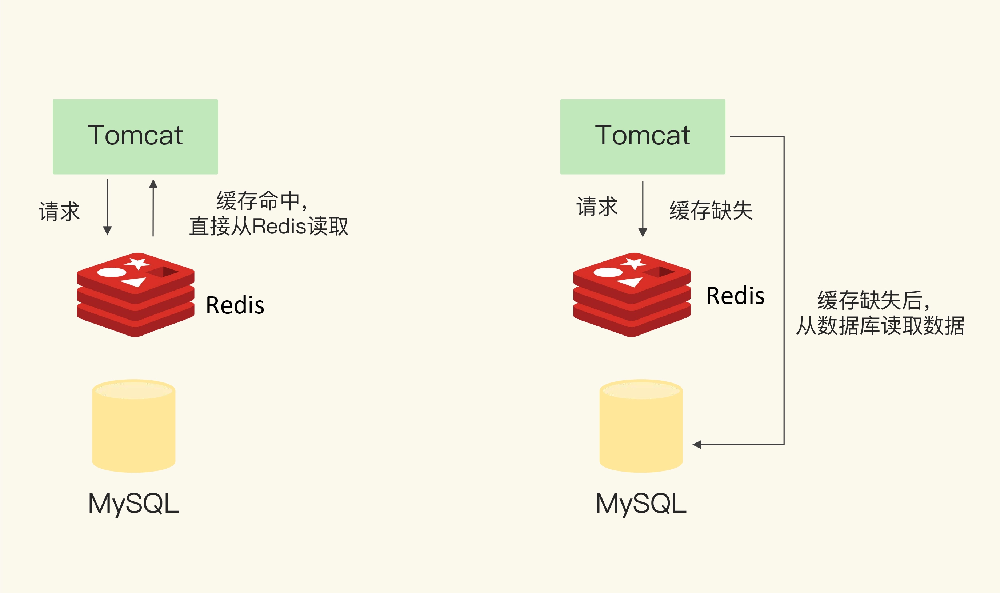
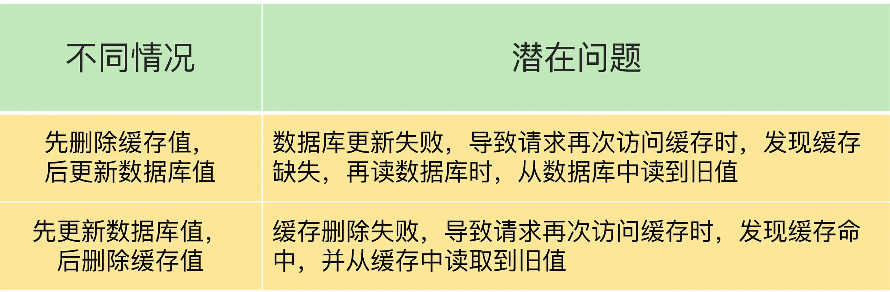
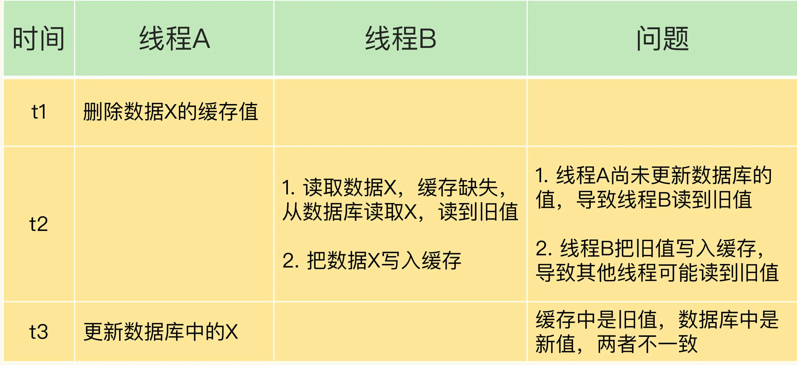
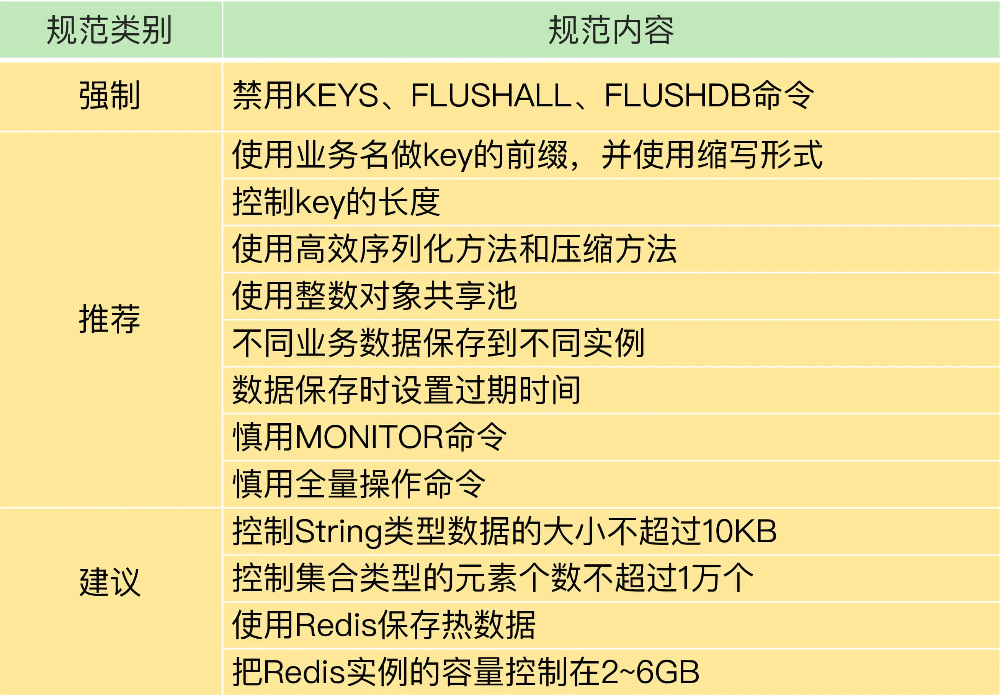

# 极客时间Redis核心技术与实战

## 开篇词


### 04 AOF日志，宕机了，Redis如何避免数据丢失


### 05 内存快照： 宕机后，Redis如何实现快速恢复
Redis在使用RDB进行持久化时，Redis会fork子进程来完成。 fork操作的用时和Redis的数据量是正相关的，而fork在执行时会阻塞主线程。 数据量越大，fork操作造成的主线程阻塞的时间越长。


### 06 数据同步：主从库如何实现数据一致
* 要解决的问题：
1. 在Redis单实例中，Redis服务宕机之后，Redis在恢复期间提供的服务是不可用的

Redis的高可靠性包括如下两点
* 数据尽量少丢失  
    AOF 和RDB 保证了数据尽量少丢失
* 服务尽量少中断      
    Reids 通过增加副本冗余量来保证服务尽量少中断

Redis部署多套实例可能存在的问题
1. 多副本之间数据如何保持一致?
2. 数据读写操作可以发给所有的实例吗?

Redis提供了主从库模式，以保证数据副本的一致，主从库之间采用的是读写分离的方式。 

* 读操作：主库，从库都可以接收
* 写操作：首先到主库执行，然后，主库将写操作同步给从库


主从库间数据第一次同步的三个阶段
* 第一阶段： 建立连接，协商同步
* 第二阶段： 主库同步数据给从库
* 第三阶段： 主库发送新的写命令给从库


主从级联模式分担全量复制是的主库压力
我们可以通过“主-从-从”模式将主库生成RDB和传输RDB的压力，以级联的方式分散到从库上。 
在部署主从集群的时候，可以手动选择一个从库（比如选择内存资源配置较高的从库），用于级联其他的从库。然后，我们可以再选择一些从库，让这些从库从所选择的从库建立起主从关系。 


一旦主从库完成了全量复制，它们之间就会一直维护一个网络连接，主库会通过这个连接将后续陆续接收到的命名操作再同步给从库，这个过程也称为**基于长链接的命令传播**，可以避免频繁建立连接的开销。 


主从库网络断了怎么办？

## 重要的参数
* repl_backlog_size 


## 总结
* Redis的主从库同步的基本原理，总结来说，有三种模式： 全量复制，基于长连接的命名传播，以及增量复制


## 新引入的问题
主从库模式使用读写分离虽然避免了同时写入实例带来的数据不一致问题，但是还面临主库故障的潜在风险。 

## 课后问题
为什么主从库间的复制不使用 AOF 呢？
个人理解： 主从库复制，使用RDB而不使用AOF 是因为使用AOF 的话，传输的数据量比较大，网络带宽消耗比较大，不利于高性能。 


## 思考
* 如何查看Redis缓存的数据占用了多少内存？
* 有什么命令，可以临时断开两个机器中间的网络连接？
* 


### 07哨兵机制：主库挂了，如何不间断服务

#### 疑惑
1. 在微服务中访问Redis集群的时候，如何确定该读取Redis集群中的哪个数据？
2. 在Redis集群中，Redis的主节点变更之后，重启集群项目，是不是需要调整Redis连接的相关信息了 ？
3. 

#### 知识点
在Redis主从集群中，哨兵机制是实现主从库自动切换的关键机制，它有效地解决了主从复制模式下故障转移的三个问题
1. 主库真的挂了吗？
2. 该选择哪个从库作为主库
3. 怎么把新主库的相关信息通知给从库和客户端


哨兵其实就是一个运行在特殊模式下的Redis进程，主从库实例运行的同时，它也在运行。 
哨兵主要负责的就是三个任务： 监控，选主（选主主库），和通知。 

* 监控
  * 监控就是指哨兵进程在运行时，周期性的给所有的主从库发送PING命令，检测她们是否仍然在线运行。 
* 选主
* 通知


#### 如何选定新主库
筛选条件
   查看从库之前的网络连接状态
打分条件
* 从库优先级    
  第一轮： 优先级最高的从库得分高
* 从库复制进度
  * 和旧主库同步程度最接近的从库得分最高
* 从库ID号
  * 每个实例都会有一个ID，这个ID 就类似于这里的从库的编号。 
  * Redis在选主库时，有一个默认的规定，在优先级和复制进度都相同的情况下，ID号最小的从库得分最高，会被选为新主库。
* 


#### 重要的参数
slave-priority ： 给不同的从库设置不同的优先级

master_repl_offset： 主库用来记录当前在最新写操作在repl_backlog_buffer 中的位置
slave_repl_offset：  从库用来记录当前的复制进度。

#### 总结
Redis的哨兵机制，是实现Redis不间断服务的重要保证。具体来说，主从集群的数据同步，是数据可靠的基础保证，而在主库发生故障时，自动的主从切换时服务不间断的关键支撑。 

### 08 哨兵集群：哨兵挂了，主从库还能切换吗？


### 09 切片集群： 数据增多了，是该加内存还是加实例？
#### 需要解决的问题
* Redis如何保存更多数据？
* 数据如何存储到redis cluster上的
* 客户端如何定位数据在哪个实例上？

##### 相关命令
* 使用info命令查看Redis的 latest_fork_usec 指标值（表示最近一次fork的耗时）
* redis cluster中的命令： 
  * cluster create 创建集群
  * cluster meet 命令手动建立实例间的连接，形成集群，
  * cluster addslots 命令，指定每个实例上的哈希槽的个数
    * 这个命令，针对不同Redis实例，内存容量不一样的情况。
* MOVED 命令 ： 可以定位某个哈希槽所在Redis实例的ip和端口。 
  * MOVED 命令会更该本地缓存，让后续所有命令都发往新实例。 
* ASK 命令：表示哈希槽正在迁移过程中，没有完全迁移完。
  * ASK 命令并不会更新客户端缓存的哈希槽分配信息。 
* ASKING 命令： 

在实际应用Redis时，随着用户或业务规模的扩展，保持大量数据的情况通常是无法避免的，而切片集群，就是一个非常好的解决方案。 

切片集群不可避免地涉及到多个实例的分布式管理问题。 要想把切片集群用起来，我们需要解决两大问题
* 数据切片后，在多个实例之间如何分布
  * 从3.0 开始，Redis官方提供了一个名为Redis Clluster的方案，用于实现切换集群。Redis Cluster中规定了数据和实例的对应规则。 
  * Redis cluster中一共有16384个哈希槽
  * 在手动分配哈希槽的时候，需要把16384个槽都分配完，否则Redis集群无法正常工作。 
* 客户端怎么确定想要访问的数据在哪个实例上？
* 

通过哈希槽，切片集群实现了数据懂啊哈希槽，哈希槽再到实例的分配。

#### 客户端如何定位数据在哪个实例上


在集群中，实例和哈希槽的对应关系并不是一成不变的，最常见的变化有两个
1. 在集群中，实例有新增或删除，Redis需要重新分配哈希槽
2. 为了负载均衡，Redis需要把哈希槽在所有实例上重新分布一遍。 
   飞：如果这样，手动设置的哈希槽位置，是不是就发生改变了？
  
Redis Cluster 方案提供了一种重定向机制，所谓的重定向，就是指，客户端给一个实例发送数据读写操作时，这个实例上并没有相应的数据，客户端要再给一个新实例发送操作命令。 


## 基础篇
## 实战篇

### 11 万金油的String为什么不好用了

String类型并不是实用与所有的场合，它有一个明显的短板，就是它保存数据时所消耗的内存空间比较多。

#### 要解决的问题
* 为什么String类型内存开销大？
* 


#### String类型内存开销为什么大？
除了记录实际数据，String类型还需要额外的内存空间记录数据长度，空间使用等信息，这些信息也叫做元数据。点那个实际保存的数据较小时，元数据的空间开心就显得比较大了，优点喧宾夺主的意思。 

***当你保存64位有符号整数时，String类型会把它保存位一个8字节的Long类型整数，这种保存方式通常也叫做int编码方式***
但是当你保存的数据中包含字符串时，String类型就会用简单动态字符串（Simple Dynamic String， SDS） 结构体来保存。

SDS：
    buf：字节数组
    len：占4个字节
    alloc： 占4个字节
对于String类型来说，除了SDS的额外开销，还有一个来自RedisObject结构体的开销。 
一个ReidsObject包含了8个字节的元数据和一个8字节的字节指针，这个指针再进一步指向具体数据类型的实际数据所在。


### 12 有一亿个keys要统计，应该用哪种集合

#### 集合类型常见的四种统计模式
* 聚合统计
  * 所谓的聚合统计，就是指统计多个集合元素的聚合结果，包括： 统计多个集合的共有元素（交集）；
  * 把两个集合相比，统计其中一个集合独有的元素（差集统计）
  * 统计多个集合的所有元素（并集统计）
  * 对应的案例： 统计手机App每天的新增用户数和第二天的留存用户数。
  * Set 集合的差集，并集和交集复杂度较高，在数据量较大的情况下，如果直接执行这些计算，会导致Reids实例阻塞。 建议：可以从主从集群中选择一个从库，让它专门负责聚合计算，或者是把数据读取到客户端，在客户端来完成聚合统计。 
* 排序统计
  * 场景： 电商网站提供最新评论列表的功能， 最新评论列表包含了所有评论中的最新留言。 
  * List是按照元素进入List的顺序进行排序饿的，而Sorted Set可以根据元素的权重来排序，我们可以自己决定每个元素的权重值。
* 二值统计
  * 场景：签到打卡的场景
  * 二值状态就是指集合元素的取值就只有0和1 两种，在签到打卡的场景中，我们只用记录签到（1）或者未签到（0），是典型的非常典型的二值状态。 
  * Bitmap本身是用String类型作为底层数据结构实现的一种统计二值状态的数据类型。 
* 基数统计
  * 场景：基数统计就是指统计一个集合中不重复元素的个数，对应到我们的场景，就是统计网页的UV。 
  * HyperLogLog 是一种用于统计基数的数据集合类型，他的最大优势在于，当集合元素数量非常多时，它计算基数所需的空间总是固定的，而且还很小。 
  * 在Redis中，每个HyperLogLog 只需要花费12kb内存，就可以计算接近2^64个元素的基数。
  * 你可以用 PFADD 命令（用于向 HyperLogLog 中添加新元素）把访问页面的每个用户都添加到 HyperLogLog 中。
  * 接下来，就可以用 PFCOUNT 命令直接获得 page1 的 UV 值了，这个命令的作用就是返回 HyperLogLog 的统计结果
  * HyperLogLog 的统计规则是基于概率完成的，所以它给出的统计结果是有一定误差的，标准误算率是 0.81%。这也就意味着，你使用 HyperLogLog 统计的 UV 是 100 万，但实际的 UV 可能是 101 万。虽然误差率不算大，但是，如果你需要精确统计结果的话，最好还是继续用 Set 或 Hash 类型
  * 
* 


### 13 GEO时什么？ 还可以定义新的数据类型吗？
#### 问题
* 介绍开发自定义的新数据类型的基本步骤
* 扩展数据类型 GEO 的实现原理和使用方法
* LBS：基于位置信息服务  （Location-Based Service， LBS ）

飞： 感觉和自己关系不大，暂时不学习这一章节内容


### 14 如何在Redis中保存时间序列数据？
### 15 消息队列的考验：Redis有哪些解决方案
### 16 异步机制： 如何避免单线程模型的阻塞？
学习日期： 2022-11-06 星期日

#### 影响Redis性能的5大方面的潜在因素
* Redis 内部的阻塞式操作
* CPU 核核NUMA架构的影响
* Redus关键系统配置
* Redis内存碎片
* Redis缓冲区 


Redis内部阻塞操作的5类操作。 
Redis的5大交互对象。 


### 17 为什么CPU结构也会影响Redis的性能？

我们学习一下目前主流服务器的CPU架构，以及基于CPU多核架构和多CPU架构优化Redis性能的方法。 

我们可以使用 taskset 命令把一个程序绑定在一个核上运行。


### 18 波动的响应延迟： 如何应对慢的Redis？（上）

#### 判断Redis的响应是否变慢
* 查看Redis的响应延迟
  * redis-cli --latency -h host -p port 查看相应延迟
* 基于当前环境下的Redis基线性能做判断
  * 所谓的基线性能，就是一个系统在低压力，无干扰下的基本性能，这个性能只能由当前的软硬件配置决定
  * redis-cli --intrinsic-latency 可以用来检测和统计测试期间内的最大延迟，这个延迟可以作为Redis的基线性能。其中，测试时长可以用--intrinsic-latency 选项的参数来指定
  * redis-cli --intrinsic-latency 120  可以查看redis在120秒内的基线延迟
  * 基线性能和当前的操作系统，硬件配置相关。因此，我们可以把它和Redis运行时的延迟结合起来，再进一步判断Redis性能是否变慢
  * 如果观察到的Redis运行时的延迟时其基线性能的2倍以上，就可以认定Redis变慢了
  * 查看基线性能，应该在服务器端执行该命令，来避免网络对基线的性能影响
* 如果你想了解网络对 Redis 性能的影响，一个简单的方法是用 iPerf 这样的工具，测量从 Redis 客户端到服务器端的网络延迟。如果这个延迟有几十毫秒甚至是几百毫秒，就说明，Redis 运行的网络环境中很可能有大流量的其他应用程序在运行，导致网络拥塞了。这个时候，你就需要协调网络运维，调整网络的流量分配了

#### 如何应对Redis变慢？
在诊断Reids变慢这个病症时，你要基于自己对Redis本身的工作原理的理解，并且结合和它交互的操作系统，存储以及网络等外部系统关键机制，再借助一些辅助工具来定位原因，并制定行之有效的解决方案。 

* Redis 自身的操作特性，文件系统和操作系统，它们时影响Redis性能的三大要素。 

#### Redis自身操作特性对Redis变慢的影响
* 慢查询命令
  * 查看Redis所有命令的介绍 https://redis.io/commands/
  * 可以通过Redis日志或者latency monitor 工具，查询变慢的请求
  * 解决方法一：使用其他高效的命令代替。 例如使用ssscan 多次迭代返回数据，而不是使用smemners 命令
  * 解决方法二：当需要进行排序，交集，并集操作的时候，可以在客户端完成，而不要用sort，sunnion，sinter 这些命令，避免拖慢Redis实例
  * 注意： keys命令需要遍历存储的健值对，所以操作延时高。 所以，keys命令一般不被建议用于生产环境中。 
* 过期key操作
  * 过期key的自动删除机制。它是Redis用来回收内存空间的常用机制，应用广泛，本身就会引起Redis的操作阻塞，导致性能变慢。
  * Redis 键值对的 key 可以设置过期时间。默认情况下，Redis 每 100 毫秒会删除一些过期 key，
  * 具体的算法如下：采样 ACTIVE_EXPIRE_CYCLE_LOOKUPS_PER_LOOP 个数的 key，并将其中过期的 key 全部删除；
  * 如果超过 25% 的 key 过期了，则重复删除的过程，直到过期 key 的比例降至 25% 以下。

要真正把Redis用好，除来要了解Redis本身的原理，还要了解和Redis交互的各底层系统的关键机制，包括操作系统和文件系统。 
通常情况下，一些难以排查的问题是Redis的用法或设置和底层系统的工作机制不协调导致的。 


### 19 波动的响应延迟：如何应对满的Redis（下）
### 20 删除数据后，为什么内存占用率还是很高？
### 21 缓冲区：一个可能引发惨案的地方

#### 输入缓冲区
1. 引起输入缓冲区溢出的原因
*  写入了bigkey
*  服务器处理请求的速度过慢，例如Reids主线程出现了间歇性阻塞，无法及时处理正常发送的请求，导致客户端发送的请求在缓冲区越积越多

2. 查看输入缓冲区内存使用情况
* CLIENT LIST 命令
* 查看和服务器端相连的每个客户端对输入缓冲区的使用情况。
* 返回结果中，与输入缓冲区相关的参数
  * cmd 表示客户端 最新执行的命令
  * qbuf 表示输入缓冲区已经使用的大小
  * qbuf-free 表示输入缓冲区尚未使用的大小
* 
#### 输出缓冲区
1. 输出缓冲区溢出的情况
* 服务器端返回bigkey的大量结果
* 执行了MONITOR命令
* 缓冲区大小设置的不合理

MONITOR命令是用来监控Redis行为的。 执行这个命令之后，就会持续输出检测到的各个命令操作。 

输入缓冲区默认是1G，且不可修改。但是输出缓冲区可以通过 client-output-buffer-limit 配置项，来设置缓冲区的大小。 


### 22: 11-21讲课后思考答案


### 23 旁路缓存：Redis是如何工作的？

系统的掌握缓存的一系列内容，包括工作原理，替换策略，异常处理和扩展机制。 具体来说，我们需要解决四个关键问题
* Redis缓存具体是怎么工作的？
* Redis缓存如果满了，该怎么半？
* 为什么会有缓存一致性，缓存穿透，缓存雪崩，缓存击穿等异常，该如何应对？
* Redis的内存毕竟有限，如果用快速的固态硬盘来保存数据，可以增加缓存的数据量，那么Redis缓存可以使用快速固态硬盘吗？
  

计算机系统中不同层之间的访问速度不一样，所以我们才需要缓存。 

缓存中的数据需要按照一定规则淘汰出去，写会后端系统，而新的数据又要从后段系统中读取进来，写入缓存。 

Redis本身是支持按照一定规则淘汰数据的，相当于实现了缓存的数据淘汰，其实，这也是Redis适合用作缓存的一个重要原因。 

#### Redis缓存是如何处理请求的/Redis缓存处理请求的两种情况
* 缓存命中
  * Redis中有相应的数据，就直接读取Redis，性能非常快
* 缓存缺失
  * 一旦发生缓存缺失，为了让后续请求能从缓存中读取到数据，我们需要把缺失的数据写入Redis，这个过程叫做缓存更新。 
  * 缓存更新操作会涉及到爆炸缓存和数据库之间的数据一致性问题。 
  


飞： 看到上面Redis缓存中的图，突然意识到Java只是一个实现某些业务逻辑的语言而已，在一个系统中，是通过某种语言来实现对某些数据库（Redis/Mysql） 的访问（读/写）。 在画部署图/架构图的时候，要体现出这些数据库之间的关系。可以试着将语言剥离出区。 通过简单的箭头来说明语言要实现的业务逻辑。 
上图中，说明了一件事，Redis 需要位于Mysql数据库前面。 为数据库避免流量洪峰起到一定的保护作用，同时Redsi作为缓存，提升了整个系统的性能。 


#### Redis作为旁路缓存的使用操作
Redis 是一个独立的系统软件，和业务应用程序是两个软件，当我们部署了 Redis 实例后，它只会被动地等待客户端发送请求，然后再进行处理。所以，如果应用程序想要使用 Redis 缓存，我们就要在程序中增加相应的缓存操作代码。所以，我们也把 Redis 称为旁路缓存，也就是说，读取缓存、读取数据库和更新缓存的操作都需要在应用程序中来完成。

这和我刚才讲的计算机系统中的 LLC 和 page cache 不一样。你可以回想下，平时在开发程序时，我们是没有专门在代码中显式地创建 LLC 或 page cache 的实例的，也没有显式调用过它们的 GET 接口。这是因为，我们在构建计算机硬件系统时，已经把 LLC 和 page cache 放在了应用程序的数据访问路径上，应用程序访问数据时直接就能用上缓存。


按照Redis缓存是否接受写请求，我们可以把它分为只读缓存和读写缓存。 
* 只读缓存
* 读写缓存
  * 根据业务应用对数据可靠性和缓存性能的不同要求，我们会有同步直写和异步写回两种策略。其中同步直写策略优先保证数据可靠性，而异步写会策略优先提供快速响应。

我们学习了缓存的两个特征，分别是在分层系统中，数据暂存在快速子系统中有助于加速访问；缓存容量有限，缓存写满时，数据需要被淘汰。而Redis天然就具有高性能访问和数据淘汰机制，
正好符合缓存的这两个特征的要求。 

Redis的旁路缓存的特性，旁路缓存就意味着需要在应用程序中新增缓存处理逻辑的代码。 
在无法修改源码的场景，就不能使用Redis做缓存。 


#### 替换策略：缓存满了怎么办？
缓存系统的重要机制--缓存数据的淘汰机制。

##### 缓存容量的设置
20%的数据不一定能贡献80%的访问量，我们不能简单地按照总数量的20%来设置缓存最大空间容量。 **系统的设计选择时一个权衡的过程**：大容量缓存时能带来性能加速的收益，但是成本也会更高，
而小容量缓存不一定就起不到加速访问的效果。 

对于Redis来说，一旦确定了缓存最大容量，可以使用如下这个命令来设定缓存的大小：
```shell
    CONFIG SET maxmemory 4gb
```

* 缓存的替换要解决两个问题
  * 决定淘汰哪些数据
  * 如何处理哪些被淘汰的数据
  
* Redis缓存的淘汰策略
  * Redis 4.0 之前的6种内存淘汰策略以及Redis 4.0之后新增的2种策略


* volatile-ttl 在筛选时，会针对设置了过期时间的键值对，根据过期时间的先后进行删除，越早过期的越先被删除。
* volatile-random 就像它的名称一样，在设置了过期时间的键值对中，进行随机删除。
* volatile-lru 会使用 LRU 算法筛选设置了过期时间的键值对。
* volatile-lfu 会使用 LFU 算法选择设置了过期时间的键值对

相对于volatile-ttl， volatile-random， volatile-lru， volatile-lfu 这四种淘汰的是设置了过期时间的数据。 
allkeys-lru，allkeys-random， allkeys-lfu 这三种淘汰策略的备选淘汰数据的范围，就扩大大了所有的件值对，无论这些键值对是否设置了过去时间。 

* allkeys-random 策略，从所有键值对中随机选择并删除数据；
* allkeys-lru 策略，使用 LRU 算法在所有数据中进行筛选。
* allkeys-lfu 策略，使用 LFU 算法在所有数据中进行筛选。

在 allkeys 的三种淘汰策略种，如果一个键值对被删除策略选中了，即使它的过去时间还没到，也需要被删除。 当然，如果它的过期时间到了，但未被策略选中，同样也会被删除。 


#### LRU算法
LRU 算法全称是 Least Recentyl Used。 按照最近最少使用的原则来筛选数据，最不常用的数据会被筛选出啦，而最近频繁使用的数据会被留在缓存中。 

LRU算法的底层是一个链表。 
在Redis中，LRU算法被做了简化，以减轻数据淘汰对缓存性能的影响。Redis默认回记录每个数据的最近异常访问的时间戳（由简直对数据结构RedisObject中的lru字段记录），然后，Redis在决定淘汰数据的时候，第一次回随机选出N个数据，把他作为一个候选集合，接下来，Redis会比较这N个数据的lru自动，把lru自动值最小的数据从缓存中淘汰出去。 


Redis提供了一个配置参数maxmemory-samples，这个参数就是Redis选出的数据个数N。 
```
  CONFIG SET maxmemory-samples 100 
```

#### 如何处理被淘汰的数据？
一般来说，一旦被淘汰的数据选定后，如果这个数据是感觉数据，那么我们就直接删除；如果这个数据是脏数据，我们需要把它写会数据库。 

对于Redis来说，它决定了被淘汰的数据后，会把它门删除，即使淘汰的数据是脏数据，Redis也不会把她们写回数据库，所以，我们在使用Redis缓存时，如果数据被修改了，需要在数据修改时将数据写回数据库。否则，这个脏数据在被淘汰时，会被Redis删除，而数据库里也没有最新的数据。 


### 25 缓存异常（上）： 如何解决缓存和数据库的不一致问题
在实际应用Redis缓存时，我们经常会遇到一些异常问题，概括来说有4个方面：
* 缓存中的数据和数据库中的不一致；
* 缓存雪崩
* 缓存击穿
* 缓存穿透

##### 缓存和数据库的数据不一致是如何发生的？
数据的一致性，包括了两种情况
* 缓存中有数据，那么缓存的数据值需要和数据库中的值相同
* 缓存中本身没有数据，那么数据库中的值比心时最新值。 


在更新数据库和删除缓存值的过程中，无论这两个操作的执行顺序谁先谁后，只要有一个操作失败了，就会导致客户端端读取到旧值。


#### 如何解决数据不一致问题？
* 方法一： 重试机制
具体来说，可以把要删除的缓存值或者是要更新的数据库值暂存到消息队列中（例如使用 Kafka 消息队列）。当应用没有能够成功地删除缓存值或者是更新数据库值时，可以从消息队列中重新读取这些值，然后再次进行删除或更新。如果能够成功地删除或更新，我们就要把这些值从消息队列中去除，以免重复操作，此时，我们也可以保证数据库和缓存的数据一致了。否则的话，我们还需要再次进行重试。如果重试超过的一定次数，还是没有成功，我们就需要向业务层发送报错信息了


* 情况一： 先删除缓存，再更新数据库
  在多线程情况下，可能存在数据不一致的情况
  
  解决方案： 在线程A更新完数据库值以后，我们可以让它先sleep一小段时间，再进行一次缓存删除操作。 （延迟双删）
  之所以要加上 sleep 的这段时间，就是为了让线程 B 能够先从数据库读取数据，再把缺失的数据写入缓存，然后，线程 A 再进行删除。所以，线程 A sleep 的时间，就需要大于线程 B 读取数据再写入缓存的时间。
* 情况二： 先更新数据库值，再删除缓存值
  
### 26 缓存异常（下）：如何解决缓存和数据库的数据不一致问题？

下面是自己凭借知识积累总结的：
* 缓存雪崩
  * 问题描述：同一时间，有大量的缓存失效，这时，有大量的请求过来，在Redis缓存层没用找到数据，将请求全部转发到数据库，导致数据库压力过大。 可能导致数据库死机。 
  * 解决方案：为redis的key设置过期时间的时候，添加一个随机时间，避免缓存同一时刻大量失效。 
* 缓存击穿
  * 问题描述：请求访问的数据不存在这种情况下，缓存中，没有数据，每次请求都会在访问完请求之后，再次访问一下数据库
  * 解决方案：对于不存在的数据，在缓存中，设置一个特殊的值，表示该值在数据库中不存在
* 缓存穿透
  * 问题描述：
  * 解决方案：

下面是课程中描述的：
* 缓存雪崩
  * 表现：缓存雪崩是指大量的应用请求无法在 Redis 缓存中进行处理，紧接着，应用将大量请求发送到数据库层，导致数据库层的压力激增。
  * 诱发原因：
    * 原因1: 缓存中有大量数据同时过期，导致大量请求无法得到处理
    * 原因2: Redis缓存实例发生故障宕机了，无法处理请求，这就会导致大量请求一下子积压到数据库层，从而发生缓存雪崩。 
  * 解决方法：
    * 基于原因1的解决方案1：我们可以避免给大量的数据设置相同的过期时间。如果业务层的确要求有些数据同时失效，捏开使用expire命令给每个数据设置过期时间时，给这些数据的过期时间增加一个较小的随机数（例如随机增加1到3分钟），这样，不同数据的过去时间有所差别，但差别又不会太大。既避免了大量数据同时过期，同时也保证了这些数据基本在相近的时间失效，仍然能满足业务需求。 
    * 基于原因1的解决方案2: 通过服务降级来应对缓存雪崩。 所谓的服务降级，是指发生缓存雪崩时，针对不同的数据采取不同的处理方式。 
    * 基于原因二的解决方案： 在业务系统中失效服务熔断或请求限流机制。 
      * 所谓的服务熔断，是指在发生缓存雪崩的时候，为了防止引发连锁的数据库雪崩，甚至是整个系统的崩溃，我们暂停业务应用对缓存系统的接口访问。再具体点说，就是业务应用调用缓存接口时，缓存
        客户端并不把请求发给Redis缓存实例，而是直接返回，等到Redis缓存实例重新恢复服务后，再允许应用请求发送到缓存系统。 
      * 使用服务熔断或是请求限流机制，来应对Redis实例宕机导致的缓存雪崩问题，是属于“事后诸葛亮”，也就是已经发生了缓存雪崩，我们使用这两个机制，来降低雪崩对数据库和整个业务系统的影响。 
    * 基于原因二的解决方案2: 事前预防。 通过主从节点方式构建Redis 缓存高可靠集群。 如果Redis缓存的主节点故障宕机了，从节点还可以切换成主节点，继续提供缓存服务，避免了由于缓存实例宕机而导致的缓存雪崩问题。 
* 缓存击穿
  * 表现：缓存击穿是指，针对某个访问非常频繁的热点数据的请求，无法再缓存中进行处理，紧接着，访问该数据的大量请求，一下子都发送到了后端数据库，导致数据库压力激增。会影响数据库处理其他请求。
  * 缓存击穿的情况，经常发生在热点数据过期失效时。 
  * 解决方案：对于访问特别频繁的热点数据，我们不设置过期时间。 
* 缓存穿透
  * 表现：缓存穿透是指要访问的数据既不再Redis缓存中，也不在数据库中，导致请求在访问缓存时，发生缓存缺失，再去访问数据库时，发现数据库中也没有要访问的数据。 
  * 出现的原因： 
    * 1. 业务层误操作： 缓存中的数据和数据库中的数据被误删除，所以缓存和数据库中都没有数据
    * 2. 恶意攻击： 专门访问数据库中没有的数据
  * 解决方案：
    * 1. 缓存空值或缺省值: 一旦发生缓存穿透，我们可以针对查询的数据，在Redis中缓存一个空值或业务层协商确定的缺省值。 
    * 2. 使用布隆过滤器快速判断数据是否存在，避免从数据库中查询数据是哦福存在，减轻数据库压力
    * 3. 在请求入口的前端进行请求检测。  在请求入口前端，对业务系统接收到的请求进行合法性检测，把恶意的请求直接过滤掉，不让她们访问后台缓存和数据库。 


一般来说，一个Redis实例可以支持数万级别的请求处理吞吐量，而耽搁数据库可能只能支持数千级别的请求处理吞吐量。她们两个的处理能里可能相差了近十倍。由于缓存雪崩，Redis缓存失效，所以，数据库就可能要承受近十倍的请求压力，从而因为压力过大而崩溃。 


### 27 缓存被污染了，该怎么办？
#### 什么叫缓存污染
在一些场景下，有些数据被访问的次数非常少，甚至只会被访问一次，当这些数据服务完访问请求后，如果还继续留存在缓存中的话，就只会白白占用缓存空间。 这种情况就是缓存污染。 

#### 如何解决缓存污染问题

飞：感觉这里基于的场景是存在一个缓存系统，所有访问数据库的操作，都会先访问redis缓存系统，然后根据实际返回结果决定是否访问数据库以及是否更新redis缓存系统。 而不是根据具体的业务来决定是否要走缓存系统，还是直接查询数据库就行。  （因为这里提到了一张扫描式单次查询操作）
LFU淘汰策略会从两个维度筛选并淘汰数据：一是，数据访问的时效性（访问时间离当前时间的远近）；二是，数据的被访问次数。 

#### LFU缓存策略的优化
LFU 缓存策略是在 LRU 策略基础上，为每个数据增加了一个计数器，来统计这个数据的访问次数。当使用 LFU 策略筛选淘汰数据时，首先会根据数据的访问次数进行筛选，把访问次数最低的数据淘汰出缓存。如果两个数据的访问次数相同，LFU 策略再比较这两个数据的访问时效性，把距离上一次访问时间更久的数据淘汰出缓存。

TODO LFU 算法还需要再深入了解一下，目前了解的不够多。 


### 28 Pika： 如何基于SSD实现大容量Redis？

#### 29 无锁的原子操作： Redis如何应对并发访问
为了保证并发访问的正确性，Redis提供了两种方法，分别是加锁和原子操作。 

加锁会导致系统并发性能降低。 
和加锁类似，原子操作也能实现并发控制，但是原子操作对系统并发性能的影响较小，接下来，
我们就来了解Redis中的原子操作。 

* Redis的两种原子操作方法
  为了实现并发控制要求的临界区代码互斥执行，Redis的原子操作采用了两种方法：
  *  把多个操作在Redis中实现成一个操作，也就是单命令操作
  *  把多个操作写到一个Lua脚本中，以原子性方式执行单个Lua脚本
  
Redis提供的INCR/DESC命令可以对数据进行增值/减值操作，而且她们本身就是单个命令操作，
Redis在执行她们的时候，本身就具有互斥性。 


实现功能： 限制某个客户端在一定时间范围内的访问次数，比如爆款商品的购买限流，社交网站中每分钟点赞次数限制等。 
解决方案： 我们可以把客户端IP作为key，把客户端的访问次数作为value，保存到Reids中。 客户端每访问一次后，我们就用INCR增加访问次数。 
    注意：需要在一定时间内，第一次访问的时候，给该key值设置过期时间。 


//TODO lua 脚本编写
在一个lua脚本中，执行如下操作
1. 访问次数加1
2. 判断访问次数是否为1
3. 设置过期时间 
   将这个三个操作，通过lua脚本，来原子的执行。 

#### 30 如何使用Redis实现分布式锁
在分布式系统中，当有多个客户端需要获取锁时，我们需要分布式锁。此时，锁时保存在一个共享存储系统中的，可以被多个客户端共享访问和获取。 

##### 单机上锁和分布式锁的联系与区别
和单机上的锁类似，分布式锁同样可以用一个变量来实现。客户端加锁和释放锁的操作逻辑，也和单机傻姑娘的加锁和释放锁的逻辑一致：加锁时需要判断锁变量的值，根据锁变量值来判断能否枷锁成功；释放锁时需要把锁变量值设置为0，表明客户端不再持有锁。 


##### 基于单个Redis节点实现分布式锁

##### 基于多个Redis节点实现分布式锁


## 未来篇

## 加餐篇
### 加餐一： 经典的Redis学习资料有哪些
工具书： 《Redis使用手册》
       如果你想要了解最全，最新的Redis命令操作，建议把Redis的命令参考网站收录到你的浏览器书签中，随用随查。 
       https://redis.io/commands/
       http://redisdoc.com/  翻译版的Redis手册
原理书： 《Redis设计与实现》
       这本书讲解得非常透彻，尤其是在 Redis 底层数据结构、RDB 和 AOF 持久化机制，以及哨兵机制和切片集群的介绍上，非常容易理解，我建议你重点学习下这些部分的内容
实战书： 《Redis开发与运维》
      介绍了 Redis 的 Java 和 Python 客户端，以及 Redis 用于缓存设计的关键技术和注意事项，这些内容在其他参考书中不太常见，你可以重点学习下

Redis源码阅读： https://github.com/redis/redis.git   
            https://github.com/huangz1990/redis-3.0-annotated   有注释，基于Redis3.0 

Redis 的很多关键功能，其实和操作系统底层的实现机制是相关的，比如说，非阻塞的网络框架、RDB 生成和 AOF 重写时涉及到的 fork 和写时复制机制，等等。另外，Redis 主从集群中的哨兵机制，以及切片集群的数据分布还涉及到一些分布式系统的内容。


### 加餐二： 用户Kaito： 我是如何学习Redis的
Redis 集群方案是 Codis

* 要想快速上手Redis，我建议你从三个步骤入手：
  * 学会基础数据类型的用法
  * 掌握扩展数据类型的用法
  * 积累一些Redis用作缓存的方法以及典型问题的解决方案


Redis提供了三种扩展数据类型，就是咱们前面学到的HyperLogLog，Bitmap和GEO

如果你遇到了缓存穿透问题，就可以使用位运算的布隆过滤器，这种方法能够在占用内存很少的情况喜爱解决我们的问题。 

* 掌握支撑Redis实现高性能，高可靠的技术点
  * Reids之所以可以实现高可靠，高性能和它的持久化机制，主从复制机制，哨兵，故障自动回复，切片集群等密不可分。 
  * 切片集群的核心问题：数据路由和数据迁移
  * 数据路由用于解决把数据写到哪个节点的问题，而数据迁移用于解决在节点发生变更时，集群数据重新分布的问题。 
* 精通Redis底层实现原理


TODO 通过思维导图将这章节的内容，梳理一下。 


### 加餐（三）： 用户Kaito： 我希望成为在压力中成长的人
* 保持好奇心
* 不要给自己设限
  * 面对任何可以让自己成长的机会，都不要轻易错过，一定不要给自己设限。你要相信，你的潜能会随着你面临的压力而被激发出来，而且它的威力巨大！
* 


### 加餐（四） | Redis客户端如何与服务器端交换命令和数据？

### 加餐（五） Redis有哪些好用的运维工具

* Redis运维的工作内容
  * Redis运行状态监控
    * info命令
  * 数据迁移
    * 数据迁移工具：Redis-shake
  * 主从集群，切片集群的部署和运维
    * 集群管理工具CacheCloud 

* 最基本的监控命令： INFO命令
  * Redis本身提供的INFO 命令会返回丰富的实例运行监控信息，**这个命令是Redis监控工具的基础**
  * 
  


#### 面向 Prometheus 的 Redis-exporter 监控
Prometheus是一套开源的系统监控报警框架。它的核心功能是从被监控系统中拉取监控数据，结合Grafana工具，进行可视化展示。

Prometheus 提供了插件功能来实现对一个系统的监控，我们把插件称为exporter。 每一个exporter实际是一个采集监控数据的组件。exporter采集的数据格式符合Prometheus的要求，
Prometheus 获取这些数据后，就可以进行展示和保存了。 

我们可以开发一个Lua脚本，定制化采集所需监控的数据。然后，我们使用scripts 命令行选项，让Redis-exporter运行这个特定的脚本，从而可以满足业务层的多样化的监控需求。 


### 加餐六 Redis的使用规范小建议
*  Redis的使用规范
   * 键值对使用
   * 业务数据保存
   * 命令使用规范

只有规范的使用Redis，才能真正的实现Redis的高性能和节省内存。 

之前讲解的内容是教你怎么用Redis，这一章节的内容，是帮助你用好Redis，尽量不出错。 

#### 键值对使用规范
* 规范一：key的命名规范，只有命名规范，才能提供可读性强，可维护性好的key，方便日常管理
* vaule的设计规范，包括避免bigkey，选择高效序列化方法和压缩方法，使用整数对象共享池，数据类型选择。 

* 将业务名称作为前缀，然后用冒号分隔，再加上具体的业务数据名。 
* 我们在设置key的名称时，要注意控制key的长度。否则，如果key很长的话，就会消耗很多内存空间，而且SDS原书记也会额外消耗一定的内存空间。 
  SDS 结构中的字符串长度和元数据大小的对应关系.webp
  
* 规范二： 避免使用bigkey。 
  * Redis是使用单线程读写数据，bigkey的读写操作会阻塞线程，降低Redis的处理效率。
    * 在业务层，我们要尽量把String类型的数据大小控制在10kb以下。 
  * 对于简直对的值时集合类型，尽量把集合类型的元素个数控制在1万以下。 
  * 如果业务层的string类型数据确实很大，我们还可以通过数据压缩来减小数据大小； 如果集合类型的元素的确很多，我们可以将一个大集合拆分成多个小集合来保存。 
* 规范三：使用高效序列化方法和压缩方法
  * 业务上有时会使用XML和JSON格式保存数据，这两种格式可读性好，便于调试。不同的开发语言都支持这两种格式的解析
  * XML和JSON格式的数据，占用的内存空间比较大。可以使用压缩工具（snappy或gzip），把数据压缩后再写入Redis，这样可以节省内存空间。 
* 使用整数对象共享池
  * 整数是常用的数据类型，Redis内部维护了0到9999 这1万个整数对象，并把这些整数对象作为一个共享池使用
  * 如果一个键值对中有0到9999范围的整数，Redis不会为这个简直对专门创建整数对象，而是会复用共享池中的整数对象。 
  * 建议： 在满足业务数据需求的前提下，能用整数就尽量用整数，这样可以节省实例内存。 
  * 整数对象池不能使用的情况。 两种
  

#### 数据保存规范
* 规范一：使用Redis保存热数据
* 规范二：不同的业务数据分实例保存
  * 建议把不同的业务数据放到不同的Redis实例中。这样一来，既可以避免单实例的内存使用量过大，也可以避免不同业务的操作相互干扰
* 规范三： 在数据保存时，要设置过期时间
* 规范四： 控制Redis实例的容量
  * Redis单实例的内存大小都不要太大，根据我自己的经验值，建议设置在2-6GB。这样一来，无论是RDB快照，还是主从集群进行数据同步，都能很快完成，不会阻塞正常请求的处理。 

#### 命令使用规范
* 规范一： 线上禁用部分命令
  * keys ： 按照简直对的key内容进行匹配，返回符合条件的键值对，该命令需要对Redis的全局哈希表进行全表扫描，严重阻塞Redis主线程
  * flushall： 删除redis实例上的所有数据。
  * flushdb： 删除当前数据库中的数据，如果数据量很大，同样会阻塞Redis主线程。 
  * 操作： 管理员用 rename-command 命令在配置文件中对这些命令进行重命名，让客户端无法使用这些命令
  * 使用其他命令替代keys，flushall， flushdb。 
    * 使用scan 命令代替keys 命令，分批返回符合条件的健值对
    * 对于flushall ， flushdb命令来说，可以加上 async选项，让这两个命令使用后台线程异步删除数据可以避免阻塞主线程。 
* 规范二： 慎用MONITOR命令
  * MONITOR 命令会把监控到的内容持续写入输出缓冲区。如果线上命令的操作很多，输出缓冲区很快就会溢出了，这就会对 Redis 性能造成影响，甚至引起服务崩溃
* 规范三：慎用全局操作命令
  

Redis 使用建议汇总



业务层面主要面向的业务开发人员：

1、key 的长度尽量短，节省内存空间
2、避免 bigkey，防止阻塞主线程
3、4.0+版本建议开启 lazy-free
4、把 Redis 当作缓存使用，设置过期时间
5、不使用复杂度过高的命令，例如SORT、SINTER、SINTERSTORE、ZUNIONSTORE、ZINTERSTORE
6、查询数据尽量不一次性查询全量，写入大量数据建议分多批写入
7、批量操作建议 MGET/MSET 替代 GET/SET，HMGET/HMSET 替代 HGET/HSET
8、禁止使用 KEYS/FLUSHALL/FLUSHDB 命令
9、避免集中过期 key
10、根据业务场景选择合适的淘汰策略
11、使用连接池操作 Redis，并设置合理的参数，避免短连接
12、只使用 db0，减少 SELECT 命令的消耗
13、读请求量很大时，建议读写分离，写请求量很大，建议使用切片集群

运维层面主要面向的是 DBA 运维人员：

1、按业务线部署实例，避免多个业务线混合部署，出问题影响其他业务
2、保证机器有足够的 CPU、内存、带宽、磁盘资源
3、建议部署主从集群，并分布在不同机器上，slave 设置为 readonly
4、主从节点所部署的机器各自独立，尽量避免交叉部署，对从节点做维护时，不会影响到主节点
5、推荐部署哨兵集群实现故障自动切换，哨兵节点分布在不同机器上
6、提前做好容量规划，防止主从全量同步时，实例使用内存突增导致内存不足
7、做好机器 CPU、内存、带宽、磁盘监控，资源不足时及时报警，任意资源不足都会影响 Redis 性能
8、实例设置最大连接数，防止过多客户端连接导致实例负载过高，影响性能
9、单个实例内存建议控制在 10G 以下，大实例在主从全量同步、备份时有阻塞风险
10、设置合理的 slowlog 阈值，并对其进行监控，slowlog 过多需及时报警
11、设置合理的 repl-backlog，降低主从全量同步的概率
12、设置合理的 slave client-output-buffer-limit，避免主从复制中断情况发生
13、推荐在从节点上备份，不影响主节点性能
14、不开启 AOF 或开启 AOF 配置为每秒刷盘，避免磁盘 IO 拖慢 Redis 性能
15、调整 maxmemory 时，注意主从节点的调整顺序，顺序错误会导致主从数据不一致
16、对实例部署监控，采集 INFO 信息时采用长连接，避免频繁的短连接
17、做好实例运行时监控，重点关注 expired_keys、evicted_keys、latest_fork_usec，这些指标短时突增可能会有阻塞风险
18、扫描线上实例时，记得设置休眠时间，避免过高 OPS 产生性能抖动


**监控数据可以保持到时序数据库中，以便运维人员进行历史查询**


#### 数据迁移工具Redis-shake 
Redis-shake： 可以实现在不同的实例间迁移数据。是阿里云Redis 和MongoDB团队开发的一个用于Redis数据同步的工具。 

数据迁移后进行数据对比： 数据一致性对比的工具。 阿里云团队开发的Redis-full-check 。 

#### 集群管理工具CacheCloud 
CacheCloud （https://github.com/sohutv/cachecloud） 是搜狐开发的一个面向Redis运维管理的云平台， 它实现了主从集群，哨兵集群和Redis Cluster 的自动部署和管理，用户可以直接在平台的管理界面上进行操作。 

针对常见的集群运维需求，CacheCloud 提供了5个运维操作
* 下线实例： 关闭实例以及实例相关的监控任务
* 上线实例： 重新启动已下线的实例，并进行监控
* 添加从接到： 在主从集群中给主节点添加一个从接到
* 故障切换： 手动完成Redis Cluster 主从节点的故障转移
* 配置管理： 用户提交配置修改的工单后，管理员进行审核并完成配置修改。 


### 加餐七： 从微博的Redis实践中，我们可以学到哪些经验？

看完：https://mp.weixin.qq.com/s?__biz=MzkwOTIxNDQ3OA==&mid=2247532706&idx=1&sn=8bdd9a61633ff1a5d121af62cb5c4f51&source=41#wechat_redirect
之后，再看这个章节


### Redis的核心知识总结

### 从学习Redis到向Redis学习


## Redis可以解决的业务问题
* 在移动应用中，需要统计每天的新增用户数和第二天的留存用户数
* 载电商网站的商品评论中，需要统计评论列表中的最新评论
* 在签到打卡中，需要统计一个月内连续打卡的用户数
  * 如果记录了1亿个用户10天的签到情况，你有办法统计出这10天连续签到的用户总数吗？
* 载网页访问记录中，需要统计独立博客访客量（unique Visitor， UV）。
