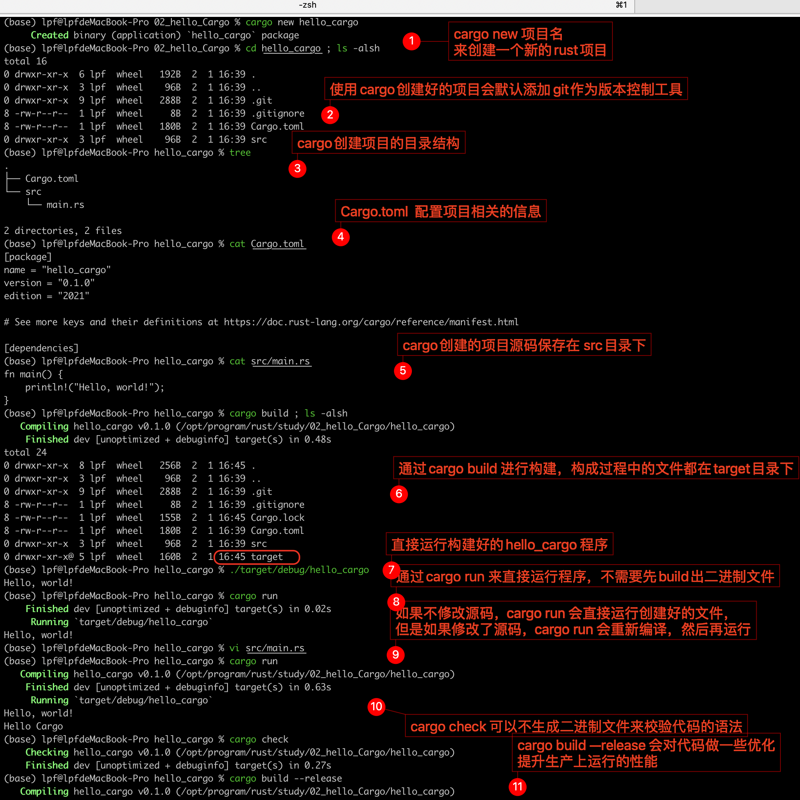

# Rust环境的搭建

## Linux系统

## 使用Cargo管理rust项目

- 可以使用 `cargo new` 创建项目。
- 可以使用 `cargo build` 构建项目。
- 可以使用 `cargo run` 一步构建并运行项目。
- 可以使用 `cargo check` 在不生成二进制文件的情况下构建项目来检查错误。

**操作步骤**：

## 参考

    https://www.rust-lang.org/tools/install

## 补充
    * Rust语言学习网站
    	* https://www.rust-lang.org 
    * Youtube:
    	* https://www.youtube.com/channel/UCaYhcUwRBNscFNUKTjgPFiA   
    * 《Rust程序设计语言》官方文档  https://doc.rust-lang.org/book/ 
    《Rust程序设计语言》 中文翻译   https://kaisery.github.io/trpl-zh-cn/
     《Rust标准库介绍》              https://rustwiki.org/zh-CN/std/
