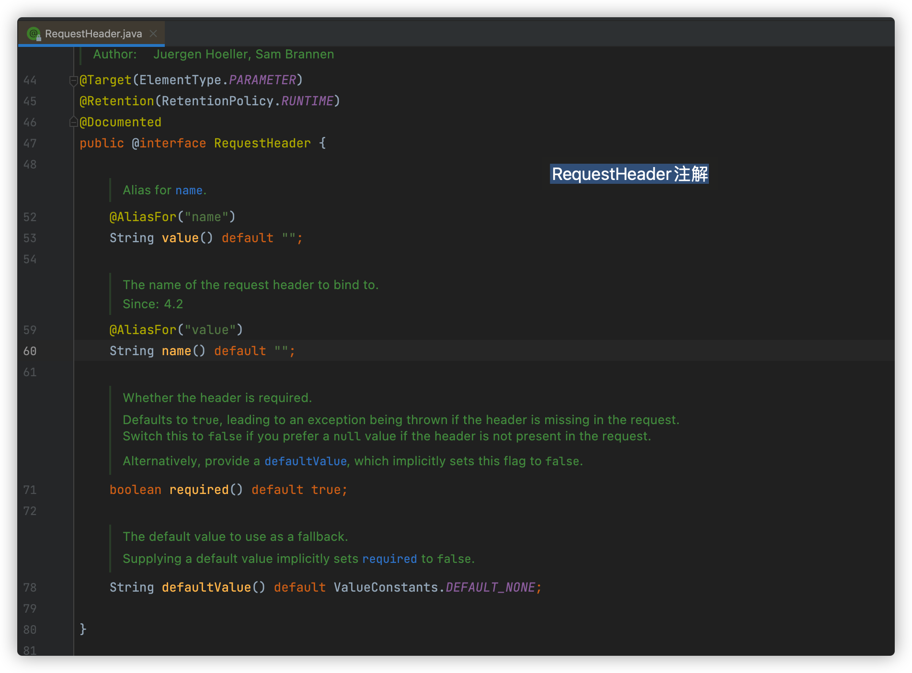

## Spring中的各种注解详解


## @RequestHeader

```java
org.springframework.web.bind.annotation.RequestHeader
```




@RequestHeader("key") 在Controller中，获取请求头中添加的参数，这里的key是header中变量的名称

用法如下：

```java
public UserInfo queryUserById(Long id, @RequestHeader("X-Request-red") String color){
  
}
```


注意： 

1. 这个注解应用在Controller类中

2. 使用@RequestHeader注解之后，请求头中，必须有对应的参数，否则请求异常。 会报 400异常

   