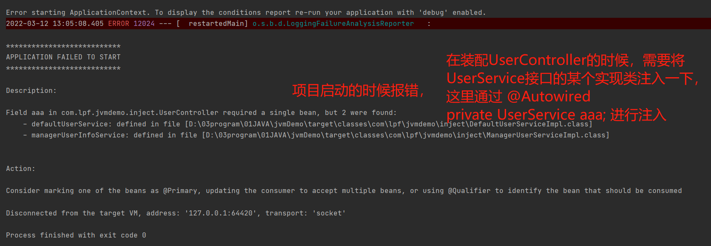

# Autowired 和Resource 注解的区别

[TOC]

### 基础代码

UserService 接口,它有两个实现类

```java
package com.lpf.jvmdemo.inject;

public interface UserService {

    /**
     *
     * @return UserInfo
     * @author lpf
     * @date 2022/3/12 12:46
     */
    UserInfo queyUserInfos();
}
```


UserService 接口的两个实现类如下

```java
package com.lpf.jvmdemo.inject;

import org.springframework.stereotype.Service;

@Service("defaultUserService")
public class DefaultUserServiceImpl implements UserService{

    /**
     *
     *
     * @author lpf
     * @date 2022/3/12 12:46
     */
    @Override
    public UserInfo queyUserInfos() {
        return new UserInfo("lpf",12,"Java Developer");
    }
}

```


```java
package com.lpf.jvmdemo.inject;

import org.springframework.stereotype.Service;

/**
 *
 * @author lpf
 * @date 2022/3/12 12:51
 */
@Service("managerUserInfoService")
public class ManagerUserServiceImpl implements UserService{

    /**
     * @author lpf
     * @date 2022/3/12 12:46
     */
    @Override
    public UserInfo queyUserInfos() {
        System.out.println("调用ManagerUserServiceImpl类的方法查询用户信息");
        return new UserInfo("管理员",12,"管理员");
    }
}
```


只有接口，没有实现类StudentService

```java
package com.lpf.jvmdemo.inject;

public interface StudentService {
    
    /**
     * 
     * @author lpf
     * @date 2022/3/12 13:18
     */
    Student queryStudentByTid();
}

```


将UserService接口的实现类注入到UserController中。


## @Autowired注解

### 场景一：要注入的接口没有实现类

```java
package com.lpf.jvmdemo.inject;

import org.springframework.beans.factory.annotation.Autowired;
import org.springframework.web.bind.annotation.RequestMapping;
import org.springframework.web.bind.annotation.RestController;

@RestController
@RequestMapping("userInfo")
public class UserController {

    @Autowired
    private StudentService studentService;

    /**
     * 查询用户信息
     * http://127.0.0.1:8080/userInfo/queyUserInfos
     * @return String
     * @author lpf
     * @date 2022/3/12 12:43
     */
    @RequestMapping("queyUserInfos")
    public UserInfo queyUserInfos(){
        Student stu = studentService.queryStudentByTid();
        UserInfo userInfo = new UserInfo();
        userInfo.setUserName(stu.getStuName());
        return userInfo;
    }
}
```


项目启动的时候报错

Field studentService in com.lpf.jvmdemo.inject.UserController required a bean of type 'com.lpf.jvmdemo.inject.StudentService' that could not be found.


针对这种，目前没有实现类的变量，如果想要启动的时候不报错，可以借助@Autowired的required属性，将required属性设置为false，可以保证接口在没有实现类的情况下，启动成功。 

代码如下：

```java
package com.lpf.jvmdemo.inject;

import org.springframework.beans.factory.annotation.Autowired;
import org.springframework.web.bind.annotation.RequestMapping;
import org.springframework.web.bind.annotation.RestController;

@RestController
@RequestMapping("userInfo")
public class UserController {

    /*** 
    * 这里@Autowired 的required属性很重要，required = false，告诉spring，如果没有找到对应的bean，可以bu
    * 注入，项目启动的时候，也不会报错
    */
    @Autowired(required = false)
    private StudentService studentService;

    /**
     * 查询用户信息
     * http://127.0.0.1:8080/userInfo/queyUserInfos
     * @return String
     * @author lpf
     * @date 2022/3/12 12:43
     */
    @RequestMapping("queyUserInfos")
    public UserInfo queyUserInfos(){
        if(studentService == null){
            System.out.println("studentService变量注入为空");
            return null;
        }
        System.out.println("studentService 变量注入成功");
        Student stu = studentService.queryStudentByTid();
        UserInfo userInfo = new UserInfo();
        userInfo.setUserName(stu.getStuName());
        return userInfo;
    }
}

```

后续如果为StudentService 接口只添加上一个实现类的时候，只需要实现相关的实现类，并把它放在classath 路径下即可。 


### 场景二：一个接口对应多个实现类

```java
package com.lpf.jvmdemo.inject;

import org.springframework.beans.factory.annotation.Autowired;
import org.springframework.web.bind.annotation.RequestMapping;
import org.springframework.web.bind.annotation.RestController;

@RestController
@RequestMapping("userInfo")
public class UserController {

    @Autowired
    private UserService aaa;

    /**
     * 查询用户信息
     * http://127.0.0.1:8080/userInfo/queyUserInfos
     * @return String
     * @author lpf
     * @date 2022/3/12 12:43
     */
    @RequestMapping("queyUserInfos")
    public UserInfo queyUserInfos(){

        UserInfo userInfo = aaa.queyUserInfos();
        System.out.println("userInfo = " + userInfo.toString());
        return userInfo;
    }
}
```

结果：启动报错，封装UserController的时候失败



这里通过@Autowird 要注入 UserService 接口的某个实现类，但是因为@Autowired是类型注入，因为这里通过UserService 接口找到连个实现类，因此不知道该选择哪一个，所以报异常。 


针对这种异常，对UserController进行了调整，使得可以注入我们想要的变量

#### 调整方式一：

修改要注入的类型。使用具体的实现类，而不是某个接口

```java
package com.lpf.jvmdemo.inject;

import org.springframework.beans.factory.annotation.Autowired;
import org.springframework.web.bind.annotation.RequestMapping;
import org.springframework.web.bind.annotation.RestController;

@RestController
@RequestMapping("userInfo")
public class UserController {

    @Autowired
    private DefaultUserServiceImpl aaa;

    /**
     * 查询用户信息
     * http://127.0.0.1:8080/userInfo/queyUserInfos
     * @return String
     * @author lpf
     * @date 2022/3/12 12:43
     */
    @RequestMapping("queyUserInfos")
    public UserInfo queyUserInfos(){
        UserInfo userInfo = aaa.queyUserInfos();
        System.out.println("userInfo = " + userInfo.toString());
        return userInfo;
    }
}
```

这里我们不再通过UserService 接口来进行注入，而是通过 它的实现类DefaultUserServiceImpl 来进行注入。 之后项目可以正确启动，并正常使用。 

注意: 这里  DefaultUserServiceImpl  类对于的beanId 是defaultUserService， 而不是aaa，因此这里可以确定他是通过类型注入的方式来找到目标对象的。 


#### 调整方式二：

修改要注入的变量名和对应实现类的beanId保持一致

```java
package com.lpf.jvmdemo.inject;

import org.springframework.beans.factory.annotation.Autowired;
import org.springframework.web.bind.annotation.RequestMapping;
import org.springframework.web.bind.annotation.RestController;

@RestController
@RequestMapping("userInfo")
public class UserController {

    /**
     * 这里注入的类型是UserService，根据byType的方式找到两个bean，
     * 之后，再根据byName 方法，根据名字来查找，正好可以找到一个，结果正确。
     */
    @Autowired
    private UserService defaultUserService;
    
    /**
     * 查询用户信息
     * http://127.0.0.1:8080/userInfo/queyUserInfos
     * @return String
     * @author lpf
     * @date 2022/3/12 12:43
     */
    @RequestMapping("queyUserInfos")
    public UserInfo queyUserInfos(){
        UserInfo userInfo = defaultUserService.queyUserInfos();
        System.out.println("userInfo = " + userInfo.toString());
        return userInfo;
    }
}
```


场景三：通过@Autowired注入一个有多个实现类的接口，且变量名和每个是实现类的beanId都不一样

```java
package com.lpf.jvmdemo.inject;

import org.springframework.beans.factory.annotation.Autowired;
import org.springframework.web.bind.annotation.RequestMapping;
import org.springframework.web.bind.annotation.RestController;

@RestController
@RequestMapping("userInfo")
public class UserController {

    @Autowired
    private UserService userService;

    /**
     * 查询用户信息
     * http://127.0.0.1:8080/userInfo/queyUserInfos
     * @return String
     * @author lpf
     * @date 2022/3/12 12:43
     */
    @RequestMapping("queyUserInfos")
    public UserInfo queyUserInfos(){
        if(userService == null){
            System.out.println("studentService变量注入为空");
            return null;
        }
        System.out.println("studentService 变量注入成功");
        return userService.queyUserInfos();
    }
}


```

代码启动报错：

```error
Description:

Field userService in com.lpf.jvmdemo.inject.UserController required a single bean, but 2 were found:
	- defaultUserService: defined in file [D:\03program\01JAVA\jvmDemo\target\classes\com\lpf\jvmdemo\inject\DefaultUserServiceImpl.class]
	- managerUserInfoService: defined in file [D:\03program\01JAVA\jvmDemo\target\classes\com\lpf\jvmdemo\inject\ManagerUserServiceImpl.class]


Action:

Consider marking one of the beans as @Primary, updating the consumer to accept multiple beans, or using @Qualifier to identify the bean that should be consumed


Process finished with exit code 0
```


调整后的代码:

```java
package com.lpf.jvmdemo.inject;

import org.springframework.beans.factory.annotation.Autowired;
import org.springframework.beans.factory.annotation.Qualifier;
import org.springframework.web.bind.annotation.RequestMapping;
import org.springframework.web.bind.annotation.RestController;

@RestController
@RequestMapping("userInfo")
public class UserController {

    @Autowired
    @Qualifier(value = "defaultUserService")
    private UserService userService;

    /**
     * 查询用户信息
     * http://127.0.0.1:8080/userInfo/queyUserInfos
     * @return String
     * @author lpf
     * @date 2022/3/12 12:43
     */
    @RequestMapping("queyUserInfos")
    public UserInfo queyUserInfos(){
        if(userService == null){
            System.out.println("studentService变量注入为空");
            return null;
        }
        System.out.println("studentService 变量注入成功");
        return userService.queyUserInfos();
    }
}
```

这里通过@Qualifier 来解决通过byName 注入时的变量名和实现类的beanId不一致的问题

这种情况发生在，有时候，在一个类中，为了保证某个变量和对应功能的一致性，可能变量名和对应对象的beanId需要不一致。 


## @Resource注解

### 场景一：通过@Resource要注入的接口没有实现类

```java
package com.lpf.jvmdemo.inject;

import org.springframework.web.bind.annotation.RequestMapping;
import org.springframework.web.bind.annotation.RestController;

import javax.annotation.Resource;

@RestController
@RequestMapping("userInfo")
public class UserController {

    /***
     * 这里@Autowired 的required属性很重要，required = false，告诉spring，如果没有找到对应的bean，可以bu
     * 注入，项目启动的时候，也不会报错
     */
    @Resource
    private StudentService studentService;

    /**
     * 查询用户信息
     * http://127.0.0.1:8080/userInfo/queyUserInfos
     * @return String
     * @author lpf
     * @date 2022/3/12 12:43
     */
    @RequestMapping("queyUserInfos")
    public UserInfo queyUserInfos(){
        if(studentService == null){
            System.out.println("studentService变量注入为空");
            return null;
        }
        System.out.println("studentService 变量注入成功");
        Student stu = studentService.queryStudentByTid();
        UserInfo userInfo = new UserInfo();
        userInfo.setUserName(stu.getStuName());
        return userInfo;
    }
}
```

项目启动报错：

```error
Description:
A component required a bean of type 'com.lpf.jvmdemo.inject.StudentService' that could not be found.
Action:
Consider defining a bean of type 'com.lpf.jvmdemo.inject.StudentService' in your configuration.

Process finished with exit code 0
```


### 场景二：@Resource 通过类型注入注入变量

```java
package com.lpf.jvmdemo.inject;

import org.springframework.web.bind.annotation.RequestMapping;
import org.springframework.web.bind.annotation.RestController;

import javax.annotation.Resource;

@RestController
@RequestMapping("userInfo")
public class UserController {
    
    @Resource
    private StudentService aaa;

    /**
     * 查询用户信息
     * http://127.0.0.1:8080/userInfo/queyUserInfos
     * @return String
     * @author lpf
     * @date 2022/3/12 12:43
     */
    @RequestMapping("queyUserInfos")
    public UserInfo queyUserInfos(){
        if(aaa == null){
            System.out.println("studentService变量注入为空");
            return null;
        }
        System.out.println("studentService 变量注入成功");
        Student stu = aaa.queryStudentByTid();
        UserInfo userInfo = new UserInfo();
        userInfo.setUserName(stu.getStuName());
        return userInfo;
    }
}
```

且，StudentService 有一个自己的实现类：

```java
package com.lpf.jvmdemo.inject;

import org.springframework.stereotype.Service;

/**
 *
 * @author lpf
 * @date 2022/3/12 13:43
 */
@Service("studentService")
public class StudentServiceImpl implements StudentService{
//public class StudentServiceImpl{

    /**
     *
     * @author lpf
     * @date 2022/3/12 13:18
     */
    @Override
    public Student queryStudentByTid() {
        return new Student("lipengfei");
    }
}
```

 这里通过@Resource 注入StudentService .项目可以正常启动。 且成功注入StudentService的唯一一个实现类。 

注意：这里注入的变量名 aaa 和StudentServiceImpl 类的beanId studentService 不一致。 注入也是成功的。 说明@Resource 也是支持类型注入的。 


### 场景三：@Resource 通过类型注入注入Map

```
package com.lpf.jvmdemo.inject;

import org.springframework.web.bind.annotation.RequestMapping;
import org.springframework.web.bind.annotation.RestController;

import javax.annotation.Resource;
import java.util.Map;

@RestController
@RequestMapping("userInfo")
public class UserController {

    @Resource
    private Map<String,UserService> userServiceMap;

    /**
     * 查询用户信息
     * http://127.0.0.1:8080/userInfo/queyUserInfos
     * @return String
     * @author lpf
     * @date 2022/3/12 12:43
     */
    @RequestMapping("queyUserInfos")
    public UserInfo queyUserInfos(){
        if(userServiceMap == null){
            System.out.println("studentService变量注入为空");
            return null;
        }
        System.out.println("studentService 变量注入成功");
        userServiceMap.values().forEach(userService -> {
           UserInfo userInfo = userService.queyUserInfos();
            System.out.println("userInfo = " + userInfo);
        });
        UserInfo userInfo = new UserInfo();
        userInfo.setUserName("test");
        return userInfo;
    }
}
```

同样它也是支持注入list，数组类型数据的。


## 补充：

在spring中beanId的名称必须唯一 。 即使是不同的接口的实现类，也不能使用相同的beanId。 

否则项目启动报错：

```error
2022-03-12 13:49:34.427  WARN 12352 --- [  restartedMain] ConfigServletWebServerApplicationContext : Exception encountered during context initialization - cancelling refresh attempt: org.springframework.beans.factory.BeanDefinitionStoreException: Failed to parse configuration class [com.lpf.jvmdemo.JvmdemoApplication]; nested exception is org.springframework.context.annotation.ConflictingBeanDefinitionException: Annotation-specified bean name 'defaultUserService' for bean class [com.lpf.jvmdemo.inject.StudentServiceImpl] conflicts with existing, non-compatible bean definition of same name and class [com.lpf.jvmdemo.inject.DefaultUserServiceImpl]
2022-03-12 13:49:34.512 ERROR 12352 --- [  restartedMain] o.s.boot.SpringApplication               : Application run failed
```


### 

## 注意

@Autowried 注解的required属性设置为false，只能保证在spring根据类型注入找不到bean的情况下不报异常，如果根据类型注入找到多个，还是会报异常的。 


个人观点：

个人认为，@Resource 可以实现的功能，@Autowired 都可以实现

但是@Autowired 可以实现的功能，@Resource 并不一定都可以实现。 

例如：@Autowried可以通过required = false来避免，没有实现类的情况下，项目启动不报错，但是@Resource 注解没有这个功能。 


结论：

在spring中@Autowired 默认的注入方式是byType，但是也支持byName

@Resource 的默认注入方式是byName，但是也支持byType

飞：通过上面的demo是推断不出两个注解的byType和byName 注入方式的先后顺序的。 但是可以byType和byName他们都是支持的。 
