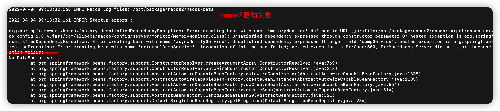
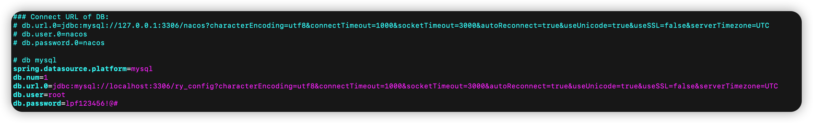

# Nacos 相关知识


## Nacos的启动

**单机模式启动**

切换到bin目录下，执行如下脚步

```shell
$> sh startup.sh -m standalone
```

在Nacos1.4.1 版本中，执行如上命令之后，会在后台运行，并且日志保存到指定的日志中（保存日志在控制台可查）


## Nacos的停止

## Nacos状态查询


通过如下命令为nacos设置相关的内容

```shell
$> curl -X POST "http://127.0.0.1:8848/nacos/v1/cs/configs?dataId=gateway-dev.properties&group=DEFAULT_GROUP&content=useLocalCache=true"
```


## Nacos 启动过程中遇到的问题

 * No DataSource set

   

​		 出错的原因是nacos 在配置文件application.yml 文件中配置了将数据保存到数据库中，但是数据库访问存在问题。

​		下图是nacos 配置数据库的相关信息

​			

​		解决办法，将相关的数据源调通即可。 

* d


