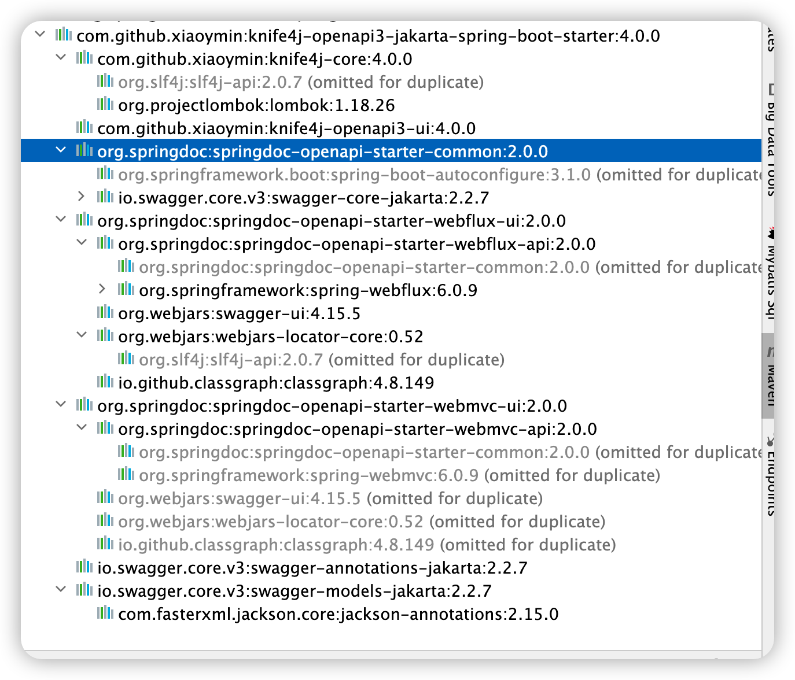
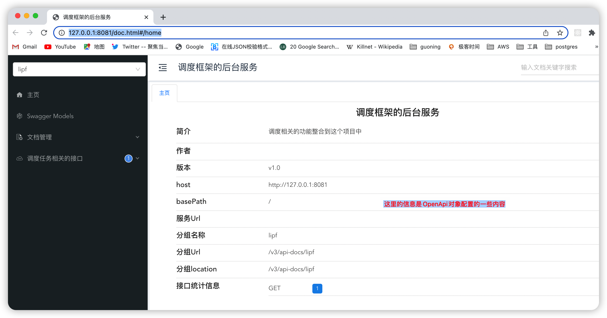
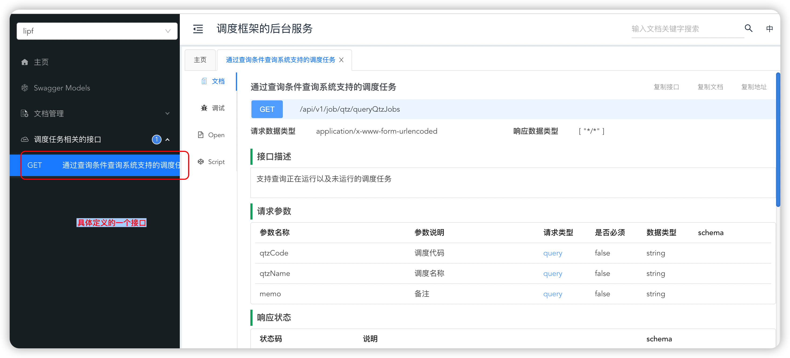
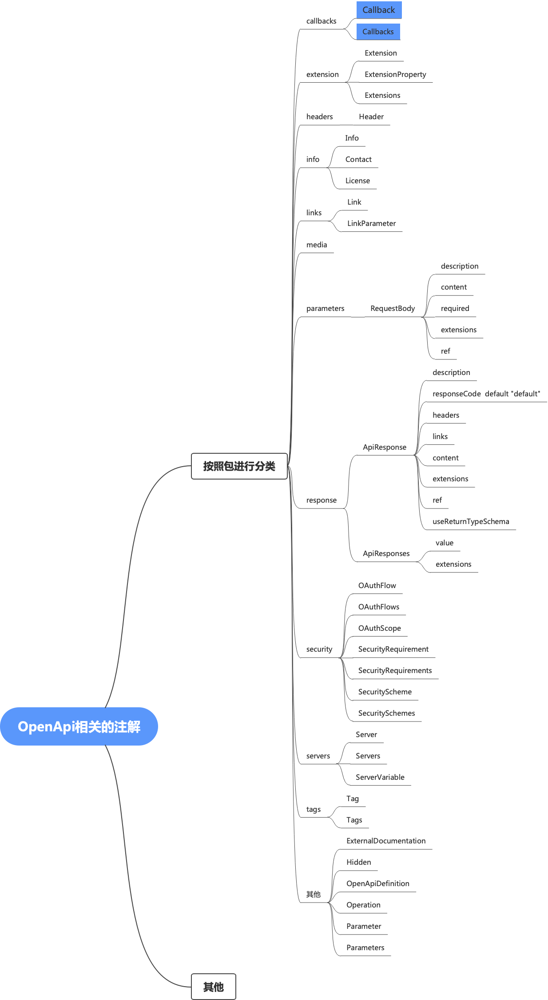
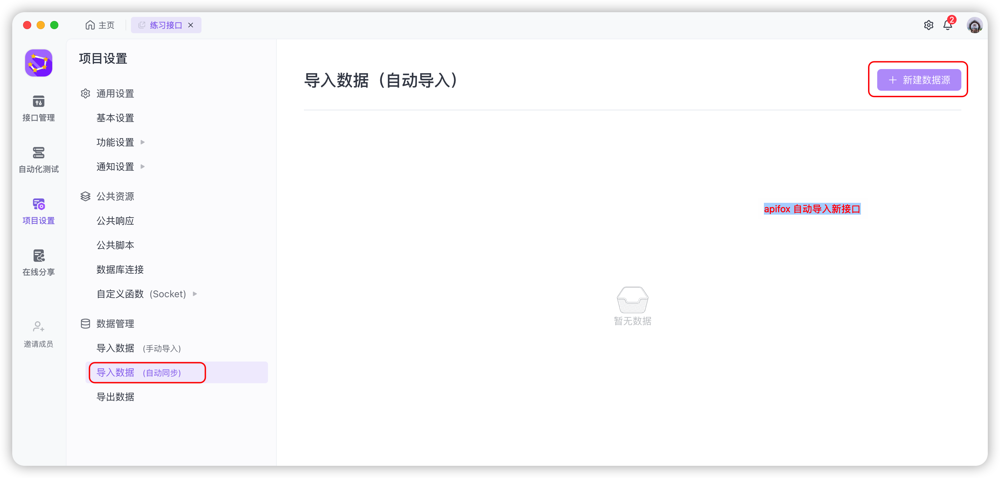
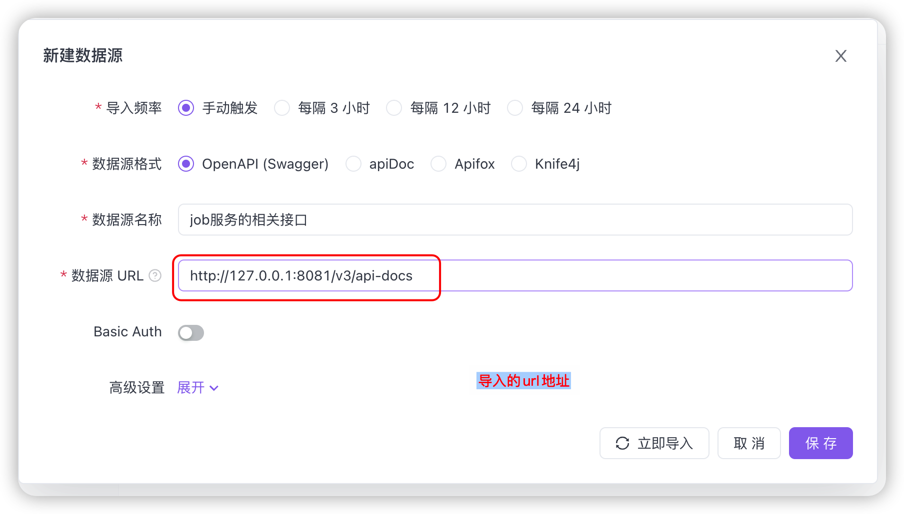

# springboot3 整合 knife4J


knife4j 是利用OpenAPI 来进行接口管理的一套软件，是用于替代Swagger-ui的一种解决方案。 


## 引入依赖
``` pom.xml
    
    <dependency>
	      <groupId>com.github.xiaoymin</groupId>
			  <artifactId>knife4j-openapi3-jakarta-spring-boot-starter</artifactId>
			  <version>4.0.0</version>
    </dependency>
    
```
具体的依赖如下



## 进行相关的配置

```java

package com.eagle.base.job.config.knife4j;

import io.swagger.v3.oas.models.ExternalDocumentation;
import io.swagger.v3.oas.models.OpenAPI;
import io.swagger.v3.oas.models.info.Info;
import io.swagger.v3.oas.models.info.License;
import org.slf4j.Logger;
import org.slf4j.LoggerFactory;
import org.springframework.context.annotation.Bean;
import org.springframework.context.annotation.Configuration;

/**
 * Knife4j 配置类
 *
 * @author lipf
 * @since 2023/6/20 21:10
 */
@Configuration
public class Knife4jConfig {

    private static final Logger log = LoggerFactory.getLogger(Knife4jConfig.class);


    /**
     * 配置多个Docket的时候，使用下面的两段代码
     * 如果只有一个Docket， 直接在配置文件中添加如下配置：
     *    springdoc.packagesToScan=package1, package2
     *    springdoc.pathsToMatch=/v1, /api/balance/**
     */
//    @Bean
//    public GroupedOpenApi publicApi() {
//        return GroupedOpenApi.builder()
//                .group("springshop-public")
//                .pathsToMatch("/public/**")
//                .build();
//    }
//    @Bean
//    public GroupedOpenApi adminApi() {
//        return GroupedOpenApi.builder()
//                .group("springshop-admin")
//                .pathsToMatch("/admin/**")
//                .addOpenApiMethodFilter(method -> method.isAnnotationPresent(Admin.class))
//                .build();
//    }


    /**
     * 配置OpenApi， 配置的信息会显示在doc.html 主页介绍中
     *
     * @author lipf
     * @since 2023/6/20 21:16
     */
    @Bean
    public OpenAPI springShopOpenAPI() {
        log.info("开始配置Knife的OpenAPI...");
        OpenAPI openAPI = new OpenAPI()
                .info(new Info().title("调度框架的后台服务")
                        .description("调度相关的功能整合到这个项目中")
                        .version("v1.0")
                        .license(new License().name("Apache 2.0").url("http://springdoc.org")))
                .externalDocs(new ExternalDocumentation()
                        .description("调度框架项目以及接口的详细说明")
                        .url("http://127.0.0.1:8081"));
        log.info("配置Knife4j的OpenApi完成.");
        return openAPI;
    }

}
```

另外还需要在application.yml 中进行配置。 
```application.yml
springdoc:
  group-configs:
    - group : 'lipf'
      packages-to-scan: com.eagle.base.job.controller.qtz.job
```


配置好之后可以通过如下地址访问
  http//:ip:port/doc.html  
  eg: 
  http://127.0.0.1:8081/doc.html


效果如下：


在主页中，可以看到代码中设置的OpenAPI的相关信息。 还可以查看到所有接口的统计信息。 


## 具体接口的定义



在这里【调度任务相关的接口】，我们是通过在controller类上，添加一个@Tag注解来实现的。

例如 : 
```java
@RestController
@Tag(name = "调度任务相关的接口")
public class QtzJobController 

``` 


这里我们要定义一个接口，例如这里的 [通过查询条件查询系统支持的调度任务], 我们是通过在方法中上通过@Operation注解来实现的。 
```java
    /**
     * 根据调度代码查询满足条件的调度任务
     *   curl http://127.0.0.1:8081/api/v1/job/qtz/queryQtzJobs
     * @param memo 备注
     * @param qtzCode 调度代码
     * @param qtzName 调度名称
     * @author lipf
     * @since 2023/6/19 10:47
     */
    @Operation(summary = "通过查询条件查询系统支持的调度任务",description = "支持查询正在运行以及未运行的调度任务")
    @GetMapping("/api/v1/job/qtz/queryQtzJobs")
    @ApiResponse(description="满足条件的调度任务",responseCode="200")
    @Parameter(name = "qtzCode", description = "调度代码")
    @Parameter(name = "qtzName", description = "调度名称")
    @Parameter(name = "memo", description = "备注")
    public Res<List<QtzJob>> queryQtzJobs(@RequestParam(required = false) String qtzCode,
                                          @RequestParam(required = false) String qtzName,
                                          @RequestParam(required = false) String memo){
                                            // code 
                                    }
```


## spring-doc支持的所有注解



## 接口文档迁移

### 将openAPi接口导入apifox。




配置导入的地址


之后可以通过手动触发来更新接口到apifox中。 


## 参考资料
springdoc的官方文档 
https://springdoc.org/ 


## 接下来
* 其他注解的详细说明
* 配置多个Docket
* 


## 变更

| 日期   |      变更内容      |  备注 |
|----------|:-------------:|------:|
| 2023-06-20 星期二 |  knife的配置以及基本使用 | 主要是springboot整合knife，使用的是spirng-mvc，而不是springflux-mvc |


