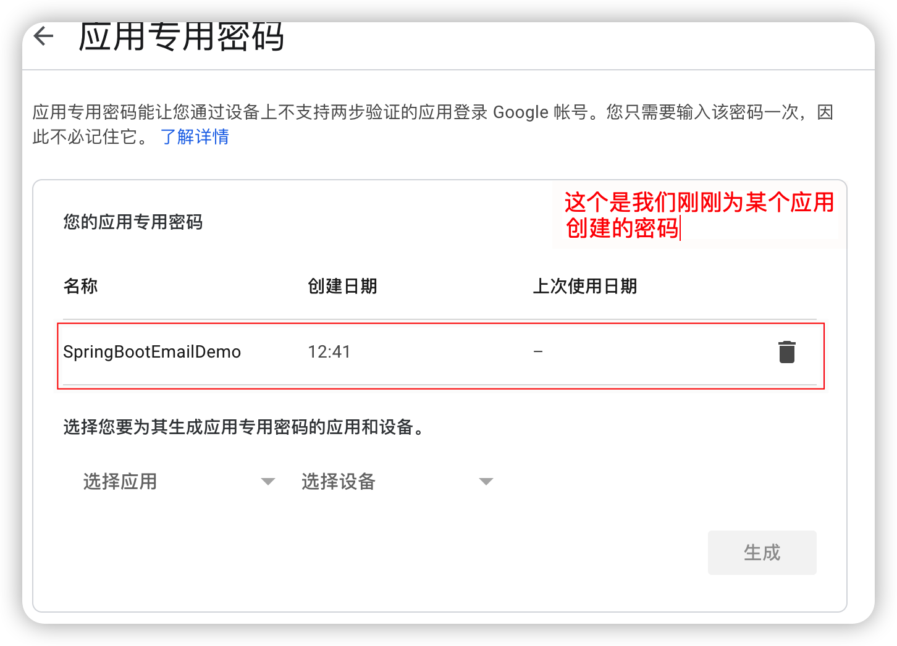

# SpringBoot2 通过Gmail发送邮件


使用SpringBoot 来利用Gmail 来发送邮件需要配置Google邮箱的账户和密码。 这里的密码不能直接使用Google的登录密码，需要使用google提供的应用专用密码

## 相关的代码

添加相关的依赖：

```pom.xml
<dependency>
			<groupId>org.springframework.boot</groupId>
			<artifactId>spring-boot-starter-mail</artifactId>
	</dependency>
```

springboot 利用google邮箱发送邮件，需要配置如下的内容

```yaml
spring:
  mail:
    host: smtp.gmail.com
    port: 587
    username: penfeilpf@gmail.com
    password: metf*****feioti
    properties:
      mail:
        smtp:
          starttls:
            enable: true
          auth: true
```

​      也可以使用properties类型的配置文件，配置内容如下：


相关的Java代码如下：

```java
package com.study.emaildemo;

import org.springframework.beans.factory.annotation.Autowired;
import org.springframework.core.io.FileSystemResource;
import org.springframework.mail.SimpleMailMessage;
import org.springframework.mail.javamail.JavaMailSender;
import org.springframework.mail.javamail.MimeMessageHelper;
import org.springframework.stereotype.Component;

import javax.mail.MessagingException;
import javax.mail.internet.MimeMessage;
import java.io.File;


/**
 * 使用Gmail 发送邮件的组件
 *
 * @author lipf
 * @date 2022/3/26 12:46
 * @version 1.0
 */
@Component("emailSender")
public class EmailSender {

    @Autowired
    private JavaMailSender mailSender;

    /**
     * 使用配置好的邮箱地址发送邮件
     *
     * @author
     * @date 2022/3/26 12:47sssssss
     * @version 1.0
     */
    public void sendEmail(String to, String subject, String content){
        SimpleMailMessage message = new SimpleMailMessage();
        message.setFrom("pengfei@gmail.com");
        message.setTo(to);
        message.setText(content);
        message.setSubject(subject);
        long startTime = System.currentTimeMillis();
        mailSender.send(message);
        long costTime = System.currentTimeMillis() - startTime;
        System.out.println("发送邮件，耗时" + costTime + "ms");
    }

    /**
     * Send Email with Attachement
     *      // TODO 当发送邮件附件的时候，如果文件比较大，比如13.6M，会很耗时耗时72015ms ，如果发送500kb的文件，则耗时 14429ms
     * @param subject
     * @param absPath file's abstract path eg:/Users/xxx/gitee/springboot/2.4.2.RELEASE/spring-boot-reference_2.4.2.Release.pdf
     * @author
     * @date 2022/3/26 13:36
     * @version 1.0
     */
    public void sendEmailWithAttch(String to, String subject, String content ,String absPath){
        System.out.println("start send Email with attachement！");
        long startTime = System.currentTimeMillis();
        try {
            MimeMessage mimeMessage = mailSender.createMimeMessage();
            MimeMessageHelper helper = new MimeMessageHelper(mimeMessage,true);
            helper.setFrom("pengfeilpf@gmail.com");
            helper.setTo(to);
            helper.setSubject(subject);
            helper.setText(content);
            System.out.println("要发送的附件是：" + absPath);
            FileSystemResource fileSystemResource =  new FileSystemResource(new File(absPath));
            helper.addAttachment(fileSystemResource.getFilename(),fileSystemResource);
            mailSender.send(mimeMessage);
            long costTime = System.currentTimeMillis() - startTime;
            System.out.println("发送带附件的邮件成功，耗时" + costTime + "ms");
        } catch (MessagingException e) {
            e.printStackTrace();
        }
    }

}

```


## 为Google邮箱生成应用专用密码

这里需要注意，它的密码需要登录网站处理一下，操作步骤如下：

1. Manage your Google Account

   

2. 选择Security 项目 

   

3. 找到 Signing into Google 

   

4. 输入google账户的登录密码

   

5. 添加设置密码的类型

   这里我们选中类型为 Other。

   

   

6. 为自己的应用指定应用名称

   可以为不同的应用设置不同的应用密码

   

7. 之后google会为我们生成相关的密码

   

8. 查看应用专用密码的使用情况

   

